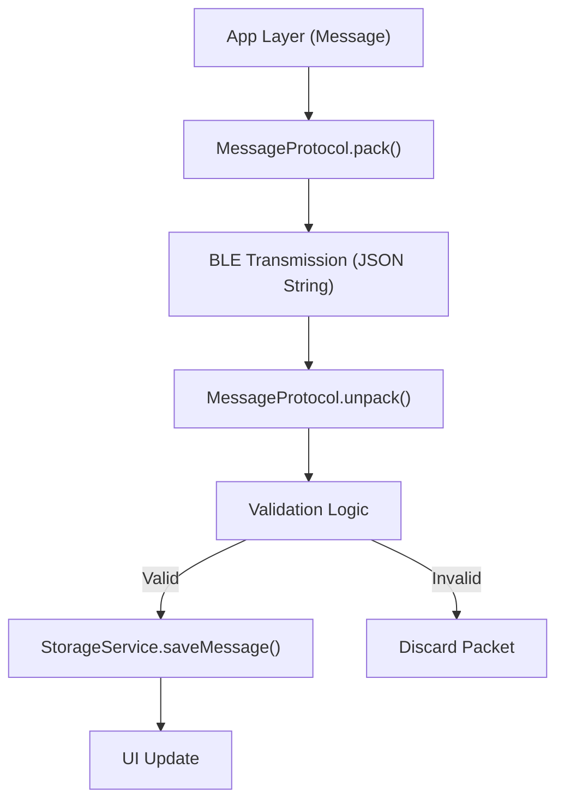

# Messaging Protocol & Storage

MeshChat utilizes a lightweight, JSON-based framing protocol for peer-to-peer BLE communication and a structured key-value storage system for local data persistence.

## Messaging Protocol

The `MessageProtocol` service ensures that every packet sent over Bluetooth Low Energy (BLE) follows a strict schema. This unification allows the mesh network to distinguish between direct messages, public broadcasts, and relayed packets.

### Packet Schema

Every message is packed into a JSON string with the following structure:

| Field | Type | Description |
| :--- | :--- | :--- |
| `id` | `string` | Unique identifier generated via `mesh_{timestamp}_{random}` |
| `from` | `string` | The nickname of the sender |
| `type` | `string` | Either `'dm'` (Direct Message) or `'public'` (Broadcast) |
| `to` | `string\|null` | Recipient identifier (`nickname::deviceName`) or `null` for public |
| `payload` | `string` | The actual message text content |
| `ts` | `number` | Unix timestamp of creation |
| `ttl` | `number` | Time-to-Live; number of hops the message can travel |
| `hops` | `number` | Current hop count (increments during relay) |

### Protocol Lifecycle

The communication flow follows a **Pack $\rightarrow$ Transmit $\rightarrow$ Unpack** pipeline.

### Key Operations

- **Packing**: Converts raw message data into a JSON string. It assigns a unique ID and defaults the `ttl` and `hops` if not provided.
- **Unpacking**: Parses incoming strings and validates the presence of required fields (`id`, `from`, `type`, `payload`). If the packet is malformed, it is discarded to prevent app crashes.
- **Relaying**: To support multi-hop mesh networking, the `relay()` method decrements the `ttl` and increments the `hops` count. If `ttl` reaches 0, the packet is dropped to prevent infinite loops in the network.

---

## Storage Architecture

The `StorageService` acts as the exclusive interface for `AsyncStorage`, ensuring all data is namespaced and consistently handled.

### Data Namespace

All keys are prefixed with `@meshchat:` to avoid collisions with other app data.

| Storage Key | Format | Description |
| :--- | :--- | :--- |
| **Username** | `@meshchat:username` | The local user's display name |
| **Peer Chat** | `@meshchat:chat:<peerMac>` | JSON array of messages for a specific peer |
| **Peer Meta** | `@meshchat:peer:<peerMac>` | Object containing `{ name, lastSeen }` |
| **Public Channel** | `@meshchat:channel:public` | JSON array of global broadcast messages |

### Storage Features

#### 1. Message Persistence
Messages are stored as JSON arrays. When retrieving chat history via `getMessages(peerMac)`, the service automatically sorts the array by timestamp to ensure chronological order in the UI.

#### 2. Public Channel Management
To prevent local storage bloat, the public channel implements a sliding window:
- **Deduplication**: Messages are checked by `id` before being saved.
- **Trimming**: The storage is capped at `MAX_PUBLIC_MESSAGES`. Once exceeded, the oldest messages are purged.

#### 3. Inbox Generation
The `getConversations()` method dynamically aggregates the inbox by:
1. Scanning all keys starting with `@meshchat:chat:`.
2. Extracting the last message and timestamp from each peer's history.
3. Mapping the `peerMac` to a human-readable name via the Peer Metadata store.
4. Sorting the resulting list by the most recent activity.

### API Summary

| Method | Purpose | Complexity |
| :--- | :--- | :--- |
| `saveMessage(mac, msg)` | Appends message to a specific peer's history | $O(1)$ |
| `getConversations()` | Aggregates all active chats for the inbox view | $O(N \log N)$ |
| `savePublicMessage(msg)`| Saves broadcast message with cap enforcement | $O(N)$ |
| `deleteConversation(mac)`| Removes both chat history and peer metadata | $O(1)$ |
| `clearAll()` | Wipes all `@meshchat:` namespaced data | $O(N)$ |