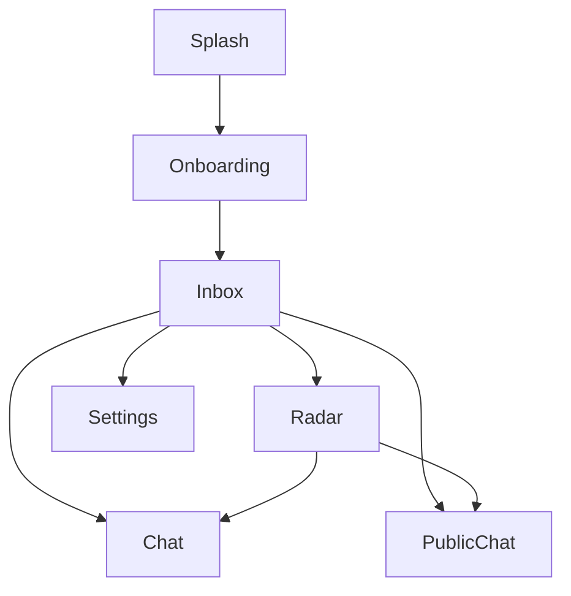

# User Interface and Navigation

MeshChat utilizes a stack-based navigation architecture implemented via `@react-navigation/native` and `@react-navigation/native-stack`. The application is wrapped in a `SafeAreaProvider` to ensure consistent rendering across various device notches and system bars.

## Navigation Architecture

The application employs a `NativeStackNavigator` to manage the screen lifecycle and transitions. The navigation configuration prioritizes a seamless user experience with a custom dark theme and standardized transition animations.

### Global Navigation Configuration
All screens within the `AppNavigator` share the following default properties:
- **Header Visibility**: Disabled (`headerShown: false`) to allow for custom screen-level headers.
- **Transition Animation**: `slide_from_right` for a native mobile feel.
- **Background Color**: `#0a0f0a` (Deep Black/Green) to maintain a consistent dark aesthetic.

## Screen Hierarchy

The following table outlines the screens defined in the navigation stack:

| Route Name | Component | Purpose |
| :--- | :--- | :--- |
| `Splash` | `SplashScreen` | Initial boot screen and app initialization. |
| `Onboarding` | `OnboardingScreen` | User introduction and initial setup flow. |
| `Inbox` | `InboxScreen` | Primary hub for managing active conversations. |
| `Radar` | `RadarScreen` | Peer discovery and mesh network scanning. |
| `Chat` | `ChatScreen` | Private one-on-one messaging interface. |
| `PublicChat` | `PublicChatScreen` | Group-based or public broadcast communication. |
| `Settings` | `SettingsScreen` | Application configuration and user preferences. |

## Navigation Flow

The application follows a linear progression from boot to the main functional areas of the mesh network.



## Implementation Details

The navigation entry point is defined in `AppNavigator.jsx`, which encapsulates the `NavigationContainer`. This ensures that the navigation state is preserved and accessible throughout the application lifecycle.

```jsx
// Simplified navigation structure
<NavigationContainer>
    <Stack.Navigator initialRouteName="Splash">
        <Stack.Screen name="Splash" component={SplashScreen} />
        {/* ... other screens */}
    </Stack.Navigator>
</NavigationContainer>