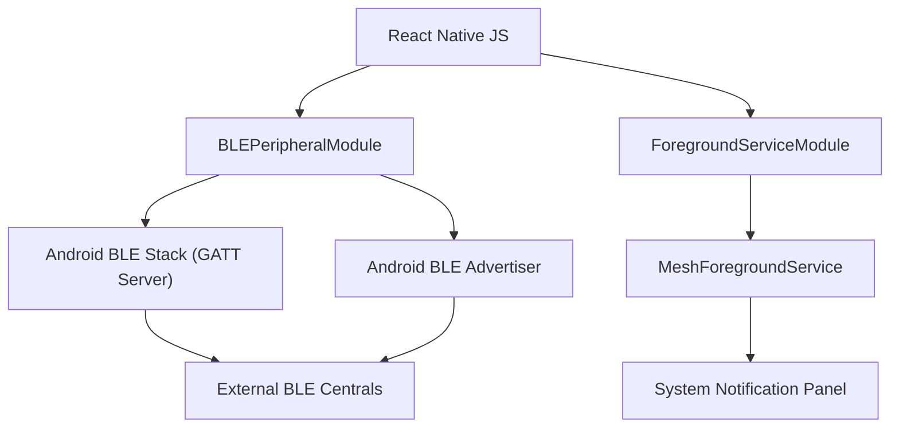

# Android Native Integration

MeshChat leverages custom Android native modules to provide low-level Bluetooth Low Energy (BLE) peripheral capabilities and background persistence. Because React Native's standard BLE libraries often focus on the *Central* role (scanning/connecting), these native modules implement the *Peripheral* role, allowing the device to act as a data source for other nodes in the mesh.

## Architecture Overview

The integration consists of two primary systems: the **BLE Peripheral Module**, which manages the GATT server and advertising, and the **Foreground Service**, which ensures the BLE stack remains active when the application is backgrounded.

## BLE Peripheral Implementation

The `BLEPeripheralModule` transforms the Android device into a BLE Peripheral. It manages a GATT (Generic Attribute Profile) server that exposes specific characteristics for mesh communication.

### GATT Server Configuration
The module implements a primary service containing two critical characteristics:
1.  **Name Characteristic (Read):** Allows Central devices to identify the node (e.g., "MeshUser").
2.  **Message Characteristic (Write):** Acts as the data ingress point. When a Central device writes to this characteristic, the native module captures the data and emits a `BLEPeripheralWrite` event to the JavaScript layer.

### Robustness Features
To ensure stability across various Android OEMs (specifically Samsung and Pixel devices), the module implements several safety mechanisms:
- **Idempotent Setup:** The `setup()` method guards against concurrent calls and performs a full cleanup of existing servers before initializing.
- **Callback Persistence:** It stores the `AdvertiseCallback` instance explicitly, preventing "Invalid Callback" errors during `stopAdvertising` on strict OEM implementations.
- **Registration Timeout:** A 5-second safety net is implemented via `SERVICE_ADD_TIMEOUT_MS` to prevent the JS promise from hanging if the Android GATT service fails to register.

## Foreground Service Support

To prevent the Android OS from killing the BLE advertising process during aggressive battery optimization, MeshChat utilizes a `Foreground Service`.

### Lifecycle & Persistence
The `MeshForegroundService` is configured as `START_STICKY`, signaling the Android system to recreate the service if it is killed due to memory pressure. 

### User Notification
In compliance with Android's foreground service requirements, a persistent, non-dismissible notification is displayed:
- **Title:** "MeshChat"
- **Text:** "Listening for nearby messages"
- **Category:** `Notification.CATEGORY_SERVICE`
- **Importance:** `IMPORTANCE_LOW` (to avoid intrusive sound/pop-ups while maintaining visibility).

## API Reference

### BLEPeripheral Module

| Method | Arguments | Description |
| :--- | :--- | :--- |
| `setup()` | `svcUUID, msgUUID, nmUUID, displayName` | Initializes the GATT server and defines the service/characteristic UUIDs. |
| `startAdvertising()` | `none` | Begins broadcasting the service UUID to make the device discoverable. |
| `stopAdvertising()` | `none` | Stops the BLE advertisement. |
| `updateName()` | `newName` | Updates the value of the Name characteristic dynamically. |
| `stop()` | `none` | Performs full cleanup: stops advertising, closes GATT server, and unregisters receivers. |

#### Native Events
The module emits the following events to the JS layer via `RCTDeviceEventEmitter`:

- `BLEBluetoothStateChanged`: Emitted when the hardware Bluetooth adapter changes state (e.g., `PoweredOn`, `PoweredOff`).
- `BLEPeripheralRead`: Emitted when a Central device reads the Name characteristic.
- `BLEPeripheralWrite`: Emitted when a Central device writes data to the Message characteristic. Payload contains `data` and `deviceId`.

### Foreground Service Module

| Method | Description |
| :--- | :--- |
| `start()` | Launches the `MeshForegroundService` and displays the system notification. |
| `stop()` | Terminates the foreground service and removes the notification. |