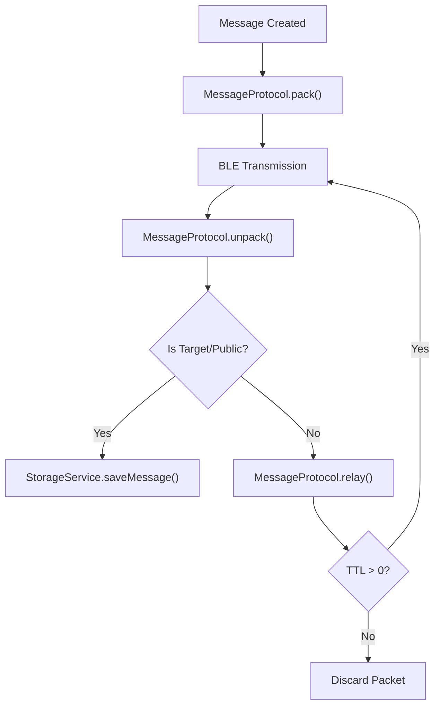

# Data Protocol & Storage

MeshChat utilizes a lightweight, JSON-based messaging protocol designed for low-bandwidth Bluetooth Low Energy (BLE) transmission and a key-value local storage system for persistence.

## Messaging Protocol

The `MessageProtocol` service acts as the serialization layer, ensuring that every packet sent over the mesh network follows a unified format. This allows for consistent routing, relaying, and message validation across different nodes.

### Packet Structure

Every message is packed into a JSON string with the following schema:

| Field | Type | Description |
| :--- | :--- | :--- |
| `id` | `string` | Unique identifier for the message (generated via `createId`). |
| `from` | `string` | The nickname of the sender. |
| `type` | `'dm' \| 'public'` | Message scope: `dm` for direct messages, `public` for broadcast. |
| `to` | `string \| null` | Recipient identifier (`nickname::deviceName`) or `null` for public. |
| `payload` | `string` | The actual message text content. |
| `ts` | `number` | Unix timestamp of when the message was created. |
| `ttl` | `number` | Time-to-Live; number of hops remaining before the packet is discarded. |
| `hops` | `number` | Current hop count, incremented each time the message is relayed. |

### Lifecycle of a Message




### Mesh Capabilities
The protocol supports multi-hop relaying through the `relay()` method. This allows a node to act as a bridge for messages not intended for it:
1. **TTL Decrement**: Every time a message is relayed, its `ttl` (Time-to-Live) is reduced by 1.
2. **Hop Increment**: The `hops` counter increases to track the distance the message has traveled.
3. **Expiration**: Once `ttl` reaches 0, the message is discarded to prevent infinite loops in the mesh.

---

## Local Storage

The `StorageService` provides a centralized wrapper around `AsyncStorage`, ensuring that data persistence is handled consistently throughout the application.

### Storage Schema

MeshChat uses a prefixed key system (`@meshchat:`) to isolate its data from other application storage.

| Key Pattern | Purpose | Data Format |
| :--- | :--- | :--- |
| `@meshchat:username` | Stores the current user's display name. | `string` |
| `@meshchat:chat:<peerMac>` | Stores the conversation history with a specific peer. | `Array<Message>` |
| `@meshchat:peer:<peerMac>` | Stores peer metadata (name, last seen). | `{ name, lastSeen }` |
| `@meshchat:channel:public` | Stores the global public channel history. | `Array<Message>` |

### Storage Logic & Optimization

#### 1. Message Ordering
Messages are not stored in a database with native sorting. Instead, `StorageService` retrieves the JSON array and performs a client-side sort by timestamp:
```javascript
messages.sort((a, b) => a.timestamp - b.timestamp);
```

#### 2. Public Channel Pruning
To prevent the local storage from growing indefinitely, the public channel is capped using `MAX_PUBLIC_MESSAGES`. When the limit is reached, the oldest messages are sliced off the front of the array.

#### 3. Conversation Aggregation
The `getConversations()` method dynamically builds the inbox list by:
- Filtering all keys starting with `@meshchat:chat:`.
- Retrieving the last message and timestamp for each peer.
- Fetching the corresponding peer name from the `@meshchat:peer:` metadata.
- Sorting the final list so the most recent conversations appear first.

### Data Management Methods

- **`saveMessage(peerMac, message)`**: Appends a message to a specific peer's history.
- **`savePublicMessage(message)`**: Appends a message to the public channel with deduplication based on message `id`.
- **`deleteConversation(peerMac)`**: Atomically removes both the chat history and the peer metadata for a specific MAC address.
- **`clearAll()`**: Wipes all data associated with the `@meshchat:` prefix.