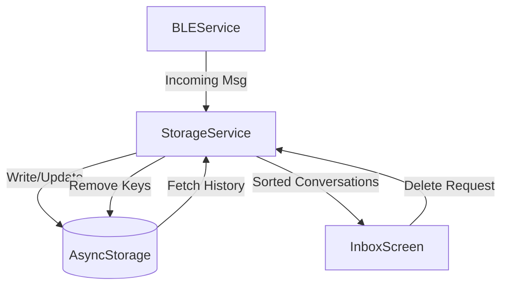

# Data and State Management

MeshChat utilizes a centralized persistence layer to manage user identity, peer metadata, and message history. Because the application operates over a decentralized Bluetooth Low Energy (BLE) mesh, local storage is critical for maintaining conversation continuity when peers move out of range.

## Storage Architecture

The application implements a service-based architecture where `StorageService.js` acts as the sole gateway to `@react-native-async-storage/async-storage`. This ensures that data access is predictable, typed, and namespaced.

### Key Namespacing
To prevent collisions with other app data, all keys are prefixed with `@meshchat:`.

| Key Pattern | Purpose | Data Type |
| :--- | :--- | :--- |
| `@meshchat:username` | Stores the local user's display name | `string` |
| `@meshchat:chat:<peerMac>` | Message history for a specific peer | `Array<Message>` |
| `@meshchat:peer:<peerMac>` | Peer metadata (name, last seen) | `Object` |
| `@meshchat:channel:public` | Global mesh broadcast history | `Array<Message>` |

## Data Flow

The following diagram illustrates how data moves from the hardware layer (BLE) through the persistence layer to the user interface.

## Implementation Details

### 1. Message Persistence
Messages are stored as JSON arrays indexed by the peer's MAC address. When a message is saved via `saveMessage(peerMac, message)`, the service performs a read-modify-write operation:
1. Retrieves the existing array for the specific `peerMac`.
2. Appends the new message object.
3. Serializes the array back to storage.

### 2. Conversation Indexing
The `getConversations()` method dynamically constructs the inbox list. Instead of maintaining a separate "index" file, it scans all storage keys starting with the chat prefix. It then:
- Extracts the latest message from each chat.
- Resolves the MAC address to a human-readable name using the peer metadata store.
- Sorts the resulting list by `lastTimestamp` in descending order.

### 3. Public Channel Management
The public channel uses a "capped collection" strategy to prevent storage bloat. Using the `MAX_PUBLIC_MESSAGES` constant, the service trims the array to only keep the most recent messages, ensuring that broadcast history does not consume excessive device memory.

## State Integration in UI

The `InboxScreen` synchronizes the local state with the storage layer using a combination of React hooks:

- **`useFocusEffect`**: Triggers a refresh of the conversation list and username whenever the user navigates back to the Inbox.
- **`useEffect`**: Subscribes to `BLEService` events (connect/disconnect). When the peer count changes, `updateNearby()` is called.
- **Filtering Logic**: To avoid duplicate entries, the UI compares currently connected BLE peers against the `StorageService.getConversations()` list. Peers are only displayed in the "Nearby" section if they do not already have an existing conversation history.

## API Summary: StorageService

| Method | Description | Complexity |
| :--- | :--- | :--- |
| `saveMessage(mac, msg)` | Appends a message to a specific peer's history. | $O(N)$ |
| `getConversations()` | Aggregates all chats, fetches peer names, and sorts by date. | $O(C \log C)$ |
| `deleteConversation(mac)` | Atomically removes both chat history and peer metadata. | $O(1)$ |
| `savePublicMessage(msg)` | Adds a message to the public pool with deduplication and trimming. | $O(N)$ |