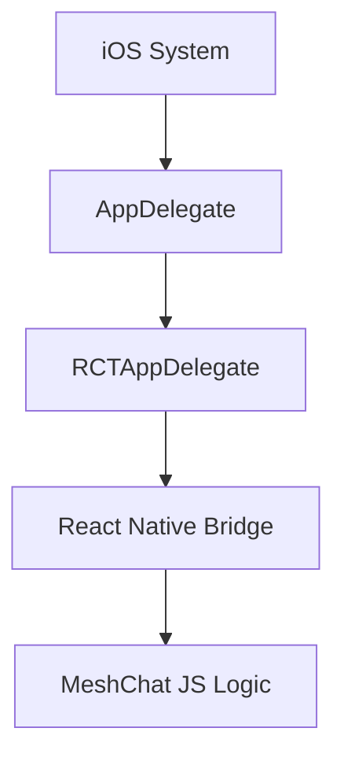

# iOS Native Integration

The iOS implementation of MeshChat utilizes the React Native framework to bridge high-level messaging logic with native system capabilities. This section covers the entry points and configuration required to initialize the application on iOS devices.

## Architecture Overview

The iOS native layer serves as the host for the React Native bridge, managing the application lifecycle and providing the necessary environment for the MeshChat JavaScript bundle to execute.



## Application Entry Point

The primary entry point for the iOS application is the `AppDelegate`. It is responsible for initializing the root view and managing the connection between the native iOS environment and the React Native runtime.

### AppDelegate.h

The `AppDelegate` class inherits from `RCTAppDelegate`, which provides the standard implementation for loading the JS bundle and creating the `RCTBridge`.

```objectivec
#import <RCTAppDelegate.h>
#import <UIKit/UIKit.h>

@interface AppDelegate : RCTAppDelegate

@end
```

Key responsibilities of this component include:
- **Lifecycle Management**: Handling app launch, backgrounding, and termination.
- **Bridge Initialization**: Configuring the bridge that allows JavaScript to call native iOS modules.
- **Root View Setup**: Initializing the main UI container that renders the MeshChat interface.

## Resource Management

MeshChat manages its visual assets through Xcode Asset Catalogs. This ensures that images are optimized for different screen densities (@2x, @3x) and device types.

### Asset Catalogs

The project utilizes `Images.xcassets` to store static resources. The `Contents.json` file tracks the versioning and metadata of these assets:

```json
{
  "info" : {
    "version" : 1,
    "author" : "xcode"
  }
}
```

## Installation and Configuration

To properly integrate the native iOS components, follow these steps:

1. **Install Dependencies**: Use CocoaPods to install the required native modules.
   ```bash
   cd ios && pod install && cd ..
   ```

2. **Build Target**: Open `MeshChat.xcworkspace` in Xcode and ensure the build target is set to a physical iOS device or a compatible simulator.

3. **Provisioning**: Configure the appropriate Development Team and Bundle Identifier in the **Signing & Capabilities** tab to allow the app to run on physical hardware.