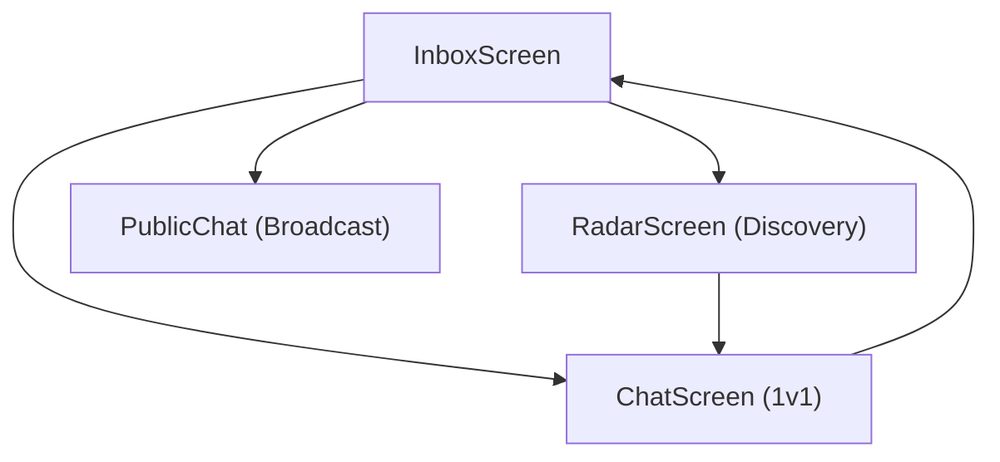

# User Interface & Screens

MeshChat employs a reactive, state-driven user interface built with React Native. The UI is designed to provide immediate feedback on the volatile nature of Bluetooth Low Energy (BLE) connections, using a high-contrast "terminal" aesthetic.

## UI Architecture Flow

The application follows a hub-and-spoke navigation model where the Inbox serves as the primary state coordinator for the BLE mesh.

## Global Components

### StatusBanner
The `StatusBanner` is a high-priority notification component rendered at the top of primary screens. It monitors the `BLEService` to alert users of hardware or OS-level blockers.

| State | Trigger | Visual Cue | Action Required |
| :--- | :--- | :--- | :--- |
| **Bluetooth Off** | `btState === 'PoweredOff'` | Brown Bar | Enable Bluetooth in System Settings |
| **Changing State** | `TurningOn` or `TurningOff` | Blue Bar | Wait for hardware initialization |
| **Permissions** | `permsOk === false` | Red Bar | Grant Location/BLE permissions |

## Primary Screens

### InboxScreen
The Inbox is the central hub. It initializes the BLE stack and manages the "Auto-Mesh" lifecycle.

**Key Logic:**
- **Auto-Mesh Initialization:** Upon mounting, the screen calls `BLEService.get().startAutoMesh()`, enabling the device to be both discoverable and a scanner.
- **Peer Categorization:** The screen dynamically splits connected peers into two lists:
    1. **Nearby:** Peers currently connected via BLE who do not have an existing entry in `StorageService`.
    2. **Conversations:** Peers with stored message history, regardless of current online status.
- **Public Channel:** A dedicated entry point for broadcasting messages to all nodes in the immediate mesh.

### ChatScreen
The `ChatScreen` handles 1v1 asynchronous messaging using a combination of real-time BLE events and local persistence.

**Technical Implementation:**
- **Message Lifecycle:**
    - **Sending:** Messages are passed through `MessageProtocol.createId()`, saved to `StorageService`, and then transmitted via `BLEService.send()`.
    - **Receiving:** A listener on the `message` event filters incoming payloads by `peerMac`.
- **Connection Resilience:** 
    - The screen monitors the `disconnect` event.
    - If a connection is lost, a **Reconnect Banner** appears, allowing the user to trigger `BLEService.reconnect(peerMac)` without leaving the chat context.
- **UX Features:** Implements `KeyboardAvoidingView` and `FlatList` with `scrollToEnd` to ensure a standard messaging experience.

### RadarScreen
The Radar provides a manual override for peer discovery, useful for debugging or finding specific devices in noisy environments.

**Core Functionality:**
- **Manual Scanning:** Unlike the Inbox's background mesh, the Radar allows users to explicitly start/stop scanning via `BLEService.startScan()`.
- **Signal Strength (RSSI):** Displays the signal strength of discovered peers using a visual bar indicator:
    - `▓▓▓` (> -60dBm): Strong
    - `▓▓░` (-60 to -80dBm): Moderate
    - `▓░░` (< -80dBm): Weak
- **BLE Console:** Includes a real-time log view that surfaces internal BLE events (e.g., `RADAR_READY`, `FOUND: [Name]`), providing transparency into the discovery process.
- **Direct Connection:** Tapping a discovered peer triggers `connectTo(deviceId)`, which, upon success, navigates the user directly to the `ChatScreen`.