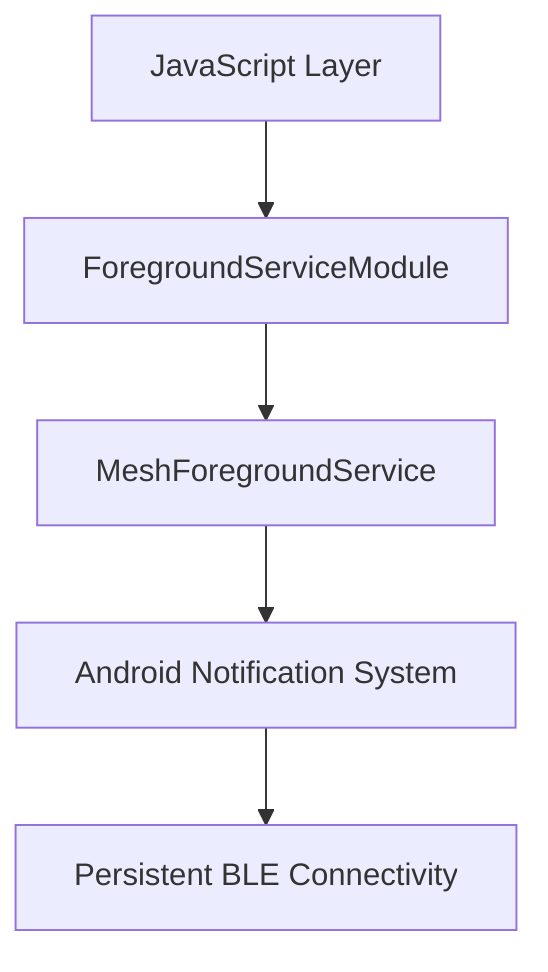

# Android Native Implementation

To maintain reliable Bluetooth Low Energy (BLE) connectivity on Android, MeshChat implements a custom Native Module and a Foreground Service. Android's aggressive battery optimization typically kills background processes; a Foreground Service ensures the application remains active and capable of scanning for and advertising mesh packets even when the UI is not in the foreground.

## Architecture Overview

The implementation follows a bridge pattern where the JavaScript layer communicates with a Java module, which in turn manages the lifecycle of a persistent Android Service.

## Native Module Components

### 1. ForegroundServiceModule
The `ForegroundServiceModule` acts as the API gateway. It extends `ReactContextBaseJavaModule` to expose two primary methods to the React Native environment:

- **`start()`**: Initiates the service. It includes a conditional check for `Build.VERSION_CODES.O` (Android 8.0) to use `startForegroundService` instead of the legacy `startService`, ensuring compatibility with modern Android background execution limits.
- **`stop()`**: Gracefully terminates the service and removes the associated notification.

Both methods utilize `Promise` objects to communicate success or failure back to the JavaScript layer.

### 2. MeshForegroundService
This is the core engine that prevents the OS from suspending the app. It extends the Android `Service` class and implements the following critical behaviors:

- **Persistence**: By returning `START_STICKY` in `onStartCommand`, the service tells the Android OS to attempt to recreate the service if it is killed due to memory pressure.
- **User Visibility**: Android requires any foreground service to display a non-dismissible notification. The service creates a `NotificationChannel` (required for API 26+) and builds a notification with `setOngoing(true)`, informing the user that MeshChat is "Listening for nearby messages."
- **Execution Safety**: The implementation explicitly calls `startForeground()` within the mandatory 5-second window after `onStartCommand` to avoid "Foreground Service Did Not Start" crashes.

### 3. ForegroundServicePackage
The `ForegroundServicePackage` is the boilerplate registration class. It implements `ReactPackage` to wrap the `ForegroundServiceModule` and inject it into the React Native bridge during the application's startup sequence.

## Technical Specifications

| Feature | Implementation Detail | Purpose |
| :--- | :--- | :--- |
| **Service Type** | `Foreground Service` | Prevents process death during background BLE operations. |
| **Restart Policy** | `START_STICKY` | Ensures the mesh node remains active after OS-level reclaims. |
| **Notification** | `IMPORTANCE_LOW` | Provides visibility without interrupting the user with sound/popups. |
| **API Compatibility** | `Build.VERSION_CODES.O` | Handles the transition to Notification Channels and foreground requirements. |
| **Context** | `ReactApplicationContext` | Allows the module to access the global application context for starting services. |

## Lifecycle Flow

1. **Trigger**: JS calls `MeshForegroundService.start()`.
2. **Bridge**: `ForegroundServiceModule` sends an `Intent` to `MeshForegroundService`.
3. **Initialization**: `onCreate()` initializes the `NotificationChannel`.
4. **Activation**: `onStartCommand()` builds a `PendingIntent` (linking the notification to `MainActivity`) and invokes `startForeground()`.
5. **Stability**: The app is now promoted to a "Foreground" state in the eyes of the Android Low Memory Killer (LMK), ensuring BLE scanning/advertising persists.