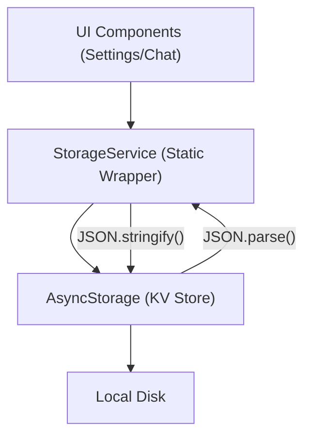

# Data Management

MeshChat utilizes a centralized persistence layer to ensure that user identity, peer metadata, and conversation histories are maintained across application sessions. To maximize reliability and minimize side effects, all disk I/O is encapsulated within a dedicated service wrapper.

## Persistence Architecture

The application employs a **Service-to-Storage** pattern. The `StorageService` acts as the exclusive gateway to the device's local storage, ensuring that key naming conventions are consistent and data serialization is handled uniformly.



## Data Schema

All stored keys are prefixed with `@meshchat:` to prevent collisions with other application data.

| Key Pattern | Data Type | Description |
| :--- | :--- | :--- |
| `@meshchat:username` | `String` | The local user's display name. |
| `@meshchat:chat:<peerMac>` | `Array<Object>` | Chronological list of messages for a specific peer. |
| `@meshchat:peer:<peerMac>` | `Object` | Metadata including `name` and `lastSeen` timestamp. |
| `@meshchat:channel:public` | `Array<Object>` | Global mesh messages (limited to `MAX_PUBLIC_MESSAGES`). |

## Core Functionalities

### 1. User Identity
The `StorageService` manages the local user's display name, which is broadcasted to other peers during the BLE handshake process.

```javascript
// Example: Updating the display name
await StorageService.setUsername("Alice");
const name = await StorageService.getUsername();
```

### 2. Peer-to-Peer History
Conversations are stored per-peer using their unique MAC address as the identifier. This ensures that chat histories are isolated and easily retrievable.

- **Saving:** Messages are appended to a JSON array and persisted.
- **Retrieval:** Messages are fetched and sorted by timestamp to ensure correct chronological rendering.
- **Conversation List:** The `getConversations()` method scans all keys matching the chat prefix to build an inbox view, including the latest message snippet and peer name.

### 3. Public Channel Management
The public channel acts as a shared broadcast space. To prevent unbounded storage growth, this channel implements a **Circular Buffer** logic:
- New messages are appended.
- If the length exceeds `MAX_PUBLIC_MESSAGES`, the oldest messages are sliced off.
- Deduplication is performed via message IDs to prevent redundant entries from mesh re-broadcasts.

## Data Lifecycle & Maintenance

### Clearing Data
The `SettingsScreen` provides a destructive action to wipe all application data. This is implemented via `StorageService.clearAll()`, which retrieves all keys starting with the `@meshchat:` prefix and removes them in a single batch operation.

### Peer Metadata
Peer information (names and timestamps) is stored separately from message history. This allows the application to display a peer's name in the inbox even if the message history for that specific peer has been deleted.

## Implementation Details: StorageService

The `StorageService` uses static methods to provide a singleton-like interface across the app:

```javascript
class StorageService {
    static async saveMessage(peerMac, message) {
        const key = `${CHAT_PREFIX}${peerMac}`;
        const existing = await AsyncStorage.getItem(key);
        const messages = existing ? JSON.parse(existing) : [];
        messages.push(message);
        await AsyncStorage.setItem(key, JSON.stringify(messages));
    }
    
    // ... other methods
}
```

## Constraints & Considerations

- **Storage Limit:** Since `AsyncStorage` is used, large chat histories may eventually hit platform-specific limits.
- **Serialization Overhead:** Because data is stored as JSON strings, frequently updating very large arrays can lead to performance degradation; the public channel's truncation strategy is the primary mitigation for this.
- **Async Nature:** All storage operations are asynchronous and return Promises, necessitating `async/await` patterns in the UI layer to prevent race conditions during screen transitions.