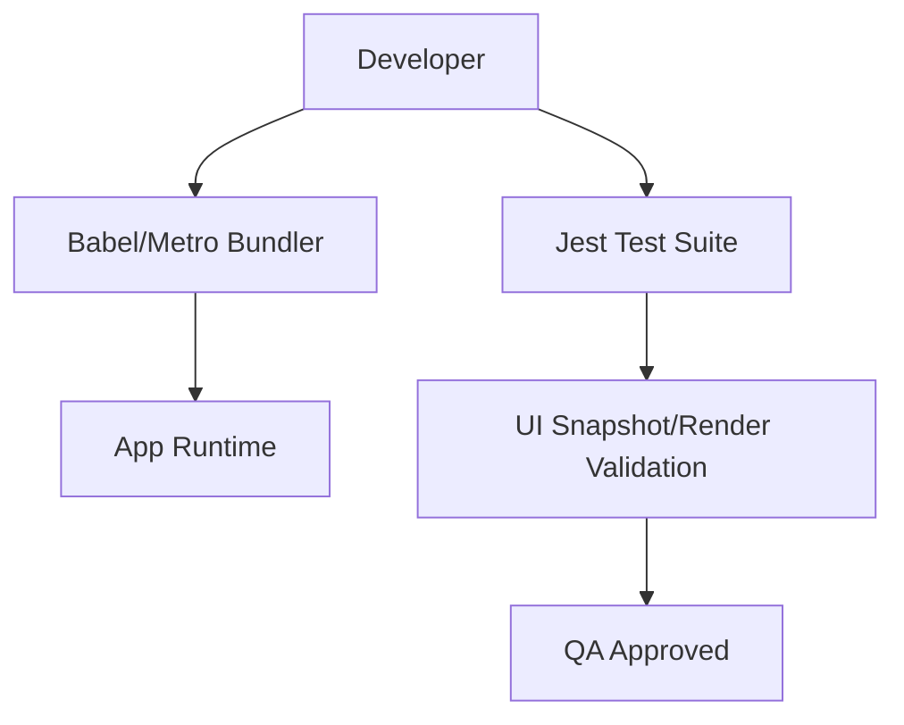

# Development and Quality Assurance

This section outlines the tooling, configuration, and testing strategies used to maintain the stability and performance of MeshChat.

## Development Environment

MeshChat leverages the standard React Native toolchain to ensure a consistent build pipeline across different development environments.

### Build and Bundling
The project uses **Metro** as the JavaScript bundler and **Babel** for transpilation.

- **Metro Configuration**: Defined in `metro.config.js`, the project utilizes `mergeConfig` and `getDefaultConfig` from `@react-native/metro-config` to maintain a lean configuration while inheriting the necessary defaults for the React Native ecosystem.
- **Babel Configuration**: The project uses the `@react-native/babel-preset` to ensure compatibility with modern JavaScript syntax and React Native specifics.

```javascript
// babel.config.js
module.exports = {
  presets: ['module:@react-native/babel-preset'],
};
```

## Quality Assurance

Quality is enforced through automated testing and a structured validation pipeline.

### Testing Framework
MeshChat uses **Jest** as the primary testing framework. The configuration is optimized for the React Native environment via the `react-native` preset.

#### Component Testing
Component rendering is validated using `react-test-renderer`. This allows developers to verify that components render the correct UI structure without requiring a full device emulator.

**Example Test Structure (`__tests__/App.test.tsx`):**
- **Imports**: Explicitly imports `it` from `@jest/globals` for strict typing.
- **Execution**: Uses `renderer.create()` to instantiate the root `App` component and verify its structural integrity.

```typescript
import renderer from 'react-test-renderer';

it('renders correctly', () => {
  renderer.create(<App />);
});
```

### Development Workflow

The following diagram illustrates the flow from code implementation to quality validation:



## Execution Commands

To maintain quality during development, use the following commands:

| Action | Command | Description |
| :--- | :--- | :--- |
| **Run Tests** | `npm test` | Executes the Jest test suite. |
| **Start Bundler** | `npm start` | Launches the Metro bundler. |
| **Linting** | `npm run lint` | (If configured) Validates code style. |