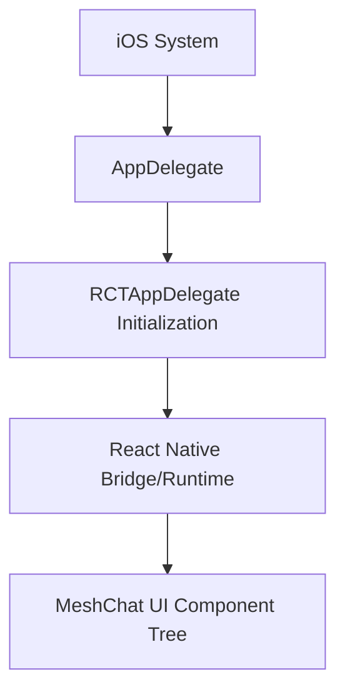

# iOS Configuration

This section outlines the native iOS configuration required to initialize the MeshChat application. The project follows the standard React Native architecture, utilizing a centralized `AppDelegate` for lifecycle management and an Xcode asset catalog for resource handling.

## Application Entry Point

The `AppDelegate` serves as the root entry point for the iOS application. MeshChat utilizes `RCTAppDelegate` to streamline the initialization of the React Native bridge and the root view controller.

### AppDelegate.h
The header file defines the interface for the application delegate, inheriting from the React Native base class to ensure compatibility with the framework's runtime requirements.

```objectivec
#import <RCTAppDelegate.h>
#import <UIKit/UIKit.h>

@interface AppDelegate : RCTAppDelegate

@end
```

## Asset Management

MeshChat manages its visual assets through the Xcode Asset Catalog system. This allows for optimized image delivery across different device resolutions (@2x, @3x).

### Asset Catalog Structure
All images, app icons, and launch screens are stored within `Images.xcassets`. The `Contents.json` file maintains the metadata and mapping for these resources.

```json
{
  "info" : {
    "version" : 1,
    "author" : "xcode"
  }
}
```

## Boot Sequence

The following diagram illustrates the initialization flow from the iOS system launch to the rendering of the React Native UI.



## Configuration Requirements

To ensure the application runs correctly on iOS, verify the following:

1.  **Xcode Version**: Ensure you are using the latest stable version of Xcode.
2.  **CocoaPods**: Run `pod install` within the `ios/` directory to link the `RCTAppDelegate` and other native dependencies.
3.  **Bundle Identifier**: Ensure the bundle identifier in the project settings matches your deployment environment.