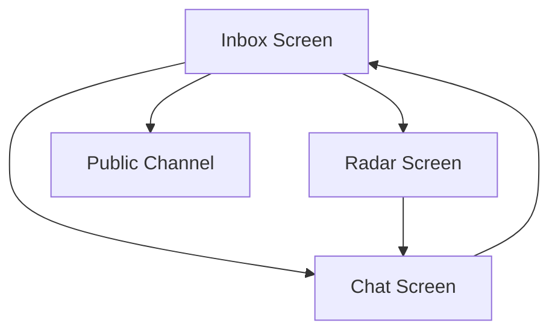

# User Interface & Screens

MeshChat utilizes a high-contrast, terminal-inspired design language optimized for low-light environments and technical clarity. The UI is built as a series of specialized screens that interface directly with the `BLEService` and `StorageService` to provide real-time P2P connectivity status.

## Navigation Architecture

The application follows a hub-and-spoke navigation model, where the Inbox serves as the primary coordination center.

---

## Screen Specifications

### 1. Inbox Screen (`InboxScreen.jsx`)
The Inbox is the central hub for managing all mesh connections. It orchestrates the automatic mesh networking logic.

**Key Responsibilities:**
- **Auto-Mesh Initialization**: Triggers `BLEService.startAutoMesh()` on mount to ensure the device is always discoverable and scanning.
- **Peer Categorization**:
    - **Nearby**: Peers discovered via BLE that do not yet have a stored message history.
    - **Conversations**: Peers with existing message history retrieved from `StorageService`.
- **Connection Tracking**: Displays a real-time count of connected peers using `BLEService.connectedCount()`.

**User Interactions:**
- **Public Channel**: Navigates to a broadcast-style chat for all nearby peers.
- **Conversation Management**: Long-pressing a conversation allows the user to delete the local history.

### 2. Chat Screen (`ChatScreen.jsx`)
A dedicated 1v1 messaging interface that handles the lifecycle of a specific peer-to-peer connection.

**Key Responsibilities:**
- **State Synchronization**: Monitors the connection status of the specific `peerMac`. If the peer disconnects, the UI updates the header status and displays a "Connection lost" banner.
- **Message Persistence**: Integrates with `StorageService` to load historical messages on mount and save new messages immediately upon sending.
- **Protocol Handling**: Uses `MessageProtocol` to generate unique IDs for every message to prevent duplicates during mesh synchronization.

**Technical Features:**
- **Reconnection Logic**: Provides a `handleReconnect` function that attempts to re-establish the BLE link without returning to the Inbox.
- **Auto-Scroll**: Utilizes a `FlatList` ref to ensure the view automatically scrolls to the most recent message.

### 3. Radar Screen (`RadarScreen.jsx`)
A diagnostic and manual discovery tool for users who need precise control over their connections.

**Key Responsibilities:**
- **Manual Scanning**: Overrides the auto-mesh behavior to perform a targeted scan for BLE peripherals.
- **Signal Analysis**: Displays the RSSI (Received Signal Strength Indicator) for discovered peers, providing a visual representation of distance (e.g., `▓▓▓` for strong signals).
- **Event Logging**: Features an integrated "Console" that streams internal BLE events (e.g., `RADAR_READY`, `FOUND`, `CONNECT_FAILED`) for debugging.

**Workflow:**
`SCAN` $\rightarrow$ `Discovery Event` $\rightarrow$ `Peer Selection` $\rightarrow$ `ConnectTo()` $\rightarrow$ `Navigation to Chat`.

---

## Shared UI Components

### StatusBanner (`StatusBanner.jsx`)
The `StatusBanner` is a global notification component injected into every major screen to provide immediate feedback on hardware and system constraints.

It listens to `BLEService` events and renders conditionally based on the following states:

| Condition | Visual Indicator | Message |
| :--- | :--- | :--- |
| `bt === 'PoweredOff'` | Brown Bar / Yellow Text | 📡 Bluetooth is disabled |
| `bt === 'TurningOn/Off'` | Dark Blue Bar / Light Blue Text | ⏳ Bluetooth is changing state... |
| `permsOk === false` | Dark Red Bar / Pink Text | 🔒 Permissions required |

If all conditions are met (Bluetooth is on and permissions are granted), the component returns `null` to maximize screen real estate.