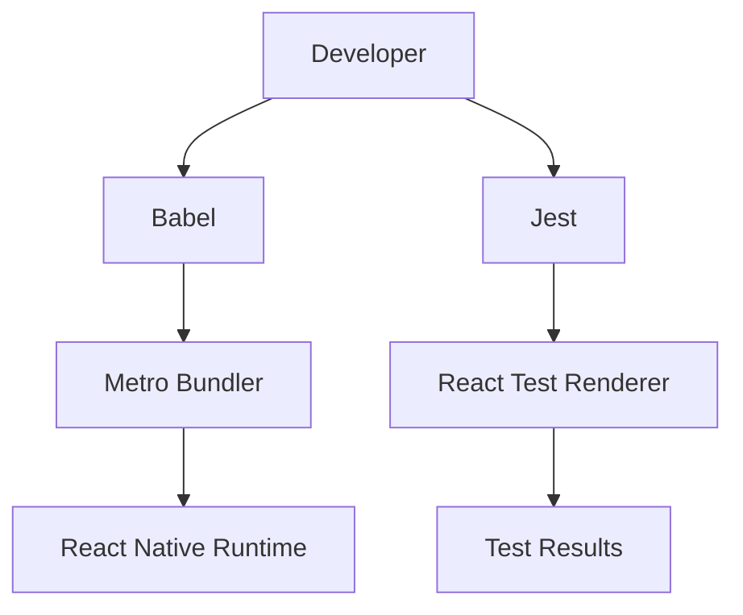

# Development & Configuration

This section provides a comprehensive guide to the build system, transpilation pipeline, and testing environment used in MeshChat.

## Technical Stack Overview

MeshChat utilizes the standard React Native toolchain to ensure cross-platform compatibility and optimized bundle delivery.



## Build System

### Metro Bundler
The project uses **Metro**, a JavaScript bundler specifically optimized for React Native. The configuration is managed via `metro.config.js`.

The current setup utilizes `mergeConfig` to combine the default React Native configuration with project-specific overrides, ensuring stability while allowing for future extensibility.

### Babel Configuration
Transpilation is handled by **Babel**, allowing the use of modern ECMAScript features. The configuration is defined in `babel.config.js`:

```javascript
module.exports = {
  presets: ['module:@react-native/babel-preset'],
};
```
This preset ensures that JSX and TypeScript are correctly transformed for the React Native environment.

## Testing Environment

MeshChat employs a robust testing strategy using **Jest** and **React Test Renderer** to verify component integrity.

### Jest Configuration
The testing framework is configured via `jest.config.js`, utilizing the `react-native` preset to handle the transformation of native modules and assets.

```javascript
module.exports = {
  preset: 'react-native',
};
```

### Writing Tests
Tests are located within the `__tests__` directory. The project uses a snapshot-style rendering approach to verify UI consistency.

**Example Test Structure (`App.test.tsx`):**
- **React Native Mocking**: `import 'react-native'` is required to initialize the environment.
- **Test Renderer**: `react-test-renderer` is used to render components into a pure JavaScript object for assertions.
- **Global Types**: Explicitly importing `{it}` from `@jest/globals` ensures full TypeScript type safety for test suites.

```tsx
import 'react-native';
import React from 'react';
import App from '../App';
import {it} from '@jest/globals';
import renderer from 'react-test-renderer';

it('renders correctly', () => {
  renderer.create(<App />);
});
```

## Development Workflow

### Running the Project
To start the development server and build the application, use the standard React Native CLI commands:

1. **Start Metro Bundler**: `npm start` or `yarn start`
2. **Run on iOS**: `npm run ios`
3. **Run on Android**: `npm run android`

### Executing Tests
Run the test suite using the following command:

```bash
npm test