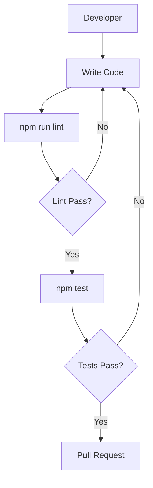

# Development & Quality Assurance

This section provides comprehensive guidelines for setting up the development environment, maintaining code quality through linting, and ensuring application stability via the test suite for MeshChat.

## Development Environment

MeshChat is built with React Native and TypeScript. To ensure compatibility across development machines, adhere to the following system requirements.

### Prerequisites

- **Node.js**: version `18` or higher (as specified in `package.json`).
- **React Native CLI**: Installed and configured for your target platform (Android/iOS).
- **Android Studio / Xcode**: Necessary for emulator and physical device deployment.

### Getting Started

1. **Install Dependencies**:
   ```bash
   npm install
   ```

2. **Start the Metro Bundler**:
   ```bash
   npm start
   ```

3. **Launch the Application**:
   - For Android: `npm run android`
   - For iOS: `npm run ios`

## Quality Assurance Workflow

MeshChat employs a strict quality gate to prevent regressions and ensure code consistency across the codebase.




## Linting and Formatting

To maintain a clean and readable codebase, we use ESLint and Prettier. The project is configured with the standard `@react-native/eslint-config`.

### Running the Linter

Execute the following command to check for code style violations and potential bugs:

```bash
npm run lint
```

This script runs `eslint .` across the entire project directory. It is recommended to run this command locally before committing any changes.

## Testing Suite

MeshChat utilizes **Jest** as the primary testing framework, integrated with `react-test-renderer` for snapshot and component testing.

### Configuration

The test environment is configured via `jest.config.js` using the `react-native` preset, which ensures that React Native components and modules are correctly mocked and transformed.

```javascript
// jest.config.js
module.exports = {
  preset: 'react-native',
};
```

### Running Tests

To execute the full test suite, run:

```bash
npm test
```

### Writing Tests

Tests are located in the `__tests__` directory. When creating new tests, ensure you import types explicitly from `@jest/globals` to maintain type safety.

**Example Test Structure (`App.test.tsx`):**

```tsx
import 'react-native';
import React from 'react';
import App from '../App';
import { it } from '@jest/globals';
import renderer from 'react-test-renderer';

it('renders correctly', () => {
  renderer.create(<App />);
});
```

### Testing Guidelines

- **Component Isolation**: Test UI components in isolation using `react-test-renderer`.
- **Dependency Mocking**: For modules like `react-native-ble-plx` or `async-storage`, use `jest.mock()` to simulate hardware behavior without requiring a physical device.
- **Type Safety**: Always leverage TypeScript types for test props and state to avoid runtime errors during the test phase.