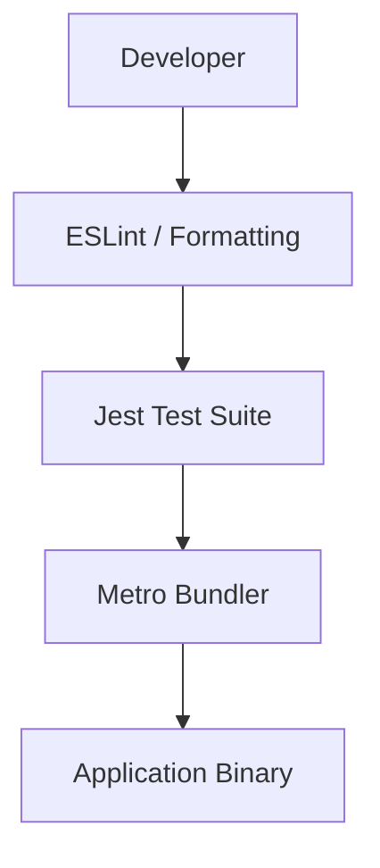

# Development & Quality Assurance

This section outlines the toolchain and quality gates implemented in MeshChat to ensure code consistency, stability, and efficient builds.

## Toolchain Overview

MeshChat utilizes a standard React Native development stack. The workflow integrates static analysis via ESLint, unit testing via Jest, and bundling via Metro.



## Static Analysis & Linting

To maintain a consistent codebase and prevent common runtime errors, the project employs **ESLint**.

The configuration is defined in `.eslintrc.js` and extends the official React Native guidelines:

```javascript
module.exports = {
  root: true,
  extends: '@react-native',
};
```

### Quality Standards
- **Rule Set**: Inherits all recommended rules from `@react-native`.
- **Scope**: Applies to all JavaScript and TypeScript files within the project root.

## Testing Framework

Quality assurance is managed through **Jest**, configured specifically for the React Native environment.

### Configuration
The `jest.config.js` file utilizes the `react-native` preset to handle asset transformation and module resolution:

```javascript
module.exports = {
  preset: 'react-native',
};
```

### Component Testing
UI components are verified using `react-test-renderer`. Tests are located in the `__tests__` directory. A typical test case validates the correct rendering of the component tree:

```tsx
import 'react-native';
import React from 'react';
import App from '../App';
import {it} from '@jest/globals';
import renderer from 'react-test-renderer';

it('renders correctly', () => {
  renderer.create(<App />);
});
```

## Build Toolchain

### Metro Bundler
MeshChat uses **Metro** as its JavaScript bundler. The configuration in `metro.config.js` follows a modular approach, merging project-specific overrides with the default React Native configuration.

```javascript
const {getDefaultConfig, mergeConfig} = require('@react-native/metro-config');

const config = {};

module.exports = mergeConfig(getDefaultConfig(__dirname), config);
```

### Build Pipeline
1. **Resolution**: Metro resolves module dependencies.
2. **Transformation**: Babel transforms JSX and TypeScript into standard JavaScript.
3. **Bundling**: Metro combines all modules into a single JavaScript bundle for the target platform (iOS/Android).