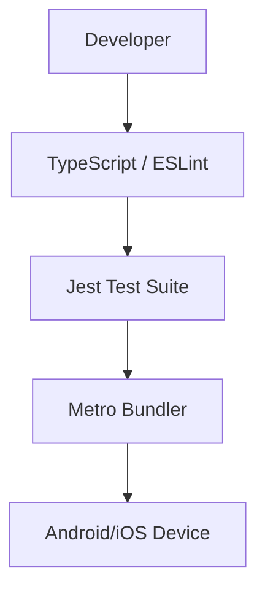

# Development & Testing

MeshChat utilizes a standardized React Native toolchain to ensure code quality, type safety, and UI consistency. This section covers the build configuration, linting process, and the test suite.

## Toolchain Overview

The project leverages the following core technologies for development:

- **TypeScript**: Provides static type checking to prevent runtime errors.
- **Jest**: The primary testing framework for unit and integration tests.
- **ESLint**: Enforces coding standards and identifies problematic patterns.
- **Prettier**: Ensures consistent code formatting across the codebase.
- **Babel**: Transpiles modern JavaScript and JSX for compatibility with the React Native environment.



## Quality Assurance Workflow

### Linting
To maintain a clean codebase and adhere to the `@react-native/eslint-config` standards, run the linting script:

```bash
npm run lint
```

This command scans the project for syntax errors and style violations, ensuring that all contributors follow the same architectural patterns.

### Testing
MeshChat uses **Jest** combined with `react-test-renderer` to verify component integrity.

#### Running Tests
Execute the test suite using the following command:

```bash
npm test
```

#### Test Implementation
The project implements render tests to ensure that the application root and its child components mount without crashing. 

**Example: `__tests__/App.test.tsx`**
The test suite validates the `App` component by attempting to create a renderer instance:

```tsx
import 'react-native';
import React from 'react';
import App from '../App';
import { it } from '@jest/globals';
import renderer from 'react-test-renderer';

it('renders correctly', () => {
  renderer.create(<App />);
});
```

## Configuration Details

### Build Configuration
The project uses a standard Babel configuration to support the React Native ecosystem:

- **`babel.config.js`**: Uses `module:@react-native/babel-preset` to handle JSX and modern JS features.
- **`jest.config.js`**: Configured with the `react-native` preset to properly handle assets and native module mocks.

### Environment Requirements
To ensure consistent builds, the following engine requirement is enforced:

- **Node.js**: `>=18`

## Development Scripts

| Command | Description |
| :--- | :--- |
| `npm run android` | Builds and launches the app on an Android emulator/device. |
| `npm run ios` | Builds and launches the app on an iOS simulator/device. |
| `npm run start` | Starts the Metro Bundler. |
| `npm run lint` | Runs ESLint to check for code quality issues. |
| `npm test` | Executes all tests defined in the `__tests__` directory. |