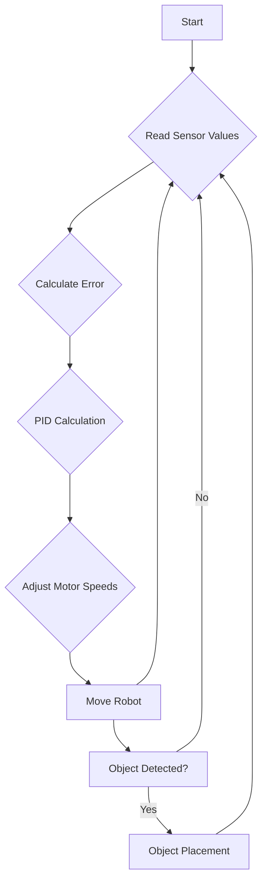
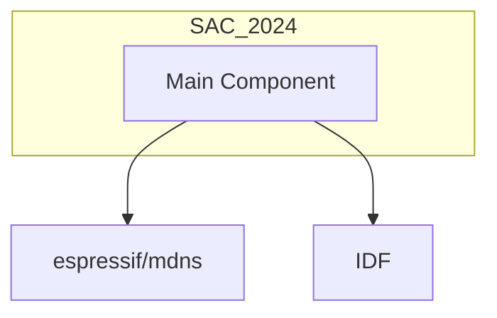

# Project Overview

This document provides a high-level overview of the SAC_2024 project, which focuses on developing a line-following robot capable of navigating a maze and placing objects. The robot utilizes five TCRT1000 infrared sensors and a PID control algorithm for accurate line tracking. The project is designed for the ESP32 microcontroller platform, making it suitable for educational robotics and industrial automation applications.

## Key Features

*   **Line Following:** Employs five TCRT1000 IR sensors to detect and follow a white line on a dark surface.
*   **PID Control:** Utilizes a PID (Proportional-Integral-Derivative) algorithm to maintain smooth and accurate line tracking.
*   **Maze Solving:** Designed to navigate complex mazes by following predefined paths.
*   **Object Placement:** Capable of picking up and placing objects at designated locations.
*   **ESP32 Platform:** Implemented on the ESP32 microcontroller, offering a balance of performance and cost-effectiveness.

## Hardware Components

The robot consists of the following major hardware components:

*   **Microcontroller:** ESP32
*   **Sensors:** 5x TCRT1000 IR sensors
*   **Motors:** 2x DC Motors with Motor Driver (TB6612FNG)
*   **Power Supply:** 3x Li-ion Battery Pack (12V)
*   **Chassis:** 3-wheel robot chassis (2 motors + 1 castor wheel)

## Software Architecture

The software architecture revolves around sensor data acquisition, PID control, and motor control.  The ESP-IDF framework is used for development.

### PID Control Algorithm Details

The PID control algorithm is central to the robot's line-following capabilities.  The algorithm calculates the necessary motor speed adjustments to keep the robot centered on the line.

```
Error = Setpoint - Sensor_Position
PID_output = (Kp * Error) + (Ki * Integral) + (Kd * Derivative)
```

Where:

*   `Kp` (Proportional Gain): Controls the response based on the current error.
*   `Ki` (Integral Gain): Adjusts for past errors to eliminate steady-state errors.
*   `Kd` (Derivative Gain): Predicts future errors and dampens oscillations.

## Code Snippets

### Reading Sensor Values

This snippet shows how the robot reads analog values from the TCRT1000 IR sensors.

```cpp
// Example (This is conceptual, actual ESP-IDF code will differ)
int sensorValues[5];
for (int i = 0; i < 5; i++) {
  sensorValues[i] = analogRead(sensorPins[i]);
}
```

[View on GitHub](https://github.com/shinymack/SAC_2024/blob/main/line_following/main/idf_component.yml)

### PID Calculation (Conceptual)

This snippet illustrates the PID calculation.  Note that the ESP-IDF would use specific hardware and timer functions that are not shown here.

```cpp
float error = setpoint - sensorPosition;
integral += error;
float derivative = error - previousError;
float pidOutput = (Kp * error) + (Ki * integral) + (Kd * derivative);
previousError = error;
```

### Motor Control (Conceptual)

```cpp
// Example - Adjust motor speeds based on PID output
void setMotorSpeed(int motor1Speed, int motor2Speed) {
  // Code to control motor driver with given speeds
}

setMotorSpeed(baseSpeed + pidOutput, baseSpeed - pidOutput);
```

### idf_component.yml

The `idf_component.yml` file manages the project's dependencies.

```yaml
dependencies:
  espressif/mdns: "^1.0.7"
  idf:
    version: ">=4.1.0"
```

[View on GitHub](https://github.com/shinymack/SAC_2024/blob/main/line_following/main/idf_component.yml)

## Adjusting PID Parameters

Tuning the PID parameters is crucial for optimal performance. The suggested approach is:

*   Start with `Kp` to get a basic response.
*   Increase `Kd` to reduce oscillations.
*   Tune `Ki` to minimize steady-state error.

## Video Demonstration
The following video demonstrates the SAC Finals:
[https://drive.google.com/file/d/1jiYRGQWqHMdFfAtZDlvRXE6fJCm3Wj6X/view?usp=drive_link ](https://drive.google.com/file/d/1jwIqWakAozG5SfbpKLwxp1zVBzRboQ-u/view?usp=drive_link)

## Future Enhancements

*   Implementing adaptive PID tuning
*   Integrating machine learning for path optimization

## Control Flow Diagram





## Component Dependency Diagram





## Key Integration Points

The key integration points involve the sensor readings being fed into the PID controller, and the PID output being used to control the motor driver. Proper calibration of the sensors and tuning of the PID parameters are essential for achieving accurate and reliable line following.

Best practices include using interrupts for sensor readings to ensure timely data acquisition, and implementing a robust error handling mechanism to deal with unexpected situations. The ESP-IDF framework provides a rich set of APIs for managing hardware resources and implementing real-time control algorithms.
```