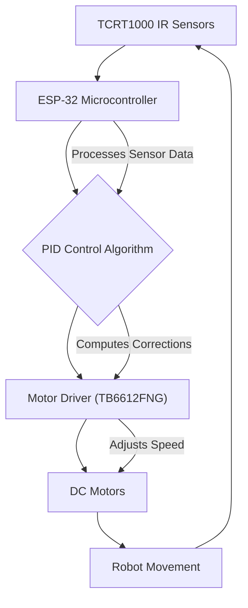

# Project Overview

This documentation provides a high-level introduction to the SAC 2024 Line Following project, detailing its purpose, core components, and operational principles. The project focuses on designing and implementing an autonomous robot capable of maze solving and object placement, leveraging precise line tracking through a PID (Proportional-Integral-Derivative) control algorithm.

## Project Purpose and Scope

The primary objective of this project is to develop a robust robot system that can navigate complex mazes by following a white line on a dark surface and perform object placement tasks. The robot employs a sophisticated control mechanism to ensure smooth, accurate, and stable movement throughout its operation.

## Major Components

The robot's functionality relies on a carefully selected set of hardware components that work in conjunction to achieve autonomous line following and control.

```plaintext
- Microcontroller: ESP-32
- Sensors: 5x TCRT1000 IR sensors
- Motors: 2x DC Motors with Motor Driver (TB6612FNG)
- Power Supply: 3x Li-ion Battery Pack (12V)
- Chassis: 3-wheel robot chassis (2 motors + 1 castor wheel for stability)
```

## Working Principle

The robot's operation follows a sequential process, integrating sensor input with control algorithms to dictate motor actions.

1.  **Sensor Input**: Five TCRT1000 infrared sensors continuously scan the surface, detecting reflections from the white line and providing analog values to the microcontroller.
2.  **Data Processing**: The ESP-32 microcontroller processes these sensor readings to accurately determine the robot's current position relative to the white line.
3.  **PID Control**: A PID control algorithm calculates the necessary adjustments to the motor speeds to correct any deviation and keep the robot centered on the line.
4.  **Motor Control**: The computed control signals are sent to the TB6612FNG motor driver, which then precisely adjusts the PWM (Pulse Width Modulation) of the DC motors, thereby controlling their speed and direction.

## System Flow Diagram

The following diagram illustrates the high-level operational flow of the robot's control system:





## PID Control Algorithm

The PID control algorithm is central to the robot's ability to maintain accurate line tracking and minimize oscillations. It continuously computes an output based on the current error, accumulated past errors, and predicted future errors.

The fundamental formula for the PID output is:

```plaintext
Error = Setpoint - Sensor_Position
PID_output = (Kp * Error) + (Ki * Integral) + (Kd * Derivative)
```

Where:
*   **Kp (Proportional Gain)**: Responds to the current error, providing a corrective action proportional to how far off the robot is from the line.
*   **Ki (Integral Gain)**: Addresses steady-state errors by accumulating past errors, helping the robot settle precisely on the line over time.
*   **Kd (Derivative Gain)**: Anticipates future errors and dampens oscillations by considering the rate of change of the error, contributing to smoother movements.

### Adjusting PID Parameters

Tuning the PID parameters (Kp, Ki, Kd) is crucial for optimal performance. A common approach involves an iterative process:

```plaintext
1. Start with Kp to get a basic response.
2. Increase Kd to reduce oscillations.
3. Tune Ki to minimize steady-state error.
```

## Applications and Future Enhancements

The principles and implementation within this project have broad applications, including:
*   Autonomous navigation systems in warehouses.
*   Educational robotics for STEM learning.
*   Industrial automation where precise path following is required.

Future enhancements for this project could include:
*   Implementing adaptive PID tuning mechanisms to automatically adjust parameters based on environmental conditions or terrain changes.
*   Integrating machine learning algorithms for more sophisticated path optimization and obstacle avoidance.

## Key Takeaways

The SAC 2024 Line Following project demonstrates a robust application of sensor technology, microcontroller programming, and PID control for autonomous navigation. It highlights the importance of precise sensor data interpretation and dynamic control algorithms in achieving accurate and stable robotic movement for tasks like maze solving and object placement.