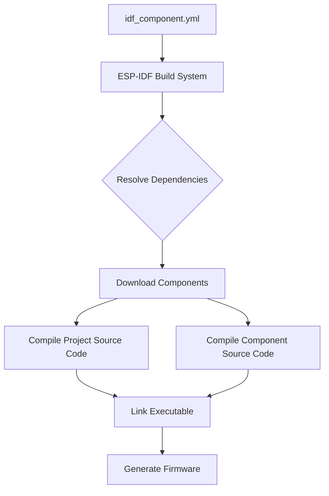

# ESP-IDF Configuration

The `idf_component.yml` file is a crucial manifest within ESP-IDF projects, defining the components required for a specific project or component. It is located at the root of a component directory (e.g., `line_following/main/idf_component.yml` for the main component) and instructs the ESP-IDF build system on how to manage and resolve external dependencies. This section details the configuration for the `main` component of the `SAC_2024` project, focusing on its declared dependencies and the required ESP-IDF framework version.

## Component Dependencies

The `dependencies` block in `idf_component.yml` lists all external components that the current component relies upon. The ESP-IDF Component Manager uses this information to fetch, build, and link these components correctly into the final firmware.

The primary dependencies for this project are:

*   **espressif/mdns**: This component provides Multicast DNS (mDNS) services, enabling devices to discover each other on a local network without a central DNS server. The `^1.0.7` version constraint ensures compatibility with versions greater than or equal to 1.0.7 but less than 2.0.0.

*   **idf**: This specifies the minimum required version of the ESP-IDF framework itself. The project explicitly requires an IDF version `>=4.1.0`, ensuring that all necessary APIs and build system features are available.

Here is the complete `dependencies` block from the `idf_component.yml`:

```yaml
dependencies:
  espressif/mdns: "^1.0.7"
  idf:
    version: ">=4.1.0"
```

### Understanding Dependency Versioning

The versioning syntax follows semantic versioning principles.
*   `^1.0.7` (caret operator): Compatible with versions `>=1.0.7` and `<2.0.0`. This is the recommended approach for most dependencies, allowing for minor updates without breaking changes.
*   `>=4.1.0` (greater than or equal): Specifies a minimum required version. This is typically used for the `idf` itself to ensure the build environment meets the project's baseline requirements.

The file also includes commented-out examples demonstrating how to declare other types of dependencies:

```yaml
  # # Put list of dependencies here
  # # For components maintained by Espressif:
  # component: "~1.0.0"
  # # For 3rd party components:
  # username/component: ">=1.0.0,<2.0.0"
  # username2/component2:
  #   version: "~1.0.0"
  #   # For transient dependencies `public` flag can be set.
  #   # `public` flag doesn't have an effect dependencies of the `main` component.
  #   # All dependencies of `main` are public by default.
  #   public: true
```

These examples illustrate how to specify Espressif-maintained components (e.g., `component: "~1.0.0"`), third-party components from the Component Registry (e.g., `username/component: ">=1.0.0,<2.0.0"`), and how to use the `public: true` flag for transient dependencies (though not typically needed for the `main` component's direct dependencies).

## Build System Flow

The `idf_component.yml` file plays a critical role in the overall ESP-IDF build process, informing the build system about the necessary components.





This diagram illustrates how the `idf_component.yml` manifest is parsed by the ESP-IDF build system to resolve and download external components from the Espressif Component Registry, which are then compiled and linked with the project's own source code to produce the final firmware.

## Key Takeaways

*   The `idf_component.yml` file defines all required external components and the minimum ESP-IDF version for the `main` component.
*   The `espressif/mdns` component is included for network service discovery.
*   The project requires ESP-IDF version `4.1.0` or newer for compatibility.
*   The Component Manager automatically handles fetching and integrating declared dependencies, simplifying the build process.