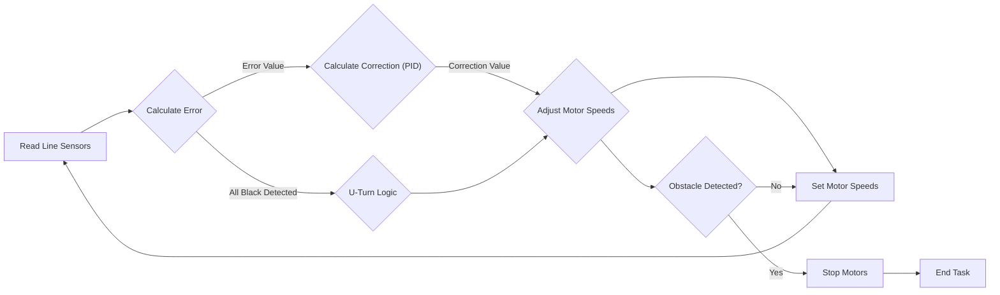

# Core Line Following Logic

This document details the core line following implementation within the SAC_2024 project, focusing on the logic implemented in `line_following/main/line_following.c`. The system utilizes a PID control loop, sensor readings from a line sensor array, and motor control to navigate the robot along a defined line.

## Line Following Implementation

The core logic resides in the `line_follow_task` function, which handles sensor readings, error calculation, PID control, and motor adjustments.

### Sensor Reading and Processing

The system uses an array of line sensors to detect the line. The `read_line_sensor` function (defined in `sra_board.h` and implemented in `sra_board.c`, not shown here for brevity, as it is not directly within the provided file but is relevant) provides the raw ADC readings. These readings are then processed to normalize the data and convert them into a usable format for error calculation.

```c
line_sensor_readings = read_line_sensor(line_sensor);

for (int i = 0; i < 5; i++) {
    line_sensor_readings.adc_reading[i] = bound(line_sensor_readings.adc_reading[i], WHITE_MARGIN, BLACK_MARGIN);
    line_sensor_readings.adc_reading[i] = map(line_sensor_readings.adc_reading[i], WHITE_MARGIN, BLACK_MARGIN, bound_LSA_LOW, bound_LSA_HIGH);
    line_sensor_readings.adc_reading[i] = 1000 - line_sensor_readings.adc_reading[i];
}
```

[View on GitHub](https://github.com/shinymack/SAC_2024/blob/main/line_following/main/line_following.c)

The code snippet above normalizes the sensor readings using `bound` and `map` functions to ensure consistent data ranges and inverts the readings so that higher values represent a darker reading (closer to black).

### Error Calculation

The `calculate_error` function determines the robot's deviation from the center of the line. It uses a weighted sum approach, where each sensor reading is multiplied by a corresponding weight.

```c
const int weights[5] = {-5, -3, 1, 3, 5};

void calculate_error() {
    all_black_flag = 1;
    float weighted_sum = 0, sum = 0;
    float pos = 0;
    bool left_reading = line_sensor_readings.adc_reading[0] > BLACK_BOUNDARY;
    bool right_reading = line_sensor_readings.adc_reading[4] > BLACK_BOUNDARY;

    for (int i = 0; i < 5; i++) {
        int k = line_sensor_readings.adc_reading[i] > BLACK_BOUNDARY ? 1 : 0;
        weighted_sum += (float)(weights[i]) * k;
        sum += k;

        if (line_sensor_readings.adc_reading[i] > BLACK_BOUNDARY) {
            all_black_flag = 0;
        }
    }

    if (left_reading == 1 ) {
        left_turn_flag = 1;
        right_turn_flag = 0;
    } else if (left_reading == 0 && right_reading == 1) {
        left_turn_flag = 0;
        right_turn_flag = 1;
    } else {
        left_turn_flag = right_turn_flag = 0;
    }

    if (all_black_flag == 1) {
        u_turn_flag = 1;
    } else {
        u_turn_flag = 0;
    }

    if (sum != 0) {
        pos = (weighted_sum - 1) / sum;
    }

    if (all_black_flag == 1) {
        error = prev_error > 0 ? 10 : -10;
    } else {
        error = pos;
    }
}
```

[View on GitHub](https://github.com/shinymack/SAC_2024/blob/main/line_following/main/line_following.c)

The weights array `{-5, -3, 1, 3, 5}` assigns negative weights to the left sensors, a positive weight to the right sensors, and a weight of 1 to the center sensor. This allows the robot to determine its position relative to the line based on which sensors are detecting the line. Flags like `left_turn_flag`, `right_turn_flag`, and `u_turn_flag` are set based on sensor readings to handle specific scenarios. The `all_black_flag` is used to detect when all sensors are on the line, indicating a potential u-turn situation.

### PID Control

A PID (Proportional-Integral-Derivative) controller is used to calculate the correction needed to keep the robot on the line.

```c
void calculate_correction() {
    difference = error - prev_error;
    cumulative_error += error;
    cumulative_error = bound(cumulative_error, -30, 30);

    correction = read_pid_const().kp * error +
                 read_pid_const().ki * cumulative_error +
                 read_pid_const().kd * difference;
    prev_error = error;
}
```

[View on GitHub](https://github.com/shinymack/SAC_2024/blob/main/line_following/main/line_following.c)

The `calculate_correction` function calculates the PID correction based on the current error, cumulative error, and the difference between the current and previous errors. The PID constants (`kp`, `ki`, `kd`) are read from `read_pid_const()`, allowing for dynamic tuning of the PID controller via an HTTP server (as seen in `tuning_http_server.h`, outside the scope of this document but a relevant integration).  The `cumulative_error` is bounded to prevent integral windup.

### Motor Control

The calculated correction is then used to adjust the motor speeds.

```c
left_duty_cycle = bound((optimum_duty_cycle + correction), lower_duty_cycle, higher_duty_cycle);
right_duty_cycle = bound((optimum_duty_cycle - correction), lower_duty_cycle, higher_duty_cycle);

set_motor_speed(motor_a_0, MOTOR_FORWARD, left_duty_cycle);
set_motor_speed(motor_a_1, MOTOR_FORWARD, right_duty_cycle);
```

[View on GitHub](https://github.com/shinymack/SAC_2024/blob/main/line_following/main/line_following.c)

The motor speeds are adjusted based on the correction value, with `left_duty_cycle` and `right_duty_cycle` representing the speeds of the left and right motors, respectively. These duty cycles are bounded to stay within the allowable range. The `set_motor_speed` function (defined in `sra_board.h` and implemented in `sra_board.c`, not included but relevant) controls the motor driver.

### Special Case Handling

The code includes logic to handle specific scenarios such as left turns, right turns and u-turns.

```c
if (left_turn_flag == 1) {
    set_motor_speed(motor_a_0, MOTOR_BACKWARD, right_duty_cycle);
    set_motor_speed(motor_a_1, MOTOR_FORWARD, right_duty_cycle);
    leftavg = 0;
    ESP_LOGI("debug", "LF == 1");
} else if (right_turn_flag == 1 && left_turn_flag == 0) {
    if (line_sensor_readings.adc_reading[2] > BLACK_BOUNDARY) {
        set_motor_speed(motor_a_0, MOTOR_FORWARD, left_duty_cycle);
        set_motor_speed(motor_a_1, MOTOR_FORWARD, right_duty_cycle);
        ESP_LOGI("debug", "STRAIGHT + RIGHT");
    } else{
        ESP_LOGI("debug", "ONLY RIGHT");
        set_motor_speed(motor_a_0, MOTOR_FORWARD, left_duty_cycle);
        set_motor_speed(motor_a_1, MOTOR_BACKWARD, left_duty_cycle);
    }
}
else if(left_turn_flag == 1 && right_turn_flag == 1){
        ESP_LOGI("debug", "TTTTTTTTTTTT");

    set_motor_speed(motor_a_0, MOTOR_BACKWARD, higher_duty_cycle);
    set_motor_speed(motor_a_1, MOTOR_FORWARD, higher_duty_cycle);
}
 else if (u_turn_flag) {
    
    if(rightavg > 0.1 && leftavg < 0.1){
        ESP_LOGI("debug", "UUU RIGHT");

        set_motor_speed(motor_a_0, MOTOR_FORWARD, higher_duty_cycle);
        set_motor_speed(motor_a_1, MOTOR_BACKWARD, higher_duty_cycle);
    }
    else{
        ESP_LOGI("debug", "UUU LEFT");

        set_motor_speed(motor_a_0, MOTOR_BACKWARD, higher_duty_cycle);
        set_motor_speed(motor_a_1, MOTOR_FORWARD, higher_duty_cycle);
    }
    vTaskDelay(400 / portTICK_PERIOD_MS);
    leftavg = 0;
    rightavg = 0;
}
```

[View on GitHub](https://github.com/shinymack/SAC_2024/blob/main/line_following/main/line_following.c)

The logic uses flags such as `left_turn_flag`, `right_turn_flag`, and `u_turn_flag` to execute specific motor control sequences for these cases. The `u_turn_flag` uses a history of sensor readings to make a decision of direction.

```c
void store_sensor_history() {
    // Store binary values indicating black (1) or white (0) for sensors 0 and 4
    sensor_0_history[history_index] = (line_sensor_readings.adc_reading[0] > BLACK_BOUNDARY) ? 1 : 0;
    sensor_4_history[history_index] = (line_sensor_readings.adc_reading[4] > BLACK_BOUNDARY) ? 1 : 0;
    history_index = (history_index + 1) % NOR; // Circular buffer
}

float calculate_average(int sensor_history[])
{
    int sum = 0;
    for (int i = 0; i < NOR; i++)
    {
        sum += sensor_history[i];
    }
    return (float)sum / NOR; // Result represents the proportion of black readings
}
```

[View on GitHub](https://github.com/shinymack/SAC_2024/blob/main/line_following/main/line_following.c)

This code maintains a history of sensor readings for the extreme left and right sensors to improve decision-making during maneuvers.

### Obstacle Detection

The code integrates an IR sensor to detect obstacles.

```c
int ir_state = gpio_get_level(IR_SENSOR_PIN);
if (ir_state == 0) {
    ESP_LOGI("debug", "Obstacle detected!");
    // Handle obstacle detection logic here
    // You could stop or change the behavior when the obstacle is detected
} else {
    ESP_LOGI("debug", "No obstacle detected.");
}
```

[View on GitHub](https://github.com/shinymack/SAC_2024/blob/main/line_following/main/line_following.c)

This snippet reads the state of the IR sensor pin. If an obstacle is detected (`ir_state == 0`), a log message is printed. Additional obstacle handling logic can be added in the designated section.

### End-of-Line Detection

The system stops the bot when the line ends.

```c
int all_white = 1;
if(line_sensor_readings.adc_reading[0] > BLACK_BOUNDARY && 
line_sensor_readings.adc_reading[1] > BLACK_BOUNDARY && 
line_sensor_readings.adc_reading[2] > BLACK_BOUNDARY && 
line_sensor_readings.adc_reading[3]> BLACK_BOUNDARY  && 
line_sensor_readings.adc_reading[4] > BLACK_BOUNDARY ){
    all_white = 1;
}
else{
    all_white = 0;
}

// Update consecutive white count
if (all_white) {
    cwhitecount++;
} else {
    cwhitecount = 0;
}

if(all_white && ir_state == 0){
    set_motor_speed(motor_a_0, MOTOR_FORWARD, higher_duty_cycle);
    set_motor_speed(motor_a_1, MOTOR_BACKWARD, higher_duty_cycle);
    vTaskDelay(1100 / portTICK_PERIOD_MS);
}

// Stop the bot if consecutive white count exceeds threshold
if (cwhitecount >= REQUIRED_WHITE_COUNT) {
    set_motor_speed(motor_a_0, MOTOR_STOP, 0);
    set_motor_speed(motor_a_1, MOTOR_STOP, 0);
    ESP_LOGI("debug", "End of line detected. Stopping bot.");
    break;
}
```
[View on GitHub](https://github.com/shinymack/SAC_2024/blob/main/line_following/main/line_following.c)

The system checks if all sensors are reading white for a consecutive number of readings, indicated by the `REQUIRED_WHITE_COUNT`. If this condition is met, the bot stops.

## Visual Representation of Control Flow





## Key Integration Points

The `line_follow_task` integrates several hardware and software components:

-   **Line Sensors:**  ADC readings are crucial for determining the robot's position relative to the line. Calibration and noise reduction are essential for accurate performance.
-   **Motor Driver:** The motor driver directly responds to the calculated duty cycles, dictating the robot's movement. Precise control over the motor driver is crucial for smooth line following.
-   **PID Controller:** The PID controller parameters (`kp`, `ki`, `kd`) significantly impact the system's stability and responsiveness.  The HTTP server provides a method to tune these values in real-time.
-   **Obstacle Avoidance:** The integration of the IR sensor provides an obstacle detection capability.
-   **FreeRTOS:** The entire system is executed as a FreeRTOS task, allowing concurrent execution with other system functionalities.

**Best Practices:**

-   **Sensor Calibration:**  Regularly calibrate the line sensors to account for variations in lighting conditions and sensor characteristics.
-   **PID Tuning:**  Iteratively tune the PID constants to achieve optimal line following performance. Start with tuning `kp`, then `ki`, and finally `kd`.
-   **Error Handling:** Implement robust error handling to gracefully manage unexpected sensor readings or motor control issues.
-   **Modularity:**  Maintain modular code to facilitate testing, debugging, and future enhancements.  For example, the `calculate_error`, `calculate_correction`, and `set_motor_speed` functions encapsulate specific functionalities, promoting code reusability and maintainability.
```