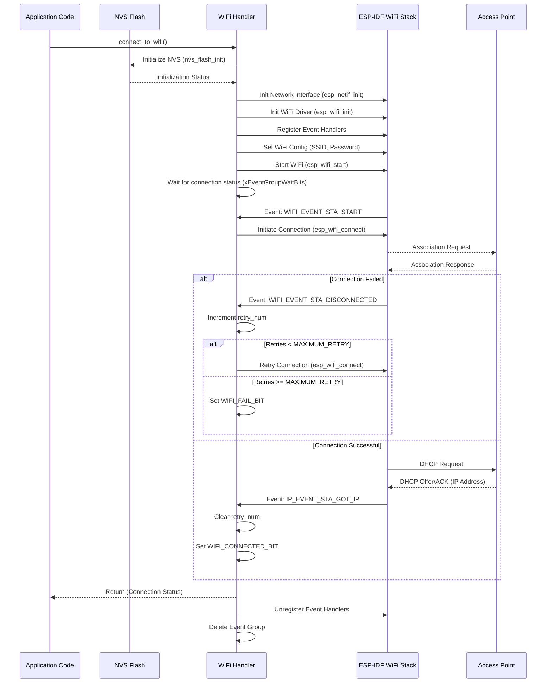

# Wi-Fi Connectivity

This section details the robust Wi-Fi connectivity module for the `SAC_2024` device, enabling it to connect to a standard Wi-Fi access point (AP) and obtain an IP address. The implementation leverages the ESP-IDF Wi-Fi stack and FreeRTOS event groups for asynchronous handling of connection events and synchronization.

## Overview

The Wi-Fi module is designed to connect the device to a pre-configured Wi-Fi network in Station (STA) mode. It handles connection attempts, retries on disconnection, and notifies the application once a connection is successfully established or fails after a maximum number of retries. Network credentials and retry limits are defined via `sdkconfig`.

## Configuration

Network credentials (SSID and Password) and the maximum number of connection retries are defined in the project's `sdkconfig` file, which are then used by the `wifi_handler.c` module through macros:

```c
#define WIFI_SSID      CONFIG_WIFI_SSID
#define WIFI_PASS      CONFIG_WIFI_PASSWORD
#define MAXIMUM_RETRY  CONFIG_MAXIMUM_RETRY
```

These macros ensure that sensitive information and configurable parameters can be managed centrally without modifying the source code directly.

## Implementation Details

The core logic resides in `wifi_handler.c`, managing the Wi-Fi connection lifecycle.

### NVS Initialization

Before Wi-Fi can be used, the Non-Volatile Storage (NVS) flash must be initialized. NVS is essential for storing Wi-Fi configuration and other system parameters persistently. The `connect_to_wifi` function ensures NVS is ready, erasing it if corrupted or a new version is detected.

```c
void connect_to_wifi()
{
    esp_err_t ret = nvs_flash_init();
    if (ret == ESP_ERR_NVS_NO_FREE_PAGES || ret == ESP_ERR_NVS_NEW_VERSION_FOUND) 
    {
      ESP_ERROR_CHECK(nvs_flash_erase());
      ret = nvs_flash_init();
    }
    ESP_ERROR_CHECK(ret);

    ESP_LOGI(TAG, "ESP_WIFI_MODE_STA");
    wifi_init_sta();
}
```

### Wi-Fi Station Initialization

The `wifi_init_sta` function performs the following steps:
1.  **Event Group Creation**: An `EventGroupHandle_t` is created to synchronize between the Wi-Fi event handler and the main application thread, signaling connection success or failure.
2.  **Network Interface Initialization**: `esp_netif_init()` and `esp_netif_create_default_wifi_sta()` set up the network interface for Wi-Fi station mode.
3.  **Wi-Fi Driver Initialization**: `esp_wifi_init()` initializes the Wi-Fi driver with default configuration.
4.  **Event Handler Registration**: The `event_handler` function is registered to listen for `WIFI_EVENT` (e.g., STA_START, STA_DISCONNECTED) and `IP_EVENT` (specifically IP_EVENT_STA_GOT_IP).
5.  **Wi-Fi Configuration**: A `wifi_config_t` structure is populated with the SSID and password from `sdkconfig`.
6.  **Mode and Start**: The Wi-Fi mode is set to `WIFI_MODE_STA`, the configuration is applied, and the Wi-Fi stack is started with `esp_wifi_start()`.

```c
    wifi_config_t wifi_config = {
        .sta = {
            .ssid = WIFI_SSID,
            .password = WIFI_PASS,
	        .threshold.authmode = WIFI_AUTH_WPA2_PSK, // Enforces WPA2_PSK for security
            .pmf_cfg = {
                .capable = true,
                .required = false
            },
        },
    };
    ESP_ERROR_CHECK(esp_wifi_set_mode(WIFI_MODE_STA) );
    ESP_ERROR_CHECK(esp_wifi_set_config(ESP_IF_WIFI_STA, &wifi_config) );
    ESP_ERROR_CHECK(esp_wifi_start() );
```

### Event Handling

The `event_handler` is critical for managing the Wi-Fi connection state:
*   **WIFI_EVENT_STA_START**: Triggers `esp_wifi_connect()` to initiate the connection.
*   **WIFI_EVENT_STA_DISCONNECTED**: If disconnection occurs, it retries `esp_wifi_connect()` up to `MAXIMUM_RETRY` times. If retries are exhausted, `WIFI_FAIL_BIT` is set in the event group.
*   **IP_EVENT_STA_GOT_IP**: Indicates a successful connection and IP address acquisition. It clears the retry counter and sets `WIFI_CONNECTED_BIT` in the event group.

```c
static void event_handler(void* arg, esp_event_base_t event_base, int32_t event_id, void* event_data)
{
    if (event_base == WIFI_EVENT && event_id == WIFI_EVENT_STA_START) 
    {
        esp_wifi_connect();
    } 
    else if (event_base == WIFI_EVENT && event_id == WIFI_EVENT_STA_DISCONNECTED) 
    {
        if (s_retry_num < MAXIMUM_RETRY) {
            esp_wifi_connect();
            s_retry_num++;
            ESP_LOGI(TAG, "retry to connect to the AP");
        } else {
            xEventGroupSetBits(s_wifi_event_group, WIFI_FAIL_BIT);
        }
        ESP_LOGI(TAG,"connect to the AP fail");
    } 
    else if (event_base == IP_EVENT && event_id == IP_EVENT_STA_GOT_IP) 
    {
        ip_event_got_ip_t* event = (ip_event_got_ip_t*) event_data;
        ESP_LOGI(TAG, "got ip:" IPSTR, IP2STR(&event->ip_info.ip));
        s_retry_num = 0;
        xEventGroupSetBits(s_wifi_event_group, WIFI_CONNECTED_BIT);
    }
}
```

### Synchronization

After starting the Wi-Fi, `wifi_init_sta` blocks using `xEventGroupWaitBits` until either `WIFI_CONNECTED_BIT` or `WIFI_FAIL_BIT` is set by the `event_handler`, indicating the outcome of the connection attempt.

```c
    EventBits_t bits = xEventGroupWaitBits(s_wifi_event_group,
            WIFI_CONNECTED_BIT | WIFI_FAIL_BIT,
            pdFALSE, // Clear bits on exit (false as we don't clear them in event group)
            pdFALSE, // Wait for all bits (false, wait for any)
            portMAX_DELAY); // Wait indefinitely
```

## Wi-Fi Connection Flow

The following diagram illustrates the sequence of operations for establishing a Wi-Fi connection:





## Integration Details

To use the Wi-Fi connectivity module, simply call `connect_to_wifi()` from your main application code. Ensure that `CONFIG_WIFI_SSID`, `CONFIG_WIFI_PASSWORD`, and `CONFIG_MAXIMUM_RETRY` are properly defined in your project's `sdkconfig` file. The function handles all necessary initializations, event management, and will block until a connection is established or deemed unrecoverable after multiple retries. You can then proceed with network-dependent operations once `connect_to_wifi()` returns, assuming a successful connection has been established.