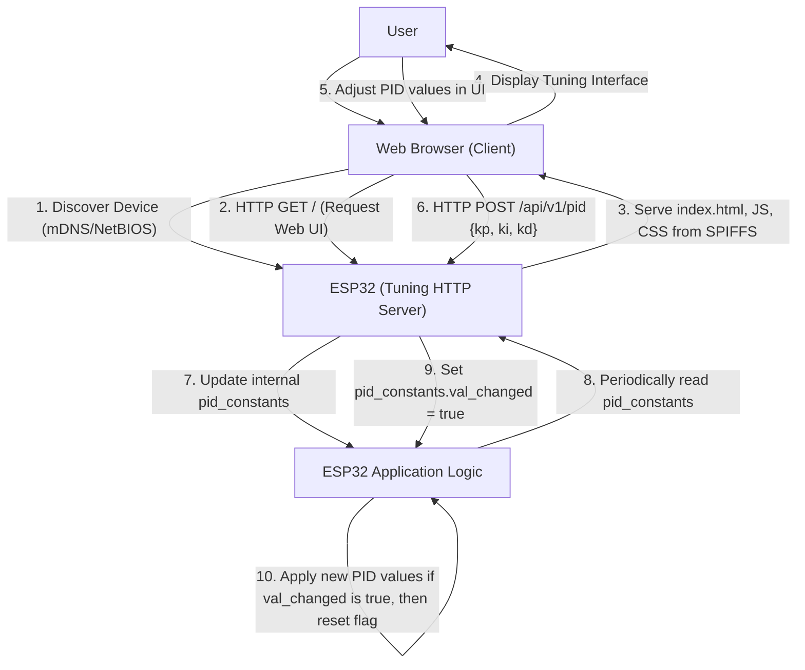

# Tuning HTTP Server

The `tuning_http_server` component provides an embedded web server on the ESP32 device, enabling remote configuration and real-time tuning of operational parameters, specifically the PID constants for line following. This server facilitates dynamic adjustments without requiring firmware recompilation, significantly speeding up the tuning process.

The server leverages ESP-IDF's `esp_http_server` for handling web requests and SPIFFS (SPI Flash File System) for serving static web assets (HTML, JavaScript, CSS). It also integrates mDNS (multicast DNS) and NetBIOS NS for easy device discovery on a local network.

## PID Constant Management

The core functionality of the tuning server revolves around managing PID (Proportional-Integral-Derivative) control constants. These constants are crucial for the robot's line-following algorithm, influencing its responsiveness and stability.

The PID constants (`kp`, `ki`, `kd`) are encapsulated in a `pid_const_t` structure. A `val_changed` flag within this structure indicates if the values have been updated by the web interface, allowing the main application loop to detect and apply the new constants.

```c
typedef struct pid_const
{
    float kp;
    float ki;
    float kd;
    bool val_changed;
} pid_const_t;

pid_const_t read_pid_const();
void reset_val_changed_pid_const();
```

The `read_pid_const()` function provides access to the currently configured PID values, while `reset_val_changed_pid_const()` clears the `val_changed` flag after the main application has processed the update.

## HTTP Server Setup

The server setup involves several initialization steps to ensure network connectivity, file system access, and discoverability:

1.  **NVS, NetIF, Event Loop**: Standard ESP-IDF initialization for non-volatile storage, network interface, and event management.
2.  **mDNS and NetBIOS NS**: These protocols allow the device to be discovered on the local network using a hostname (e.g., `http://espressif.local`) instead of an IP address. The `MDNS_HOST_NAME` define, often configured via `sdkconfig`, specifies the hostname.
3.  **WiFi Connection**: The server relies on a stable WiFi connection, established via the `connect_to_wifi()` function, to be accessible on the network.
4.  **SPIFFS Initialization**: The embedded web UI files (HTML, JS, CSS) are stored in a SPIFFS partition. `init_fs()` mounts this partition to the `WEB_MOUNT_POINT` (`/www`).

```c
void start_tuning_http_server()
{
    ESP_ERROR_CHECK(nvs_flash_init());
    ESP_ERROR_CHECK(esp_netif_init());
    ESP_ERROR_CHECK(esp_event_loop_create_default());
    initialise_mdns();
    netbiosns_init();
    netbiosns_set_name(MDNS_HOST_NAME);

    connect_to_wifi();
    ESP_ERROR_CHECK(init_fs());
    ESP_ERROR_CHECK(start_tuning_http_server_private());
    
    vTaskDelete(NULL);
}
```

## API Endpoints and File Serving

The HTTP server registers two primary URI handlers:

### Static File Serving (`GET /*`)

The `rest_common_get_handler` serves static web assets from the SPIFFS partition. When a client requests a URI, the handler maps it to a file path within the `WEB_MOUNT_POINT` (e.g., `/www/index.html` for `/`). It dynamically sets the HTTP `Content-Type` header based on the file extension.

```c
static esp_err_t rest_common_get_handler(httpd_req_t *req)
{
    char filepath[FILE_PATH_MAX] = WEB_MOUNT_POINT;

    if (strlen(req->uri) > 0 && req->uri[strlen(req->uri) - 1] == '/') 
    {
        strlcat(filepath, "/index.html", sizeof(filepath));
    }
    else 
    {
        strlcat(filepath, req->uri, sizeof(filepath));
    }

    int fd = open(filepath, O_RDONLY, 0);
    // ... file reading and sending logic ...
}
```

### PID Tuning API (`POST /api/v1/pid`)

The `tuning_pid_post_handler` is responsible for receiving updated PID constants from the web interface. It expects a JSON payload containing `kp`, `ki`, and `kd` values. Upon successful parsing, it updates the internal `pid_constants` global variable and sets the `val_changed` flag to `true`.

```c
static esp_err_t tuning_pid_post_handler(httpd_req_t *req)
{
    // ... receive request body into 'buf' ...
    
    cJSON *root = cJSON_Parse(buf);
    if (root == NULL)
    {   
        ESP_LOGE(TAG, "invalid json response");
        return ESP_FAIL;
    }
    
    if (!cJSON_HasObjectItem(root, "kp") || !cJSON_HasObjectItem(root, "ki") || !cJSON_HasObjectItem(root, "kd"))
    {
        ESP_LOGE(TAG, "invalid json response");
        return ESP_FAIL;
    }
    
    pid_constants.kp = (float)cJSON_GetObjectItem(root, "kp")->valuedouble;
    pid_constants.ki = (float)cJSON_GetObjectItem(root, "ki")->valuedouble;
    pid_constants.kd = (float)cJSON_GetObjectItem(root, "kd")->valuedouble;

    cJSON_Delete(root);
    httpd_resp_sendstr(req, "Post control value successfully");

    pid_constants.val_changed = true;
    return ESP_OK;
}
```

The `start_tuning_http_server_private()` function registers these handlers:

```c
    httpd_uri_t tuning_pid_post_uri = {
        .uri = "/api/v1/pid",
        .method = HTTP_POST,
        .handler = tuning_pid_post_handler,
        .user_ctx = NULL
    };
    if (httpd_register_uri_handler(server, &tuning_pid_post_uri) != ESP_OK)
    {
        ESP_LOGE(TAG, "register post uri failed");
        return ESP_FAIL;
    }

    httpd_uri_t common_get_uri = {
        .uri = "/*",
        .method = HTTP_GET,
        .handler = rest_common_get_handler,
        .user_ctx = NULL
    };
    if(httpd_register_uri_handler(server, &common_get_uri) != ESP_OK)
    {
        ESP_LOGE(TAG, "register get uri failed");
        return ESP_FAIL;
    }
```

## Tuning Server Interaction Flow

The following diagram illustrates the typical interaction flow between a user, the web browser, and the ESP32 tuning HTTP server.





## Key Takeaways

*   **Real-time Tuning**: The embedded HTTP server allows for dynamic adjustment of PID constants, eliminating the need for firmware reflashing during the tuning process.
*   **Web Interface**: Static files served from SPIFFS provide a user-friendly web interface for interaction.
*   **mDNS/NetBIOS**: Simplifies device discovery on the local network using hostnames.
*   **RESTful API**: A `/api/v1/pid` endpoint handles `POST` requests for updating PID parameters via JSON.
*   **`val_changed` Flag**: A boolean flag (`val_changed`) within the `pid_const_t` structure signals to the main application loop when new PID values have been set, ensuring efficient application of updates.