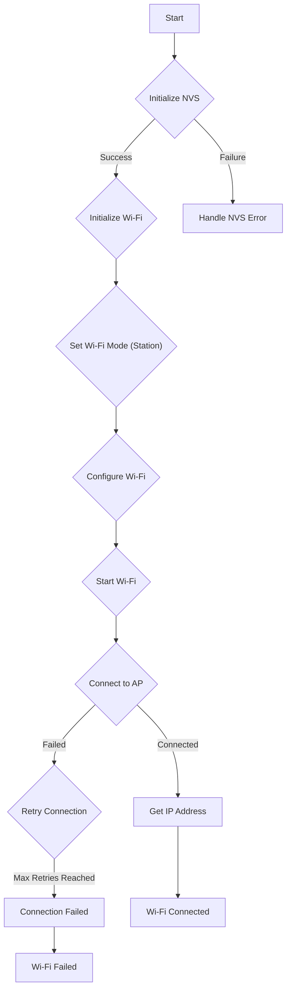
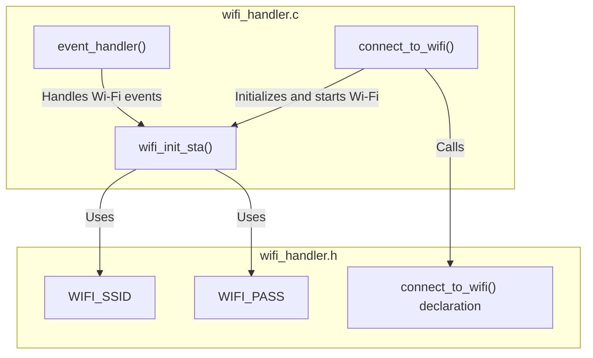

# Wi-Fi Connectivity

This document describes the Wi-Fi connection management within the SAC_2024 project, focusing on how the system connects to a Wi-Fi network and handles connection events. The relevant files are `line_following/main/wifi_handler.c` and `line_following/main/include/wifi_handler.h`.

## Wi-Fi Handling Overview

The system uses the ESP-IDF framework to manage Wi-Fi connectivity. The `wifi_handler.c` file contains the core logic for initializing the Wi-Fi module, connecting to a specified network, and handling connection events such as successful connection, disconnection, and IP address acquisition. `wifi_handler.h` declares the interface for interacting with the Wi-Fi module.

### Key Features:

*   **Station Mode:** The system operates in Wi-Fi station mode, connecting to an existing access point.
*   **Event Handling:** Uses the ESP-IDF event loop to handle Wi-Fi and IP events asynchronously.
*   **Retry Mechanism:** Implements a retry mechanism to automatically reconnect to the Wi-Fi network if the connection is lost.
*   **Configuration:** Wi-Fi SSID and password are configurable through the project's configuration settings.

## Code Snippets and Explanations

### 1. Wi-Fi Configuration

This snippet shows how the Wi-Fi configuration is set up.

```c
// File: line_following/main/wifi_handler.c
wifi_config_t wifi_config = {
    .sta = {
        .ssid = WIFI_SSID,
        .password = WIFI_PASS,
        .threshold.authmode = WIFI_AUTH_WPA2_PSK,
        .pmf_cfg = {
            .capable = true,
            .required = false
        },
    },
};
ESP_ERROR_CHECK(esp_wifi_set_mode(WIFI_MODE_STA) );
ESP_ERROR_CHECK(esp_wifi_set_config(ESP_IF_WIFI_STA, &wifi_config) );
ESP_ERROR_CHECK(esp_wifi_start() );
```

This code configures the Wi-Fi settings, including the SSID, password, and authentication mode. It sets the Wi-Fi mode to station mode and applies the configuration.
[View on GitHub](https://github.com/shinymack/SAC_2024/blob/main/line_following/main/wifi_handler.c)

### 2. Event Handler

This snippet shows the event handler function which is responsible for reacting to wifi events.

```c
// File: line_following/main/wifi_handler.c
static void event_handler(void* arg, esp_event_base_t event_base, int32_t event_id, void* event_data)
{
    if (event_base == WIFI_EVENT && event_id == WIFI_EVENT_STA_START) 
    {
        esp_wifi_connect();
    } 
    else if (event_base == WIFI_EVENT && event_id == WIFI_EVENT_STA_DISCONNECTED) 
    {
        if (s_retry_num < MAXIMUM_RETRY) {
            esp_wifi_connect();
            s_retry_num++;
            ESP_LOGI(TAG, "retry to connect to the AP");
        } else {
            xEventGroupSetBits(s_wifi_event_group, WIFI_FAIL_BIT);
        }
        ESP_LOGI(TAG,"connect to the AP fail");
    } 
    else if (event_base == IP_EVENT && event_id == IP_EVENT_STA_GOT_IP) 
    {
        ip_event_got_ip_t* event = (ip_event_got_ip_t*) event_data;
        ESP_LOGI(TAG, "got ip:" IPSTR, IP2STR(&event->ip_info.ip));
        s_retry_num = 0;
        xEventGroupSetBits(s_wifi_event_group, WIFI_CONNECTED_BIT);
    }
}
```

This function handles various Wi-Fi and IP events. When the station starts, it attempts to connect to the Wi-Fi network. If disconnected, it retries to connect up to a maximum number of retries. Upon receiving an IP address, it sets the `WIFI_CONNECTED_BIT`.
[View on GitHub](https://github.com/shinymack/SAC_2024/blob/main/line_following/main/wifi_handler.c)

### 3. Wi-Fi Initialization

```c
// File: line_following/main/wifi_handler.c
void wifi_init_sta(void)
{
    s_wifi_event_group = xEventGroupCreate();

    ESP_ERROR_CHECK(esp_netif_init());

    esp_netif_create_default_wifi_sta();

    wifi_init_config_t cfg = WIFI_INIT_CONFIG_DEFAULT();
    ESP_ERROR_CHECK(esp_wifi_init(&cfg));

    esp_event_handler_instance_t instance_any_id;
    esp_event_handler_instance_t instance_got_ip;
    ESP_ERROR_CHECK(esp_event_handler_instance_register(WIFI_EVENT,
                                                        ESP_EVENT_ANY_ID,
                                                        &event_handler,
                                                        NULL,
                                                        &instance_any_id));
    ESP_ERROR_CHECK(esp_event_handler_instance_register(IP_EVENT,
                                                        IP_EVENT_STA_GOT_IP,
                                                        &event_handler,
                                                        NULL,
                                                        &instance_got_ip));

    // ... (rest of the function)
}
```

This code initializes the TCP/IP stack, creates a network interface, initializes the Wi-Fi driver, and registers event handlers for Wi-Fi and IP events.
[View on GitHub](https://github.com/shinymack/SAC_2024/blob/main/line_following/main/wifi_handler.c)

### 4. Connecting to Wi-Fi

```c
// File: line_following/main/wifi_handler.c
void connect_to_wifi()
{
    esp_err_t ret = nvs_flash_init();
    if (ret == ESP_ERR_NVS_NO_FREE_PAGES || ret == ESP_ERR_NVS_NEW_VERSION_FOUND) 
    {
      ESP_ERROR_CHECK(nvs_flash_erase());
      ret = nvs_flash_init();
    }
    ESP_ERROR_CHECK(ret);

    ESP_LOGI(TAG, "ESP_WIFI_MODE_STA");
    wifi_init_sta();
}
```

This function initializes the non-volatile storage (NVS) and then calls `wifi_init_sta()` to initialize and start the Wi-Fi connection. NVS is used to store Wi-Fi credentials and other configuration data.
[View on GitHub](https://github.com/shinymack/SAC_2024/blob/main/line_following/main/wifi_handler.c)

### 5. Header file

```c
// File: line_following/main/include/wifi_handler.h
#ifndef WIFI_HANDLER_H
#define WIFI_HANDLER_H

#include <string.h>
#include "freertos/FreeRTOS.h"
#include "freertos/task.h"
#include "freertos/event_groups.h"
#include "esp_system.h"
#include "esp_wifi.h"
#include "esp_event.h"
#include "esp_log.h"
#include "nvs_flash.h"
#include "lwip/err.h"
#include "lwip/sys.h"
#include "sdkconfig.h"

#define WIFI_CONNECTED_BIT BIT0
#define WIFI_FAIL_BIT      BIT1

#define WIFI_SSID      CONFIG_WIFI_SSID
#define WIFI_PASS      CONFIG_WIFI_PASSWORD
#define MAXIMUM_RETRY  CONFIG_MAXIMUM_RETRY

void connect_to_wifi();

#endif
```

This header file defines the necessary includes, macros, and function prototypes for the Wi-Fi handler. It includes definitions for the Wi-Fi connected and failed event bits, as well as the SSID, password, and maximum retry count.
[View on GitHub](https://github.com/shinymack/SAC_2024/blob/main/line_following/main/include/wifi_handler.h)

## Wi-Fi Connection Flow





This diagram illustrates the general flow of connecting to a Wi-Fi network.

## Event Handling in Detail

The ESP-IDF event loop is central to the Wi-Fi connection process. The `event_handler` function responds to key events:

*   **WIFI_EVENT_STA_START:** Initiates the Wi-Fi connection attempt.
*   **WIFI_EVENT_STA_DISCONNECTED:** Triggers a reconnection attempt, up to `MAXIMUM_RETRY` times.
*   **IP_EVENT_STA_GOT_IP:** Indicates a successful connection and IP address acquisition.

The `s_wifi_event_group` is used to synchronize the main task with the event handler.  The `xEventGroupWaitBits` function blocks until either `WIFI_CONNECTED_BIT` or `WIFI_FAIL_BIT` is set, allowing the main task to determine the connection status.

## Key Integration Points

*   The `connect_to_wifi()` function should be called early in the application's startup sequence to establish a Wi-Fi connection.
*   Wi-Fi credentials (SSID and password) are defined in the project's configuration (`sdkconfig`). Ensure these are correctly set for the target network.
*   The `MAXIMUM_RETRY` macro controls the number of reconnection attempts. Adjust this value based on the expected network stability.
*   Error handling is crucial. The code includes checks for various ESP-IDF functions and logs errors accordingly. Implement proper error recovery mechanisms to handle potential Wi-Fi connection issues.

## Best Practices

*   **Secure Credentials:** Avoid hardcoding Wi-Fi credentials directly in the source code. Use the project's configuration system or a secure storage mechanism to store sensitive information.
*   **Robust Error Handling:** Implement comprehensive error handling to gracefully handle connection failures, network outages, and other potential issues.
*   **Power Management:** Consider implementing power management techniques to reduce power consumption when the Wi-Fi connection is not actively used.
*   **Periodic Checks:** Consider implementing periodic checks to ensure the Wi-Fi connection remains active and stable. If the connection is lost, initiate a reconnection attempt.

## Wi-Fi Component Structure





This diagram illustrates how the C files and their functions and variables related to WiFi connect to each other.
```