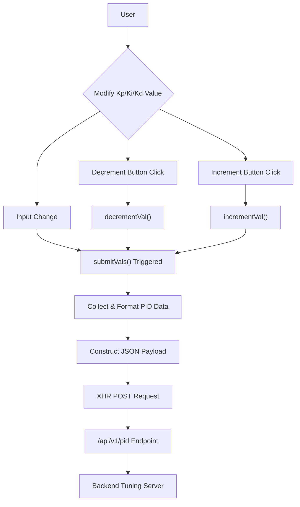

# Web-Based Frontend

The web-based frontend provides an intuitive interface for real-time tuning of PID control parameters for the line-following mechanism. Accessible via the tuning HTTP server, this single-page application (`index.html`) allows users to adjust `Kp`, `Ki`, and `Kd` values and immediately apply them to the robotic system.

## Structure and Styling

The frontend is a self-contained HTML file that includes inline CSS for its visual presentation. The layout is minimalistic, centering a main control panel on the page with a dark, hexagonal pattern background.

The core structure consists of a `main` element that houses a primary heading and three distinct `button-group` divisions, one for each PID parameter (`Kp`, `Ki`, `Kd`). Each `button-group` features:
*   A heading (`h3`) indicating the parameter.
*   A decrement button (`<`).
*   A number input field displaying the current value.
*   An increment button (`>`).

```html
<main>
    <h1>Line Following</h1>
    <div class="button-group">
        <h3>Kp</h3>
        <button>&lt;</button>
        <input type="number" value="0.000" id="kp" />
        <button>&gt;</button>
    </div>
    <!-- ... similar groups for Ki and Kd ... -->
</main>
```

The styling uses a dark theme with light text, aiming for clarity and ease of use. A subtle background pattern is applied, and the main control panel has a semi-transparent background with rounded corners.

```css
body {
    width: 100%;
    height: 100vh;
    background: url("data:image/svg+xml;base64,..."); /* SVG background pattern */
    display: flex;
    justify-content: center;
    align-items: center;
}
main {
    background-color: rgba(0, 0, 0, 0.493);
    color: white;
    min-width: 35%;
    padding: 2em;
    height: 90vh;
    border-radius: 10px;
    display: flex;
    flex-direction: column;
    justify-content: space-around;
    align-items: center;
}
.button-group input {
    background-color: transparent;
    border: none;
    border-bottom: 2px solid white;
    color: white;
    text-align: center;
    font-size: 1.2rem;
    padding: 5px;
}
```

## Functionality and API Interaction

The frontend's interactivity is managed by embedded JavaScript. It listens for changes in the input fields and clicks on the increment/decrement buttons to update PID values and communicate them to the backend.

### Value Submission

The `submitVals` function is the core of the interaction. It collects the current `Kp`, `Ki`, and `Kd` values from their respective input fields, converts them to floating-point numbers, and packages them into a JSON object. This JSON payload is then sent to the backend via an `XMLHttpRequest` POST request.

```javascript
function submitVals() {
    const data = {};
    data["kp"] = parseFloat(document.getElementById("kp").value);
    data["ki"] = parseFloat(document.getElementById("ki").value);
    data["kd"] = parseFloat(document.getElementById("kd").value);
    let finaldata = JSON.stringify(data);

    let xhr = new XMLHttpRequest();
    let url = "/api/v1/pid"; // Backend API endpoint
    xhr.open("POST", url, true);
    xhr.setRequestHeader("Content-Type", "application/json");

    xhr.onreadystatechange = function () {
        if (xhr.readyState === 4 && xhr.status === 400) {
            console.log("Success!"); // Placeholder for success handling
        } else if (xhr.readyState === 4) {
            console.log(xhr.status);
        }
    };
    xhr.send(finaldata);
}
```

This `submitVals` function is triggered whenever an input field's value changes:
```javascript
for (let i = 0; i < inpArray.length; i++) {
    inpArray[i].addEventListener("change", submitVals);
}
```

### Increment/Decrement Buttons

Dedicated buttons allow users to fine-tune the PID parameters by increments of `0.01`. When clicked, the `decrementVal` or `incrementVal` function updates the corresponding input field's value and then calls `submitVals` to notify the backend.

```javascript
function decrementVal(e) {
    let inputField = e.target.parentNode.children[2];
    let currentValue = Number(inputField.value);
    if (!isNaN(currentValue)) {
        inputField.value = String((currentValue - 0.01).toFixed(3));
        submitVals();
    } else {
        inputField.value = "0.000"; // Reset if invalid
    }
}
function incrementVal(e) {
    let inputField = e.target.parentNode.children[2];
    let currentValue = Number(inputField.value);
    if (!isNaN(currentValue)) {
        inputField.value = String((currentValue + 0.01).toFixed(3));
        submitVals();
    } else {
        inputField.value = "0.000"; // Reset if invalid
    }
}
```

## Frontend Interaction Flow

The following diagram illustrates the user interaction and data flow within the web-based tuning interface:





## Key Takeaways

The web-based frontend provides a straightforward and responsive mechanism for configuring PID control parameters. Its single-page architecture simplifies deployment, while the JavaScript-driven updates ensure that any parameter changes are immediately communicated to the backend, enabling real-time tuning of the line-following algorithm. The use of a simple `XMLHttpRequest` ensures broad compatibility and minimal overhead for communication with the tuning HTTP server.