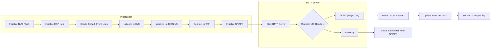
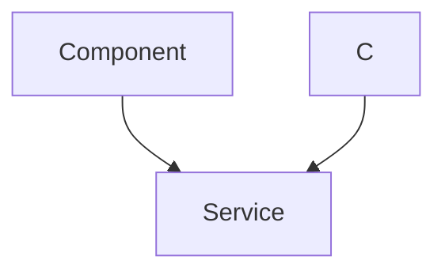

# Tuning HTTP Server

This document explains the HTTP server implemented for real-time parameter tuning and monitoring of the line-following robot. The server allows for adjusting PID (Proportional-Integral-Derivative) controller constants and observing the robot's performance through a web interface.

## Overview

The HTTP server is built using the Espressif IDF framework's built-in HTTP server component. It serves static files (HTML, CSS, JavaScript) from a SPIFFS file system and provides a REST API endpoint for updating PID constants.  The server also uses mDNS for easy discovery on the local network.

## Key Features

*   **Web Interface:** Provides a user-friendly web interface for adjusting PID parameters.
*   **Real-time Tuning:** Allows for real-time adjustment of PID constants while the robot is running.
*   **SPIFFS Integration:** Stores web files on a SPIFFS partition.
*   **mDNS Discovery:**  Uses mDNS to advertise the server on the local network, making it easy to find the robot's IP address.
*   **REST API:** Exposes a REST API for updating PID constants via HTTP POST requests.

## Relevant Files

*   `line_following/main/tuning_http_server.c`: Contains the implementation of the HTTP server.
*   `line_following/main/include/tuning_http_server.h`:  Defines the interface for the HTTP server.

## Implementation Details

### Dependencies and Includes

The `tuning_http_server.h` file includes necessary header files for networking, FreeRTOS, SPIFFS, and the HTTP server.

```c
// File: line_following/main/include/tuning_http_server.h
#ifndef TUNING_HTTP_SERVER_H
#define TUNING_HTTP_SERVER_H

#include <string.h>
#include <fcntl.h>
#include "freertos/FreeRTOS.h"
#include "freertos/task.h"
#include "driver/gpio.h"
#include "esp_spiffs.h"
#include "nvs_flash.h"
#include "esp_netif.h"
#include "esp_event.h"
#include "esp_log.h"
#include "mdns.h"
#include "lwip/apps/netbiosns.h"
#include "esp_http_server.h"
#include "esp_system.h"
#include "esp_vfs.h"
#include "cJSON.h"
#include "sdkconfig.h"
#include "wifi_handler.h"

// ... (rest of the header file)

#endif
```

[View on GitHub](https://github.com/shinymack/SAC_2024/blob/main/line_following/main/include/tuning_http_server.h)

### Data Structures

The `pid_const_t` struct is used to store the PID constants.

```c
// File: line_following/main/include/tuning_http_server.h
typedef struct pid_const
{
    float kp;
    float ki;
    float kd;
    bool val_changed;
} pid_const_t;

pid_const_t read_pid_const();
void reset_val_changed_pid_const();
void start_tuning_http_server();
```

[View on GitHub](https://github.com/shinymack/SAC_2024/blob/main/line_following/main/include/tuning_http_server.h)

### Initializing mDNS

The `initialise_mdns` function sets up mDNS to advertise the HTTP server on the local network.  This allows users to access the server using a hostname (defined in `CONFIG_MDNS_HOST_NAME`) instead of an IP address.

```c
// File: line_following/main/tuning_http_server.c
static void initialise_mdns(void)
{
    mdns_init();
    mdns_hostname_set(MDNS_HOST_NAME);
    mdns_instance_name_set(MDNS_INSTANCE);

    mdns_txt_item_t serviceTxtData[] = {
        {"board", "esp32"},
        {"path", "/"}
    };

    ESP_ERROR_CHECK(mdns_service_add("ESP32-WebServer", "_http", "_tcp", 80, serviceTxtData,
                                     sizeof(serviceTxtData) / sizeof(serviceTxtData[0])));
}
```

[View on GitHub](https://github.com/shinymack/SAC_2024/blob/main/line_following/main/tuning_http_server.c)

### Initializing SPIFFS

The `init_fs` function initializes the SPIFFS file system, which stores the static web files.

```c
// File: line_following/main/tuning_http_server.c
static esp_err_t init_fs(void)
{
    esp_vfs_spiffs_conf_t conf = {
        .base_path = WEB_MOUNT_POINT,
        .partition_label = NULL,
        .max_files = 5,
        .format_if_mount_failed = false
    };
    esp_err_t ret = esp_vfs_spiffs_register(&conf);

    if (ret != ESP_OK) {
        if (ret == ESP_FAIL) {
            ESP_LOGE(TAG, "Failed to mount or format filesystem");
        } else if (ret == ESP_ERR_NOT_FOUND) {
            ESP_LOGE(TAG, "Failed to find SPIFFS partition");
        } else {
            ESP_LOGE(TAG, "Failed to initialize SPIFFS (%s)", esp_err_to_name(ret));
        }
        return ESP_FAIL;
    }

    size_t total = 0, used = 0;
    ret = esp_spiffs_info(NULL, &total, &used);
    if (ret != ESP_OK) {
        ESP_LOGE(TAG, "Failed to get SPIFFS partition information (%s)", esp_err_to_name(ret));
    } else {
        ESP_LOGI(TAG, "Partition size: total: %d, used: %d", total, used);
    }
    return ESP_OK;
}
```

[View on GitHub](https://github.com/shinymack/SAC_2024/blob/main/line_following/main/tuning_http_server.c)

### HTTP Request Handlers

The `rest_common_get_handler` function serves static files from the SPIFFS file system.  It determines the content type based on the file extension.

```c
// File: line_following/main/tuning_http_server.c
/* Send HTTP response with the contents of the requested file */
static esp_err_t rest_common_get_handler(httpd_req_t *req)
{
    char filepath[FILE_PATH_MAX] = WEB_MOUNT_POINT;

    if (strlen(req->uri) > 0 && req->uri[strlen(req->uri) - 1] == '/') 
    {
        strlcat(filepath, "/index.html", sizeof(filepath));
    }
    else 
    {
        strlcat(filepath, req->uri, sizeof(filepath));
    }

    int fd = open(filepath, O_RDONLY, 0);
    if (fd == -1) {
        ESP_LOGE(TAG, "Failed to open file : %s", filepath);
        /* Respond with 500 Internal Server Error */
        httpd_resp_send_err(req, HTTPD_500_INTERNAL_SERVER_ERROR, "Failed to read existing file");
        return ESP_FAIL;
    }

    set_content_type_from_file(req, filepath);

    char *chunk = scratch;
    memset(scratch, '\0', SCRATCH_BUFSIZE);
    ssize_t read_bytes;
    do {
        /* Read file in chunks into the scratch buffer */
        read_bytes = read(fd, chunk, SCRATCH_BUFSIZE);
        if (read_bytes == -1) {
            ESP_LOGE(TAG, "Failed to read file : %s", filepath);
        } else if (read_bytes > 0) {
            /* Send the buffer contents as HTTP response chunk */
            if (httpd_resp_send_chunk(req, chunk, read_bytes) != ESP_OK) {
                close(fd);
                ESP_LOGE(TAG, "File sending failed!");
                /* Abort sending file */
                httpd_resp_sendstr_chunk(req, NULL);
                /* Respond with 500 Internal Server Error */
                httpd_resp_send_err(req, HTTPD_500_INTERNAL_SERVER_ERROR, "Failed to send file");
                return ESP_FAIL;
            }
        }
    } while (read_bytes > 0);
    /* Close file after sending complete */
    close(fd);
    ESP_LOGI(TAG, "File sending complete");
    /* Respond with an empty chunk to signal HTTP response completion */
    httpd_resp_send_chunk(req, NULL, 0);
    return ESP_OK;
}
```

[View on GitHub](https://github.com/shinymack/SAC_2024/blob/main/line_following/main/tuning_http_server.c)

The `tuning_pid_post_handler` function handles POST requests to the `/api/v1/pid` endpoint. It parses the JSON payload, updates the PID constants, and sets a flag indicating that the constants have been changed.

```c
// File: line_following/main/tuning_http_server.c
/* Simple handler for Tuning PID */
static esp_err_t tuning_pid_post_handler(httpd_req_t *req)
{
    int total_len = req->content_len;
    int cur_len = 0;
    char *buf = scratch;
    memset(scratch, '\0', SCRATCH_BUFSIZE);
    int received = 0;
    if (total_len >= SCRATCH_BUFSIZE) {
        /* Respond with 500 Internal Server Error */
        httpd_resp_send_err(req, HTTPD_500_INTERNAL_SERVER_ERROR, "content too long");
        return ESP_FAIL;
    }
    while (cur_len < total_len) {
        received = httpd_req_recv(req, buf + cur_len, total_len);
        if (received <= 0) {
            /* Respond with 500 Internal Server Error */
            httpd_resp_send_err(req, HTTPD_500_INTERNAL_SERVER_ERROR, "Failed to post control value");
            return ESP_FAIL;
        }
        cur_len += received;
    }
    buf[total_len] = '\0';

    cJSON *root = cJSON_Parse(buf);
    if (root == NULL)
    {   
        ESP_LOGE(TAG, "invalid json response");
        return ESP_FAIL;
    }
    
    if (!cJSON_HasObjectItem(root, "kp") || !cJSON_HasObjectItem(root, "ki") || !cJSON_HasObjectItem(root, "kd"))
    {
        ESP_LOGE(TAG, "invalid json response");
        return ESP_FAIL;
    }
    
    pid_constants.kp = (float)cJSON_GetObjectItem(root, "kp")->valuedouble;
    pid_constants.ki = (float)cJSON_GetObjectItem(root, "ki")->valuedouble;
    pid_constants.kd = (float)cJSON_GetObjectItem(root, "kd")->valuedouble;

    cJSON_Delete(root);
    httpd_resp_sendstr(req, "Post control value successfully");

    pid_constants.val_changed = true;
    return ESP_OK;
}
```

[View on GitHub](https://github.com/shinymack/SAC_2024/blob/main/line_following/main/tuning_http_server.c)

### Starting the HTTP Server

The `start_tuning_http_server_private` function configures and starts the HTTP server, registering the URI handlers.

```c
// File: line_following/main/tuning_http_server.c
static esp_err_t start_tuning_http_server_private()
{
    httpd_handle_t server = NULL;
    httpd_config_t config = HTTPD_DEFAULT_CONFIG();
    config.uri_match_fn = httpd_uri_match_wildcard;

    ESP_LOGI(TAG, "Starting HTTP Server");
    if (httpd_start(&server, &config) != ESP_OK)
    {
        ESP_LOGE(TAG, "start server failed");
        return ESP_FAIL;
    }
    
    httpd_uri_t tuning_pid_post_uri = {
        .uri = "/api/v1/pid",
        .method = HTTP_POST,
        .handler = tuning_pid_post_handler,
        .user_ctx = NULL
    };
    if (httpd_register_uri_handler(server, &tuning_pid_post_uri) != ESP_OK)
    {
        ESP_LOGE(TAG, "register post uri failed");
        return ESP_FAIL;
    }

    httpd_uri_t common_get_uri = {
        .uri = "/*",
        .method = HTTP_GET,
        .handler = rest_common_get_handler,
        .user_ctx = NULL
    };
    if(httpd_register_uri_handler(server, &common_get_uri) != ESP_OK)
    {
        ESP_LOGE(TAG, "register get uri failed");
        return ESP_FAIL;
    }

    return ESP_OK;
}
```

[View on GitHub](https://github.com/shinymack/SAC_2024/blob/main/line_following/main/tuning_http_server.c)

### Overall Flow





## Key Integration Points

*   The `start_tuning_http_server` function is responsible for initializing the necessary components (NVS, network, SPIFFS) and starting the HTTP server.
*   The `read_pid_const` and `reset_val_changed_pid_const` functions provide access to the PID constants and the `val_changed` flag, allowing other parts of the system to retrieve and acknowledge updates to the PID parameters.
*   The `wifi_handler` module (not detailed here) is crucial for establishing a Wi-Fi connection before the HTTP server can be started.  Ensure that the Wi-Fi configuration is correct for the target environment.

## Best Practices

*   **Error Handling:**  The code includes error checking for file system operations, network initialization, and HTTP server functions.  Robust error handling is essential for a reliable embedded system.
*   **Configuration:**  Use the ESP-IDF configuration system (menuconfig) to configure the HTTP server, mDNS hostname, and other parameters.  This allows for easy customization without modifying the source code.
*   **Security:**  For production deployments, consider adding security measures such as HTTPS and authentication to protect the HTTP server from unauthorized access.
*   **File System Management:** Ensure that the SPIFFS file system is properly managed. Provide a mechanism to upload/update files to the file system for web interface changes and enhancements.

## Example: Updating PID constants via command line

You can use `curl` to send HTTP POST requests to update the PID constants.

```bash
curl -X POST -H "Content-Type: application/json" -d '{"kp": 1.0, "ki": 0.1, "kd": 7.0}' http://<your_esp32_ip>/api/v1/pid
```

Replace `<your_esp32_ip>` with the actual IP address or mDNS hostname of your ESP32 device. The server will respond with "Post control value successfully" if the update is successful.

## Considerations

*   **Resource Usage:** The HTTP server consumes memory and CPU resources.  Consider optimizing the code and web files to minimize resource usage, especially on resource-constrained embedded systems.
*   **Concurrency:** The HTTP server handles requests concurrently. Ensure that any shared resources (e.g., PID constants) are protected with appropriate synchronization mechanisms (e.g., mutexes) to prevent race conditions.





```