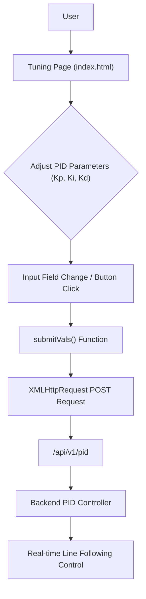

# User Interface and Interaction

The `index.html` file serves as the primary user interface for monitoring and controlling the Line Following system, specifically designed for tuning its PID (Proportional-Integral-Derivative) parameters. This frontend interface provides interactive elements to adjust Kp, Ki, and Kd values, which are then communicated to the backend system for real-time control adjustments.

## Page Structure and Styling

The page is a single-page application with a minimalist design, focusing on the core functionality of PID parameter tuning.

The central `main` container uses a semi-transparent background with a subtle blur effect to keep the focus on the control elements. The overall aesthetic is clean and modern, leveraging `Segoe UI` as the primary font.

```html
<main>
    <h1>Line Following</h1>
    <div class="button-group">
        <h3>Kp</h3>
        <button>&lt;</button>
        <input type="number" value="0.000" id="kp" />
        <button>&gt;</button>
    </div>
    <!-- ... similar groups for Ki and Kd ... -->
</main>
```

The styling ensures a responsive and user-friendly experience, with interactive elements clearly distinguishable. The `body` background features a dynamic SVG pattern, contributing to the visual appeal.

```css
body {
    width: 100%;
    height: 100vh;
    background: url("data:image/svg+xml;base64,PHN2ZyB4bWxucy..."); /* Snipped for brevity */
    display: flex;
    justify-content: center;
    align-items: center;
}
main {
    background-color: rgba(0, 0, 0, 0.493);
    color: white;
    min-width: 35%;
    padding: 2em;
    height: 90vh;
    border-radius: 10px;
    display: flex;
    flex-direction: column;
    justify-content: space-around;
    align-items: center;
    font-weight: 100;
}
```

## PID Parameter Controls

The interface prominently features three control groups for Kp, Ki, and Kd, each comprising:

*   A heading (`<h3>`) indicating the parameter name.
*   Two buttons (`<` and `>`) for decrementing and incrementing the value by a fixed step.
*   A numerical input field (`<input type="number">`) displaying the current value, allowing direct manual entry.

These controls are designed for easy and precise adjustments of the PID constants.

## Interaction Logic

The frontend utilizes JavaScript to handle user interactions and communicate parameter changes to the backend.

### Value Submission

Any change in the input fields or clicks on the increment/decrement buttons triggers the `submitVals()` function. This function collects the current Kp, Ki, and Kd values, parses them as floating-point numbers, and constructs a JSON object.

```javascript
function submitVals() {
    const data = {};
    data["kp"] = parseFloat(document.getElementById("kp").value);
    data["ki"] = parseFloat(document.getElementById("ki").value);
    data["kd"] = parseFloat(document.getElementById("kd").value);
    let finaldata = JSON.stringify(data);
    console.log(finaldata);

    let xhr = new XMLHttpRequest();
    let url = "/api/v1/pid";
    xhr.open("POST", url, true);
    xhr.setRequestHeader("Content-Type", "application/json");
    // ... (xhr.onreadystatechange omitted for brevity)
    xhr.send(finaldata);
}
```

### Increment and Decrement Functions

The `<` and `>` buttons are linked to `decrementVal()` and `incrementVal()` functions, respectively. These functions adjust the associated input field's value by `0.01` and then call `submitVals()` to send the updated parameters. Values are formatted to three decimal places.

```javascript
function decrementVal(e) {
    let test = e.target.parentNode.children[2].value;
    if (!isNaN(Number(test))) {
        e.target.parentNode.children[2].value = String(
            (Number(test) - 0.01).toFixed(3)
        );
        submitVals();
    } else {
        e.target.parentNode.children[2].value = "0.000";
    }
}
// ... (incrementVal() is similar)
```

## API Communication

All PID parameter adjustments are sent to the backend using an `XMLHttpRequest` (XHR) POST request. The `submitVals()` function is responsible for initiating this communication. The target endpoint for these updates is `/api/v1/pid`. The request body is a JSON object containing the `kp`, `ki`, and `kd` values.

```javascript
// open a connection
xhr.open("POST", url, true);

// Set the request header i.e. which type of content you are sending
xhr.setRequestHeader("Content-Type", "application/json");
// Create a state change callback
xhr.onreadystatechange = function () {
    if (xhr.readyState === 4) {
        if (xhr.status == 400) {
            console.log("Success!");
        } else {
            console.log(xhr.status);
        }
    }
};

// Sending data with the request
xhr.send(finaldata);
```

## User Interaction Flow





## Key Takeaways

*   The `index.html` provides a dedicated interface for real-time PID parameter tuning for line following.
*   Users can adjust Kp, Ki, and Kd values via numeric input fields or dedicated increment/decrement buttons.
*   All parameter changes are immediately transmitted to the backend via an asynchronous `POST` request to `/api/v1/pid`.
*   The interface is designed for simplicity and direct control, crucial for effective system calibration.