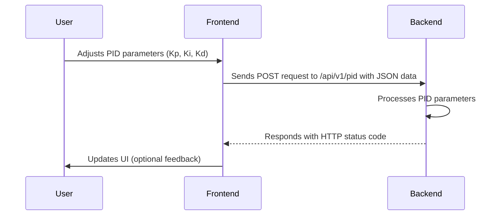
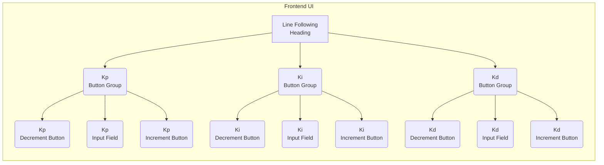

# Web Frontend Interface

This document details the HTML-based frontend interface for the SAC_2024 project, focusing on user interaction and visualization of parameters for the line-following algorithm. The primary file discussed is `line_following/frontend/index.html`.

## Overview

The frontend provides a simple and intuitive interface for tuning the PID (Proportional-Integral-Derivative) controller parameters used in the line-following algorithm.  It allows users to adjust the Kp, Ki, and Kd values and immediately submit these changes to the backend for real-time testing and optimization.

## Core Features

*   **PID Parameter Adjustment:**  Input fields and increment/decrement buttons for precise tuning of Kp, Ki, and Kd values.
*   **Real-time Updates:**  Automatic submission of parameter changes to the backend via `XMLHttpRequest` upon value changes or button clicks.
*   **Minimalist Design:**  A clean and focused user interface designed for efficient parameter tuning.

## Frontend Structure

The `index.html` file is structured as follows:

1.  **HTML Head:** Contains meta-information, title, and CSS styling.
2.  **HTML Body:**
    *   `main` element:  A container for the entire tuning interface.
    *   `h1` element:  The title "Line Following".
    *   Multiple `div` elements with class `button-group`: Each group contains:
        *   `h3` element:  Label for the parameter (Kp, Ki, Kd).
        *   `button` elements:  Decrement and increment buttons.
        *   `input` element:  A number input field to display and edit the parameter value.
    *   `script` element:  JavaScript code for handling user interactions and sending data to the backend.

## Key Components and Code Snippets

### 1. HTML Structure for a Parameter Group

Each PID parameter (Kp, Ki, Kd) is represented by a `button-group` div. This structure ensures clear association between the label, input field, and increment/decrement controls.

```html
<div class="button-group">
    <h3>Kp</h3>
    <button>&lt;</button>
    <input type="number" value="0.000" id="kp" />
    <button>&gt;</button>
</div>
```

[View on GitHub](https://github.com/shinymack/SAC_2024/blob/main/line_following/frontend/index.html)

### 2. CSS Styling

The CSS provides basic styling for the interface, including layout, colors, and font. Note the use of a background image for visual appeal.

```css
body {
    width: 100%;
    height: 100vh;
    background: url("data:image/svg+xml;base64,PHN2ZyB4bWxucz0iaHR0cDovL3d3dy53My5vcmcvMjAwMC9zdmciIHhtbG5zOnhsaW5rPSJodHRwOi8vd3d3LnczLm9yZy8xOTk5L3hsaW5rIiB3aWR0aD0iMTAwJSIgaGVpZ2h0PSIxMDAlIj48ZGVmcz48cGF0dGVybiBpZD0icGF0dGVybiIgd2lkdGg9IjQ2LjE5IiBoZWlnaHQ9IjQwIiB2aWV3Qm94PSIwIDAgMzQuNjQxMDE2MTUxMzc3NTUsMzAiIHBhdHRlcm5Vbml0cz0idXNlclNwYWNlT25Vc2UiIHBhdHRlcm5UcmFuc2Zvcm09InJvdGF0ZSgxMzUpICI+PHJlY3QgaWQ9InBhdHRlcm4tYmFja2dyb3VuZCIgd2lkdGg9IjQwMCUiIGhlaWdodD0iNDAwJSIgZmlsbD0icmdiYSgyNiwgMzIsIDQ0LDEpIj48L3JlY3Q+IDxwYXRoIGZpbGw9InJnYmEoNDUsIDU1LCA3MiwxKSIgZD0iTS0yMCAtMjAgaDIwMCB2MjAwIGgtMjAwIE0zMy43NyAyNS41TDI1Ljk4IDIxTDE4LjE5IDI1LjVMMTguMTkgMzQuNUwyNS45OCAzOUwzMy43NyAzNC41ek0xNi40NSAyNS41TDguNjYgMjFMMC44NyAyNS41TDAuODcgMzQuNUw4LjY2IDM5TDE2LjQ1IDM0LjV6TTcuNzkgMTAuNUwwIDZMLTcuNzkgMTAuNUwtNy43OSAxOS41TDAgMjRMNy43OSAxOS41ek0xNi40NSAtNC41TDguNjYgLTlMMC44NyAtNC41TDAuODcgNC41TDguNjYgOUwxNi40NSA0LjV6TTMzLjc3IC00LjVMMjUuOTggLTlMMTguMTkgLTQuNUwxOC4xOSA0LjVMMjUuOTggOUwzMy43NyA0LjV6TTQyLjQzIDEwLjVMMzQuNjQgNkwyNi44NSAxMC41TDI2Ljg1IDE5LjVMMzQuNjQgMjRMNDIuNDMgMTkuNXpNMjUuMTEgMTAuNUwxNy4zMiA2TDkuNTMgMTAuNUw5LjUzIDE5LjVMMTcuMzIgMjRMMjUuMTEgMTkuNXoiPjwvcGF0aD48cGF0aCBmaWxsPSJyZ2JhKDE5MCwgMjI3LCAyNDgsMSkiIGQ9Ik0tMjAgLTIwIGgyMDAgdjIwMCBoLTIwMCBNMjQuMjEgMjUuMjVMMTUuOTggMjAuNUw3Ljc1IDI1LjI1TDcuNzUgMzQuNzVMMTUuOTggMzkuNUwyNC4yMSAzNC43NXpNNi44OSAyNS4yNUwtMS4zNCAyMC41TC05LjU3IDI1LjI1TC05LjU3IDM0Ljc1TC0xLjM0IDM5LjVMNi44OSAzNC43NXpNLTEuNzcgMTAuMjVMLTEwIDUuNUwtMTguMjMgMTAuMjVMLTE4LjIzIDE5Ljc1TC0xMCAyNC41TC0xLjc3IDE5Ljc1ek02Ljg5IC00Ljc1TC0xLjM0IC05LjVMLTkuNTcgLTQuNzVMLTkuNTcgNC43NUwtMS4zNCA5LjVMNi44OSA0Ljc1ek0yNC4yMSAtNC43NUwxNS45OCAtOS41TDcuNzUgLTQuNzVMNy43NSA0Ljc1TDE1Ljk4IDkuNUwyNC4yMSA0Ljc1ek0zMi44NyAxMC4yNUwyNC42NCA1LjVMMTYuNDEgMTAuMjVMMTYuNDEgMTkuNzVMMjQuNjQgMjQuNUwzMi44NyAxOS43NXpNNDEuNTMgMjUuMjVMMzMuMyAyMC41TDI1LjA3IDI1LjI1TDI1LjA3IDM0Ljc1TDMzLjMgMzkuNUw0MS41MyAzNC43NXpNMTUuNTUgNDAuMjVMNy4zMiAzNS41TC0wLjkxIDQwLjI1TC0wLjkxIDQ5Ljc1TDcuMzIgNTQuNUwxNS41NSA0OS43NXpNLTEwLjQzIDI1LjI1TC0xOC42NiAyMC41TC0yNi44OSAyNS4yNUwtMjYuODkgMzQuNzVMLTE4LjY2IDM5LjVMLTEwLjQzIDM0Ljc1ek0tMTAuNDMgLTQuNzVMLTE4LjY2IC05LjVMLTI2Ljg5IC00Ljc1TC0yNi44OSA0Ljc1TC0xOC42NiA5LjVMLTEwLjQzIDQuNzV6TTE1LjU1IC0xOS43NUw3LjMyIC0yNC41TC0wLjkxIC0xOS43NUwtMC45MSAtMTAuMjVMNy4zMiAtNS41TDE1LjU1IC0xMC4yNXpNNDEuNTMgLTQuNzVMMzMuMyAtOS41TDI1LjA3IC00Ljc1TDI1LjA3IDQuNzVMMzMuMyA5LjVMNDEuNTMgNC43NXpNMzIuODcgNDAuMjVMMjQuNjQgMzUuNUwxNi40MSA0MC4yNUwxNi40MSA0OS43NUwyNC42NCA1NC41TDMyLjg3IDQ5Ljc1ek0tMS43NyA0MC4yNUwtMTAgMzUuNUwtMTguMjMgNDAuMjVMLTE4LjIzIDQ5Ljc1TC0xMCA1NC41TC0xLjc3IDQ5Ljc1ek0tMTkuMDkgMTAuMjVMLTI3LjMyIDUuNUwtMzUuNTUgMTAuMjVMLTM1LjU1IDE5Ljc1TC0yNy4zMiAyNC41TC0xOS4wOSAxOS43NXpNLTEuNzcgLTE5Ljc1TC0xMCAtMjQuNUwtMTguMjMgLTE5Ljc1TC0xOC4yMyAtMTAuMjVMLTEwIC01LjVMLTEuNzcgLTEwLjI1ek0zMi44NyAtMTkuNzVMMjQuNjQgLTI0LjVMMTYuNDEgLTE5Ljc1TDE2LjQxIC0xMC4yNUwyNC42NCAtNS41TDMyLjg3IC0xMC4yNXpNNTAuMTkgMTAuMjVMNDEuOTYgNS41TDMzLjczIDEwLjI1TDMzLjczIDE5Ljc1TDQxLjk2IDI0LjVMNTAuMTkgMTkuNzV6TTE1LjU1IDEwLjI1TDcuMzIgNS41TC0wLjkxIDEwLjI1TC0wLjkxIDE5Ljc1TDcuMzIgMjQuNUwxNS41NSAxOS43NXoiPjwvcGF0aD48L3BhdHRlcm4+ICA8L2RlZnM+IDxyZWN0IGZpbGw9InVybCgjcGF0dGVybikiIGhlaWdodD0iMTAwJSIgd2lkdGg9IjEwMCUiPjwvcmVjdD48L3N2Zz4=");
    display: flex;
    justify-content: center;
    align-items: center;
}
```

[View on GitHub](https://github.com/shinymack/SAC_2024/blob/main/line_following/frontend/index.html)

### 3. JavaScript:  Value Submission (`submitVals` function)

This function is responsible for collecting the Kp, Ki, and Kd values from the input fields and sending them to the backend via an HTTP POST request to `/api/v1/pid`.

```javascript
function submitVals() {
    const data = {};
    data["kp"] = parseFloat(document.getElementById("kp").value);
    data["ki"] = parseFloat(document.getElementById("ki").value);
    data["kd"] = parseFloat(document.getElementById("kd").value);
    let finaldata = JSON.stringify(data);
    console.log(finaldata);

    let xhr = new XMLHttpRequest();

    // Vedant!
    let url = "/api/v1/pid";

    // open a connection
    xhr.open("POST", url, true);

    // Set the request header i.e. which type of content you are sending
    xhr.setRequestHeader("Content-Type", "application/json");
    // Create a state change callback
    xhr.onreadystatechange = function () {
        if (xhr.readyState === 4) {
            if (xhr.status == 400) {
                console.log("Success!");
            } else {
                console.log(xhr.status);
            }
            // Print received data from server
        }
    };

    // Sending data with the request
    xhr.send(finaldata);
}
```

[View on GitHub](https://github.com/shinymack/SAC_2024/blob/main/line_following/frontend/index.html)

This function uses `XMLHttpRequest` to send the data. The data is stringified into JSON format before sending. Error handling is included to log the status of the request.

### 4. JavaScript: Event Listeners for Input Changes

Event listeners are attached to each input field to trigger the `submitVals` function whenever the value is changed.  This ensures that any modification to the PID parameters is immediately sent to the backend.

```javascript
let inpArray = document.querySelectorAll("input[type='number']");
for (let i = 0; i < inpArray.length; i++) {
    inpArray[i].addEventListener("change", submitVals);
}
```

[View on GitHub](https://github.com/shinymack/SAC_2024/blob/main/line_following/frontend/index.html)

### 5. JavaScript: Increment/Decrement Buttons

Functions `incrementVal` and `decrementVal` handle the incrementing and decrementing of PID values, respectively. They also call `submitVals` after updating the input field.

```javascript
function decrementVal(e) {
    let test = e.target.parentNode.children[2].value;
    if (!isNaN(Number(test))) {
        e.target.parentNode.children[2].value = String(
            (Number(test) - 0.01).toFixed(3)
        );
        submitVals();
    } else {
        e.target.parentNode.children[2].value = "0.000";
    }
}
function incrementVal(e) {
    let test = e.target.parentNode.children[2].value;
    if (!isNaN(Number(test))) {
        e.target.parentNode.children[2].value = String(
            (Number(test) + 0.01).toFixed(3)
        );
        submitVals();
    } else {
        e.target.parentNode.children[2].value = "0.000";
    }
}
```

[View on GitHub](https://github.com/shinymack/SAC_2024/blob/main/line_following/frontend/index.html)

### 6. JavaScript: Attaching Event Listeners to Buttons

This snippet selects all increment and decrement buttons and attaches click event listeners to them, calling the corresponding functions.

```javascript
let decrementButtons = document.querySelectorAll(
    ".button-group button:first-of-type"
);
let incrementButtons = document.querySelectorAll(
    ".button-group button:last-of-type"
);

for (button of decrementButtons) {
    button.addEventListener("click", decrementVal);
}
for (button of incrementButtons) {
    button.addEventListener("click", incrementVal);
}
```

[View on GitHub](https://github.com/shinymack/SAC_2024/blob/main/line_following/frontend/index.html)

## Communication Flow

The following Mermaid diagram illustrates the communication flow between the frontend and backend:





## UI Component Relationship

This flowchart diagram illustrates the relationship between the UI components.





## Key Integration Points

*   **API Endpoint:** The frontend communicates with the backend via the `/api/v1/pid` endpoint.  Ensure this endpoint is correctly implemented and accessible on the backend.
*   **Data Format:** The frontend sends PID parameters in JSON format. The backend must be able to parse this JSON data.
*   **Error Handling:**  The frontend includes basic error handling to log the status code of the HTTP request. More robust error handling may be needed to provide user feedback.

## Best Practices

*   **Input Validation:** Implement input validation on the frontend to prevent users from entering invalid parameter values.
*   **Backend Validation:**  Implement validation on the backend to ensure that the received PID parameters are within acceptable ranges.
*   **User Feedback:**  Provide visual feedback to the user when parameters are successfully updated.
*   **Accessibility:** Ensure that the frontend is accessible to users with disabilities by following accessibility guidelines.  Consider ARIA attributes and keyboard navigation.