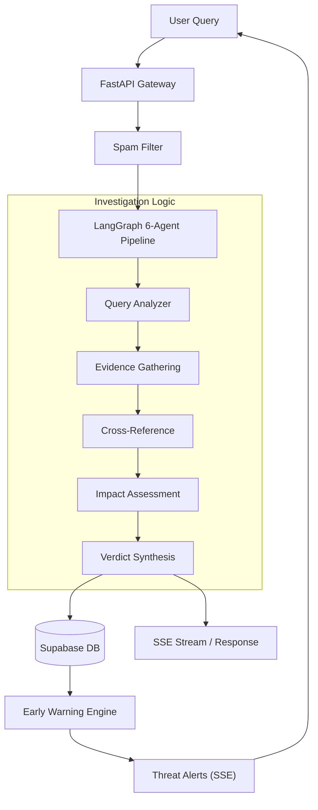

# Project Overview

Veritas is a sophisticated **Multi-Source Misinformation & Social Risk Early Warning System** designed to combat the spread of digital falsehoods. By leveraging a multi-agent AI architecture, Veritas autonomously investigates claims in real-time, cross-referencing diverse data streams to provide a verifiable verdict on the accuracy and potential social impact of a given piece of information.

The system transforms raw user queries into comprehensive investigation reports, utilizing a rigorous pipeline that mimics the workflow of professional fact-checkers and risk analysts.

## Core Purpose

In an era of rapid information decay, Veritas serves three primary functions:
1. **Verification**: Determining the truthfulness of a claim using authoritative evidence.
2. **Impact Quantification**: Assessing the potential risk a claim poses to public safety, emotional stability, or social cohesion.
3. **Early Warning**: Detecting emerging patterns of misinformation "spikes" before they reach critical mass.

## Backend Capabilities

The Veritas backend is built on a high-performance stack featuring **FastAPI**, **LangGraph**, and **Supabase**, providing a robust foundation for complex AI orchestration.

### 1. The 6-Agent Investigation Pipeline
The heart of Veritas is a LangGraph-powered orchestration layer that executes a sequential, multi-step verification process:

*   **Query Analyzer**: Refines user input and determines the appropriate domain category (Health, Finance, Politics, Tech, or General).
*   **Clarifier**: Identifies ambiguities in the query and generates necessary follow-up questions.
*   **Evidence Gatherer**: Orchestrates four specialized sub-agents to pull data from Tavily (Web), Media Cloud (News), Authority domains, and Google Fact Check API.
*   **Cross-Reference Analyzer**: Synthesizes all gathered evidence to identify consensus points and contradictions.
*   **Impact Assessor**: Evaluates the claim across five dimensions: Topic Sensitivity, Geographic Reach, Emotional Charge, Actionability, and Vulnerable Populations.
*   **Verdict Synthesizer**: Produces the final verdict (**TRUE**, **FALSE**, **PARTIALLY_TRUE**, **MISLEADING**, or **UNVERIFIED**) with a confidence score.

### 2. Early Warning Engine
Beyond individual queries, Veritas runs a background monitoring service that analyzes investigation clusters every two minutes. If a spike in similar claims is detected with high average impact scores, the system automatically generates a `Threat` record and broadcasts a real-time alert via Server-Sent Events (SSE).

### 3. Real-Time Streaming Architecture
To handle the latency inherent in deep AI research (~60 seconds per report), the backend implements **SSE (Server-Sent Events)**. This allows the frontend to stream the "thought process" of the agents in real-time, providing users with immediate visibility into the investigation's progress.

## System Architecture Flow

## Technical Summary

| Component | Technology | Role |
| :--- | :--- | :--- |
| **Orchestration** | LangGraph | State management for the agentic workflow |
| **LLM** | Google Gemini | Reasoning and synthesis engine |
| **Database** | Supabase (PostgreSQL) | Persistent storage for reports and threat telemetry |
| **Search** | Tavily / Media Cloud | Real-time web and news indexing |
| **Communication** | SSE / JSON | Real-time event streaming and RESTful API |