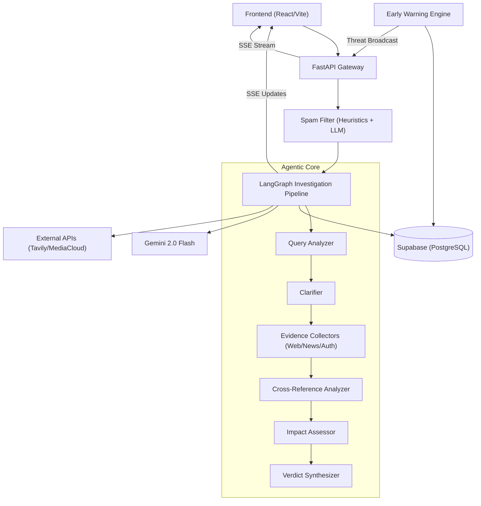

# System Architecture

Veritas is designed as a high-throughput, agentic misinformation detection and social risk monitoring system. It leverages a decoupled architecture combining a reactive API layer, a stateful agentic orchestration pipeline, and asynchronous background engines for early threat detection.

## High-Level System Blueprint

The system follows a request-response and event-driven hybrid model. User investigations are processed through a sequential agent pipeline, while systemic risks are identified by background scanners and broadcasted via Server-Sent Events (SSE).




## The Agentic Core

The heart of Veritas is a compiled **LangGraph StateGraph**. Unlike linear chains, the investigation pipeline manages a shared `InvestigationState` object, allowing agents to read and append data cumulatively.

### Pipeline Orchestration

Each node in the graph represents a specialized agent. The transition between nodes is managed by the state, where specific flags (e.g., `needs_clarification`) can trigger conditional routing.

| Agent | Role | Logic | Output |
| :--- | :--- | :--- | :--- |
| **Query Analyzer** | Classification | LLM | `refined_query`, `category` |
| **Clarifier** | Ambiguity Resolution | LLM (Conditional) | Refined user intent |
| **Collectors** | Data Acquisition | API Integration | `EvidenceItem[]` (Web, News, Fact-Checks) |
| **Cross-Reference** | Conflict Detection | LLM | Consensus points, contradictions |
| **Impact Assessor** | Risk Quantization | LLM | 5-Dimension Impact Score |
| **Verdict Synth** | Final Determination | LLM | `Verdict`, `Confidence`, `Summary` |

### Shared State & Reducers

To prevent state overwriting during parallel execution (specifically among the Evidence Collectors), Veritas uses **Annotated Reducers**. 

```python
# Conceptual state reduction
evidence: Annotated[list[EvidenceItem], merge_evidence]
investigation_trail: Annotated[list[str], merge_trail]
```

The `merge_evidence` reducer ensures that as different search agents (Web, News, Authority) complete their tasks, their findings are appended to the global list rather than replacing it.

## Data Flow & Persistence

### 1. Investigation Lifecycle
1. **Ingress**: A `InvestigateRequest` is validated via Pydantic and passed through the **Spam Filter**.
2. **Processing**: The LangGraph pipeline executes. Every agent transition triggers an `AgentStepEvent` sent via SSE to the frontend.
3. **Persistence**: The final `InvestigationReport` and associated `EvidenceItem` records are persisted to Supabase.
4. **Completion**: The SSE stream closes with a `complete` event containing the final report.

### 2. Early Warning Lifecycle
The **Early Warning Engine** operates as an independent asynchronous loop:
- **Fetch**: Pulls all investigations from the last 6 hours.
- **Cluster**: Uses Jaccard similarity to group similar claims.
- **Detect**: If a cluster exceeds a threshold ($\ge 3$ claims) and possesses a high average impact score ($> 60$), it is escalated to a `Threat`.
- **Broadcast**: The new threat is pushed to the `ThreatEventBus`, which pushes real-time updates to all connected clients.

## Communication Protocols

### Server-Sent Events (SSE)
Veritas uses SSE instead of WebSockets to maintain a lightweight, unidirectional stream for long-running LLM tasks.

- **Investigation Stream**: Provides granular visibility into the agentic "thought process" (`agent_step` $\rightarrow$ `complete`).
- **Threat Stream**: A global broadcast channel for systemic risk alerts (`threat` $\rightarrow$ `ping`).

### API Interface
The backend exposes a RESTful interface for non-streaming operations:
- `/feed`: Paginated retrieval of published investigations.
- `/threats`: Management and retrieval of identified social risks.
- `/investigate`: Entry point for the agentic pipeline (SSE).

## Impact Assessment Framework

The system quantifies risk using five distinct dimensions, each scored from $0.0$ to $100.0$:

- **Topic Sensitivity**: Subject matter volatility (e.g., Health vs. General).
- **Geographic Reach**: Potential for cross-border spread.
- **Emotional Charge**: Level of provocative language.
- **Actionability**: Likelihood of triggering harmful real-world behavior.
- **Vulnerable Populations**: Risk to specific marginalized or at-risk groups.