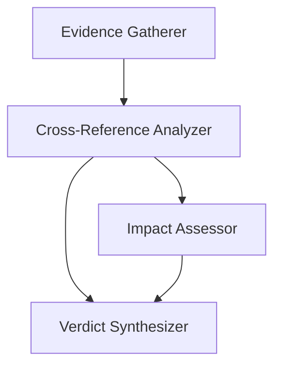

# Agent Specializations

Veritas employs a multi-agent orchestration architecture designed to mitigate LLM hallucination and bias. By decomposing the investigation process into discrete, specialized roles, the system ensures that evidence is gathered from diverse sources, cross-verified for consistency, and assessed for societal risk before a final verdict is synthesized.

## 1. Evidence Gatherer
The Evidence Gatherer acts as the primary data acquisition layer. Rather than relying on a single search, it deploys four parallel sub-agents to ensure a comprehensive evidentiary base.

### Sub-Agent Breakdown
| Sub-Agent | Source/API | Focus | Credibility Weight |
| :--- | :--- | :--- | :--- |
| **Web Search** | Tavily API | Broad web presence and general discourse | Medium |
| **News Scanner** | Media Cloud | Recent reporting from national news collections | Medium-High |
| **Authority Checker** | Tavily (Filtered) | Official domains (WHO, CDC, .gov, .edu) | High |
| **Fact-Check Lookup** | Google Fact Check | Existing claims and professional debunking | High |

Each item gathered is stored as an `EvidenceItem`, containing the raw content, source metadata, and an initial credibility score.

## 2. Cross-Reference Analyzer
The Cross-Reference Analyzer transforms raw evidence into a structured analysis. Its primary goal is to identify the "shape" of the truth across multiple sources.

**Key Analysis Metrics:**
- **Consensus Points:** Factual claims that appear consistently across multiple high-credibility sources.
- **Contradictions:** Direct conflicts between sources (e.g., Source A claims $X$, Source B claims $Y$).
- **Unique Findings:** Data points appearing in only one source, flagged for cautious interpretation.
- **Source Agreement Score:** A normalized value (0.0 to 1.0) representing the overall coherence of the gathered evidence.

## 3. Impact Assessor
The Impact Assessor evaluates the potential real-world harm associated with the claim. This prevents the system from treating trivial misinformation with the same urgency as high-risk medical or safety claims.

The agent scores the following six dimensions from 0-100:

1. **Topic Sensitivity:** Sensitivity of the subject matter (e.g., Public Health vs. Pop Culture).
2. **Geographic Reach:** The potential scale of the spread (Global vs. Hyper-local).
3. **Emotional Charge:** The level of fear, outrage, or provocation.
4. **Actionability:** The likelihood that a user will take harmful physical or financial action.
5. **Vulnerable Populations:** Whether the claim targets specific high-risk groups.
6. **Amplification Risk:** The probability of the claim going viral via social algorithms.

The **Overall Impact Score** is a weighted average that prioritizes *Actionability* and *Vulnerable Populations*.

## 4. Verdict Synthesizer
The Verdict Synthesizer is the final decision-making authority. It consumes the outputs of all previous agents to produce a definitive, evidence-backed conclusion.

### Verdict Classifications
The synthesizer maps its findings to one of five categories:

- `TRUE`: Strong evidence from multiple credible sources.
- `FALSE`: Strong evidence from multiple credible sources contradicting the claim.
- `PARTIALLY_TRUE`: Elements of truth are present, but the context is incomplete.
- `MISLEADING`: Technically accurate data used to support a false conclusion.
- `UNVERIFIED`: Insufficient evidence to make a determination.

### Confidence Scoring
Confidence is assigned based on the strength of the evidentiary chain:
- **0.9 - 1.0:** Multiple authoritative sources + Fact-checker confirmation.
- **0.7 - 0.9:** Strong evidence from credible sources with high consensus.
- **0.5 - 0.7:** Mixed evidence or moderate contradictions.
- **0.3 - 0.5:** Limited evidence; high uncertainty.
- **0.0 - 0.3:** Purely speculative; negligible evidence.