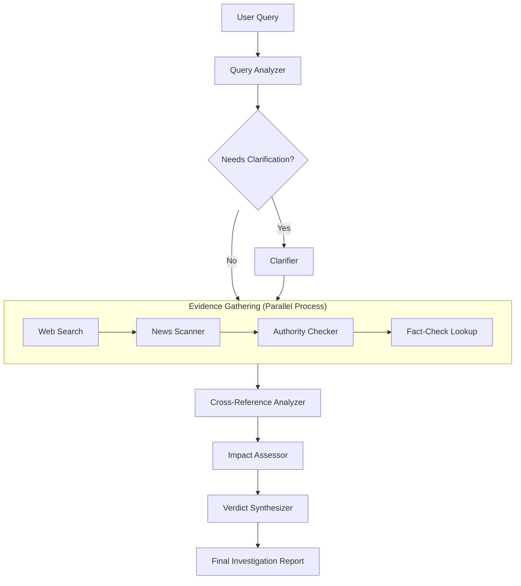

# AI Agent Pipeline

The Veritas investigation pipeline is a sophisticated multi-agent orchestration system built on **LangGraph**. It transforms a raw user query into a verified verdict by routing the claim through a series of specialized agents, each responsible for a distinct phase of the misinformation detection lifecycle.

## Architecture Overview

The pipeline operates as a directed graph where the `InvestigationState` acts as the single source of truth, passed between nodes and updated incrementally.




## Pipeline Stages

### 1. Query Analysis
The `query_analyzer` serves as the gateway. It parses the raw input to:
- **Refine the Claim**: Convert ambiguous queries into neutral, factual statements.
- **Categorize**: Assign the claim to a domain (Health, Finance, Politics, Tech, or General) to optimize downstream search parameters.
- **Determine Clarity**: Decide if the query is too vague to investigate, triggering a conditional route to the `Clarifier`.

### 2. Evidence Gathering
Once the query is refined, the system initiates a comprehensive data collection phase. While represented sequentially in the graph edges for state flow, these agents function as a "fan-out" to collect diverse data points:
- **Web Search**: Broad retrieval of current web data.
- **News Scanner**: Focused scanning of journalistic sources.
- **Authority Checker**: Validation of the credibility of the sources found.
- **Fact-Check Lookup**: Querying known fact-checking databases.

### 3. Synthesis and Verdict
The final phase transforms raw evidence into an actionable intelligence report:
- **Cross-Reference Analyzer**: Identifies contradictions or corroborations across the gathered evidence.
- **Impact Assessor**: Evaluates the potential real-world harm or significance of the claim.
- **Verdict Synthesizer**: Produces the final `Verdict` (e.g., True, False, Misleading) with a confidence score and a detailed summary.

## State Management

Veritas uses a shared `InvestigationState` to maintain continuity across agent boundaries. To prevent data loss during the parallel evidence gathering phase, the pipeline employs **State Reducers**.

### Reducer Logic
Instead of overwriting the state, specific fields use merge functions:

- **Evidence Merger**: The `merge_evidence` function ensures that `EvidenceItem` lists are deduplicated by ID, allowing multiple agents to contribute to the same evidence pool.
- **Trail Merger**: The `merge_trail` function appends timestamps and agent logs to the `investigation_trail`, creating a transparent audit log of the AI's reasoning process.

## Execution and Streaming

The pipeline supports two execution modes via `backend/app/agents/pipeline.py`:

### Streaming Mode (`run_investigation`)
Designed for real-time UI updates, this method uses `investigation_graph.astream`. It yields `AgentStepEvent` objects via Server-Sent Events (SSE), notifying the frontend as each agent completes its task:

```typescript
// Example Event Sequence
{ "agent": "query_analyzer", "status": "completed", "message": "Query Analyzer completed" }
{ "agent": "web_search", "status": "completed", "message": "Web Search completed" }
// ...
{ "agent": "pipeline", "status": "completed", "data": { ...InvestigationReport } }
```

### Simple Mode (`run_investigation_simple`)
A non-streaming wrapper that invokes the graph and returns a final `InvestigationReport` object, ideal for API integrations or background jobs.