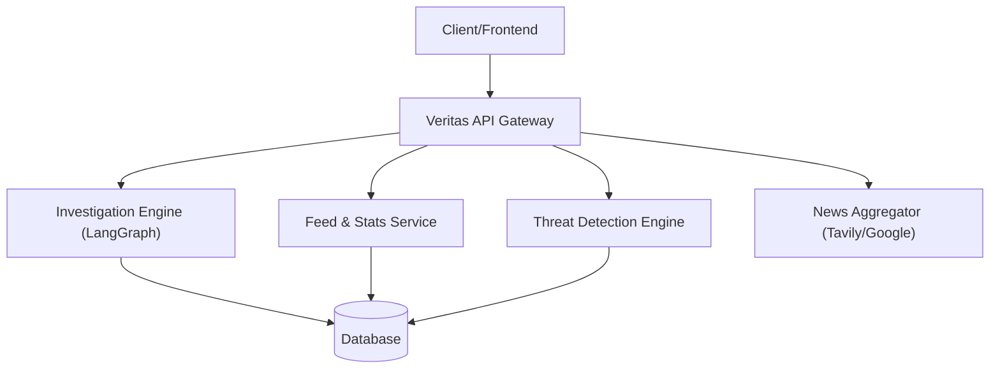

# API Reference

The Veritas API provides a robust interface for executing AI-driven investigations, monitoring real-time misinformation threats, and consuming curated news feeds. The API is built with FastAPI and leverages Server-Sent Events (SSE) for long-running asynchronous processes.




## Investigation API
The core engine for analyzing claims using the LangGraph pipeline.

### Trigger Investigation (Streaming)
`POST /investigate`

Runs the full investigation pipeline. This endpoint uses **Server-Sent Events (SSE)** to stream agent steps in real-time.

**Request Body**
| Field | Type | Description |
| :--- | :--- | :--- |
| `query` | `string` | The claim or question to investigate. |

**Behavior**
- **Spam Filter**: Queries are passed through a spam filter; rejected queries return a `400 Bad Request`.
- **Duplicate Check**: If a similar claim was investigated recently, it returns a `409 Conflict` with the existing `investigation_id`.
- **Persistence**: The final report is automatically saved to the database upon completion.

### Trigger Investigation (Synchronous)
`POST /investigate/sync`

Executes the pipeline and returns the final `InvestigationReport` as a single JSON response. Useful for programmatic integrations.

**Response**
Returns a full `InvestigationReport` object including verdict, confidence score, and evidence.

---

## Feed API
Access to the public archive of past investigations and global platform statistics.

### List Investigations
`GET /feed`

Retrieve a paginated list of past investigations.

**Query Parameters**
| Parameter | Type | Default | Description |
| :--- | :--- | :--- | :--- |
| `category` | `string` | `null` | Filter by category (e.g., Health, Politics). |
| `sort` | `string` | `recent` | Sort by `recent`, `impact`, or `trending`. |
| `page` | `int` | `1` | Page number (min: 1). |
| `limit` | `int` | `20` | Items per page (max: 100). |

### Recent Activity
`GET /feed/recent`

Returns a compact list of the 5 most recent investigations for dashboard tickers.

### Investigation Report
`GET /feed/{investigation_id}`

Fetch the full detailed report for a specific investigation.

### Vote/Flag Report
`POST /feed/{investigation_id}/vote`

Allows users to upvote or flag an investigation for quality control.

**Request Body**
```json
{
  "user_id": "string",
  "vote_type": "upvote | flag"
}
```

### Dashboard Stats
`GET /feed/stats`

Returns aggregate metrics including total investigations, average confidence, and verdict distributions.

---

## Threat API
The Early Warning System (EWS) for detecting viral misinformation clusters.

### Active Threats
`GET /threats/active`

Returns a list of current high-priority threats detected by the engine.

### Real-time Threat Stream
`GET /threats/stream`

An **SSE endpoint** that pushes new threat alerts to the client as they are detected.
- **Events**: `threat` (New threat detected), `ping` (Keep-alive).

### Topic Clusters
`GET /threats/clusters`

Groups similar investigations from the last 6 hours using similarity thresholds. Returns clusters with 2+ related claims.

**Response Object**
- `topic`: The primary query of the cluster.
- `count`: Number of related investigations.
- `avg_impact`: Mean impact score of the cluster.
- `verdicts`: Unique verdicts found within the group.

---

## News API
External intelligence gathering for the discovery sidebar.

### Trending News
`GET /news/trending`

Aggregates trending headlines from Tavily and the Google Fact Check Tools API.

**Technical Details**
- **Caching**: Results are cached in-memory for **30 minutes** to optimize API quota usage.
- **Deduplication**: Case-insensitive title deduplication is applied across sources.
- **Limit**: Returns a maximum of 10 curated items.