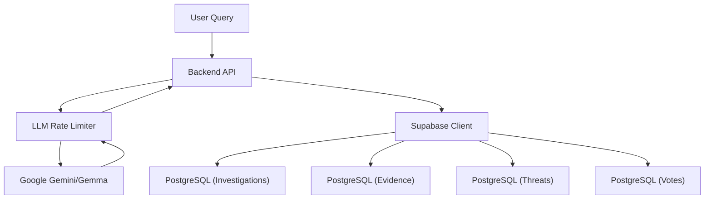

# Core Infrastructure

Veritas utilizes a modern serverless architecture designed for high-reliability fact-checking and threat detection. The core infrastructure is built upon a Python backend, Google's Generative AI models, and Supabase as the primary persistence and authentication layer.

## System Architecture

The following diagram illustrates the flow of data from the LLM orchestration layer through the backend logic into the Supabase persistence layer.

## LLM Orchestration & Rate Limiting

To ensure stability and prevent API quota exhaustion (particularly when using models like `gemma-3-27b-it`), Veritas implements a custom token-bucket style rate limiter.

### Rate Limiting Logic
The `_RateLimiter` class enforces a minimum interval between LLM calls. Based on token-per-minute (TPM) limits, the system is configured with a **10-second delay** between requests.

- **Implementation**: Uses an `asyncio.Lock` to ensure sequential access to the LLM during high-concurrency periods.
- **Invocation**: All LLM calls are routed through `rate_limited_invoke()`, which awaits the limiter before executing the `ainvoke` method.

### Model Configuration
The system integrates `ChatGoogleGenerativeAI` via LangChain, supporting configurable temperatures (defaulting to `0.1` for high determinism) and system message conversion to maintain compatibility across different Gemini model versions.

## Data Architecture

The persistence layer is powered by PostgreSQL via Supabase, utilizing a relational schema optimized for auditing and rapid retrieval.

### Database Schema

| Table | Purpose | Key Features |
| :--- | :--- | :--- |
| `investigations` | Core analysis reports | Stores verdicts, confidence scores, and JSONB blobs for impact and cross-references. |
| `evidence` | Source verification | Links to investigations; tracks `credibility_score` and `source_type`. |
| `threats` | Early warning system | Aggregates clusters of investigations to identify emerging misinformation trends. |
| `votes` | Community validation | Tracks user upvotes and flags with a unique constraint on `(investigation_id, user_id)`. |

### Schema Highlights
- **JSONB Storage**: To maintain flexibility for LLM-generated outputs, fields such as `evidence`, `impact`, and `investigation_trail` use JSONB, allowing the schema to evolve without requiring migrations for every new analysis metric.
- **Indexing**: Optimized indices are placed on `is_published`, `category`, and `created_at` to support fast feed generation and trending claim detection.

## Supabase Configuration & Security

Veritas employs a tiered security model using Supabase **Row Level Security (RLS)** to balance public transparency with data integrity.

### Access Control Layers

1.  **Public Access**:
    - Can read `investigations` where `is_published = true`.
    - Read-only access to `evidence` and `threats`.
2.  **Authenticated Users**:
    - Can create new investigations.
    - Can update only their own investigations (`auth.uid() = user_id`).
    - Can manage their own votes.
3.  **Service Role**:
    - The backend utilizes the `service_role_key` to bypass RLS for administrative tasks, such as updating global threat stats, aggregating votes, and performing system-wide cleanup.

### Database Helpers
The `backend/app/core/database.py` module provides an abstraction layer over the Supabase client, handling the serialization of Pydantic models (e.g., `InvestigationReport`) into database-compatible dictionaries before insertion.