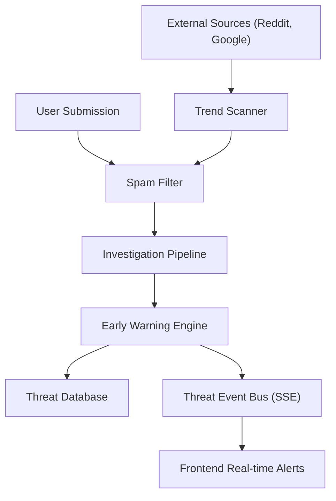

# Background Services

Veritas employs a suite of autonomous background services that transform the platform from a reactive fact-checker into a proactive threat detection system. These services handle input sanitization, proactive trend ingestion, and the identification of emerging misinformation spikes.

## Spam Filter

The Spam Filter acts as the primary gatekeeper for the Veritas pipeline. Every query—whether submitted by a user or ingested by the Trend Scanner—must pass through this LLM-based validation layer to prevent resource exhaustion and platform abuse.

### Classification Logic
The filter categorizes queries into four distinct buckets:
- **Genuine**: A real claim or question regarding possible misinformation.
- **Spam**: Nonsensical text, advertising, or gibberish.
- **Abusive**: Hate speech, threats, or harassment.
- **Off-topic**: Requests unrelated to factual claims (e.g., "write a poem").

### Implementation Details
The filter utilizes a low-temperature LLM configuration to ensure deterministic classification. To maintain system availability, the filter implements a **"fail open"** strategy: if the LLM service encounters an error, the query is allowed through to avoid blocking legitimate investigations.

## Trend Scanner

The Trend Scanner is a proactive ingestion engine that monitors the digital landscape for emerging claims, ensuring Veritas identifies misinformation before it becomes viral.

### Data Ingestion Sources
The scanner aggregates data from three primary streams:
1. **Google Trends**: Captures high-volume search spikes.
2. **Reddit RSS**: Monitors "hot" posts in news, science, and technology subreddits.
3. **Google Fact Check API**: Tracks claims currently being addressed by professional fact-checkers.

### Processing Pipeline
The scanner follows a five-stage cycle:
1. **Fetch**: Parallel retrieval of raw headlines from all sources.
2. **Filter**: An LLM selects the top 5 most "investigation-worthy" claims and rephrases them into clear, factual statements.
3. **Deduplicate**: Queries are compared against investigations from the last 24 hours using a keyword overlap threshold ($>0.6$) to avoid redundant work.
4. **Investigate**: Selected claims are automatically injected into the `run_investigation_simple` pipeline.
5. **Persist**: Results are saved to the database, feeding the Early Warning Engine.

## Early Warning Engine

The Early Warning Engine analyzes the output of the investigation pipeline to detect systemic misinformation campaigns. It identifies "spikes" where multiple similar claims appear in a short window.

### Spike Detection Algorithm
The engine runs a periodic loop (default: every 120 seconds) executing the following logic:
- **Semantic Clustering**: Groups completed investigations from the last 2 hours based on query similarity.
- **Threshold Analysis**: A cluster is escalated to an **Active Threat** if it meets two criteria:
  - **Volume**: $\ge 3$ similar claims detected.
  - **Severity**: Average impact score $> 60/100$.

### Escalation and Alerting
When a spike is detected, the engine:
1. Creates a `Threat` record in the database with the status `ACTIVE`.
2. Calculates the average confidence and impact across the cluster.
3. Publishes the threat to the `ThreatEventBus`.

## Threat Event Bus

To provide real-time intelligence, Veritas uses a lightweight pub/sub Event Bus. This allows the backend to push critical alerts to the frontend via **Server-Sent Events (SSE)** without requiring the client to poll the database.

- **Subscribers**: Frontend clients maintain an open SSE connection.
- **Publishers**: The Early Warning Engine pushes `new_threat` events containing the threat's metadata and escalation reason.
- **Reliability**: The bus uses `asyncio.Queue` with non-blocking puts to ensure slow network consumers do not lag the background detection loop.