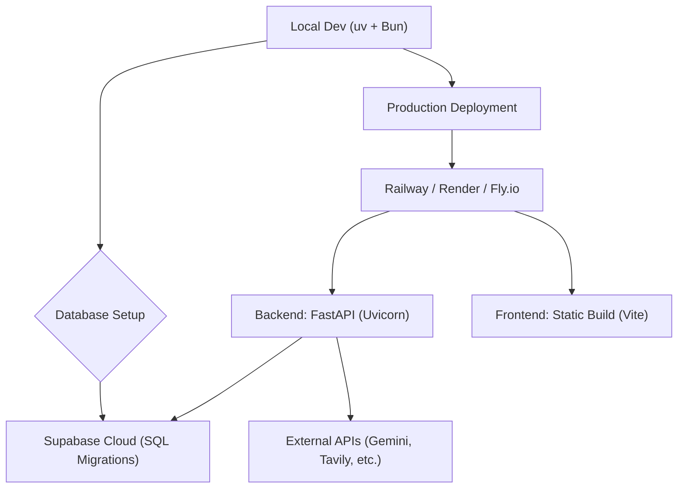

# Deployment & Testing

This guide provides comprehensive instructions for setting up the Veritas environment locally, deploying to production platforms, and validating the system using the test suite.

## Local Development Setup

Get Veritas running on your local machine in under 5 minutes.

### Prerequisites

| Tool | Version | Installation |
| :--- | :--- | :--- |
| **Python** | 3.12+ | [python.org](https://www.python.org/downloads/) |
| **uv** | Latest | `curl -LsSf https://astral.sh/uv/install.sh \| sh` |
| **Node.js** | 18+ | [nodejs.org](https://nodejs.org/) |
| **Bun** | Latest (Optional) | `curl -fsSL https://bun.sh/install \| bash` |

### Quick Start Steps

1. **Clone and Configure Backend**
   ```bash
   git clone <your-repo-url>
   cd backend
   cp .env.example .env
   ```
   Edit `.env` and provide your API keys (Gemini and Supabase are mandatory).

2. **Install Dependencies**
   ```bash
   uv sync
   ```

3. **Initialize Database**
   Go to your [Supabase Dashboard](https://supabase.com/dashboard) $\rightarrow$ **SQL Editor**, paste the contents of `backend/app/db/migrations.sql`, and execute it.

4. **Launch Services**
   ```bash
   # Start Backend (Port 8000)
   uv run uvicorn app.main:app --reload --port 8000

   # Start Frontend (Port 5173)
   cd ../frontend
   bun install && bun dev
   ```

## Deployment Architecture

The following diagram illustrates the deployment flow from local development to a production environment.




## Production Deployment Options

Veritas is designed to be platform-agnostic. Choose the method that best fits your needs.

### Option 1: Railway (Recommended)
Ideal for rapid deployment and hackathons.
- **Backend**: Set root to `backend`, start command: `uvicorn app.main:app --host 0.0.0.0 --port $PORT`.
- **Frontend**: Set root to `frontend`, build: `bun install && bun run build`, start: `npx serve dist -s -l $PORT`.

### Option 2: Render
- **Backend**: Web Service $\rightarrow$ Root: `backend` $\rightarrow$ Build: `pip install uv && uv sync` $\rightarrow$ Start: `uv run uvicorn app.main:app --host 0.0.0.0 --port $PORT`.
- **Frontend**: Static Site $\rightarrow$ Root: `frontend` $\rightarrow$ Publish Directory: `frontend/dist`.

### Option 3: Docker / VPS
Use the provided `docker-compose.yml` for self-hosting:
```bash
docker compose up -d
```

## Environment Configuration

Ensure these variables are set in your production environment.

| Variable | Required | Purpose |
| :--- | :---: | :--- |
| `GOOGLE_API_KEY` | ✅ | Gemini 2.0 Flash LLM access |
| `SUPABASE_URL` | ✅ | Connection string for Supabase |
| `SUPABASE_SERVICE_ROLE_KEY` | ✅ | Bypasses RLS for server-side operations |
| `TAVILY_API_KEY` | ⚠️ | Web search capabilities |
| `FRONTEND_URL` | ✅ | CORS configuration for the frontend domain |
| `DEBUG` | ❌ | Set to `false` in production |

## Testing Suite

The backend includes a robust test suite with 84+ tests that use mocked API responses to ensure stability without consuming credits.

### Running Tests
```bash
cd backend
uv run python -m pytest tests/ -v
```

### Test Architecture
The suite utilizes `pytest` and `httpx` for asynchronous API testing. Key fixtures defined in `conftest.py` include:
- `client`: An `AsyncClient` for FastAPI endpoint validation.
- `sample_state`: A pre-populated `InvestigationState` for agent testing.
- `mock_supabase`: A `MagicMock` instance to simulate database interactions.

## Production Checklist

- [ ] **Security**: All API keys moved from `.env` to platform Secret Management.
- [ ] **Database**: `migrations.sql` executed in the production Supabase project.
- [ ] **CORS**: `FRONTEND_URL` matches the live production URL.
- [ ] **Performance**: `DEBUG` is set to `false`.
- [ ] **Reliability**: `/health` endpoint is monitored.

## Scaling Considerations

- **LLM Bottlenecks**: Each investigation triggers 4 sequential LLM calls. Consider implementing a request queue for high-traffic periods.
- **I/O Bounds**: Evidence gathering is asynchronous but sequential per pipeline.
- **Connections**: Server-Sent Events (SSE) are used for real-time updates; ensure your load balancer supports long-lived HTTP connections.
- **Database**: Supabase's free tier is sufficient for small to medium scales but monitor connection limits.