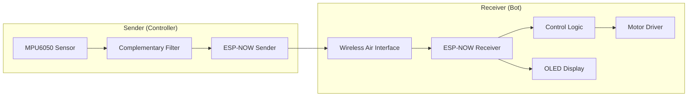

# Introduction

The **Gesture-Controlled Bot** is an embedded system designed to control a robotic vehicle through hand gestures. The system consists of two primary nodes: a **Sender** (the controller) and a **Receiver** (the bot), which communicate wirelessly using the ESP-NOW protocol to achieve low-latency, connectionless data transmission.

## Project Purpose

The primary objective of this project is to translate physical orientation changes (pitch and roll) into directional movement for a mobile robot. By leveraging an Inertial Measurement Unit (IMU), the system allows a user to steer a robot intuitively by tilting a handheld device, eliminating the need for traditional joysticks or buttons.

## High-Level Functionality

The system operates in a continuous loop of data acquisition, processing, and actuation:

1.  **Sensing**: The Sender node reads raw accelerometer and gyroscope data from an MPU6050 sensor.
2.  **Processing**: A complementary filter is applied to the raw data to calculate stable Euler angles (Pitch and Roll).
3.  **Transmission**: The integer values of the calculated angles are packaged into a structure and transmitted via ESP-NOW to a specific MAC address.
4.  **Reception**: The Receiver node captures the incoming packet and extracts the motion data.
5.  **Actuation**: The Receiver maps the pitch and roll values to specific motor commands to move the bot forward, backward, or rotate it.
6.  **Feedback**: The Receiver updates an onboard OLED display to show the current accelerometer values for real-time monitoring.

## System Data Flow

The following diagram illustrates the end-to-end flow of data from the physical gesture to the mechanical response.



## Component Responsibilities

The system is divided into two distinct firmware implementations, each with specific hardware requirements and software responsibilities.

| Component | Primary Hardware | Key Software Responsibilities |
| :--- | :--- | :--- |
| **Sender** | ESP32, MPU6050 (I2C) | I2C initialization, IMU data acquisition, Angle computation, Peer management. |
| **Receiver** | ESP32, Motor Driver, OLED | ESP-NOW callback handling, Motion thresholding, PWM motor control, LVGL display updates. |

## Communication Interface

The Sender and Receiver share a common data structure to ensure consistent parsing of motion data. Only the integer portions of the calculated angles are transmitted to reduce payload size and transmission time.

```c
typedef struct {
  int accel_x; // Integer part of pitch angle
  int accel_y; // Integer part of roll angle
} struct_message;
```

## Motion Mapping Logic

The Receiver translates the `struct_message` values into bot movements based on predefined thresholds (set at $\pm 40$ units).

| Input Condition | Bot Action | Motor A0 State | Motor A1 State |
| :--- | :--- | :--- | :--- |
| `accel_x < -40` | Forward | `MOTOR_FORWARD` | `MOTOR_FORWARD` |
| `accel_x > 40` | Backward | `MOTOR_BACKWARD` | `MOTOR_BACKWARD` |
| `accel_y < -40` | Left Turn | `MOTOR_BACKWARD` | `MOTOR_FORWARD` |
| `accel_y > 40` | Right Turn | `MOTOR_FORWARD` | `MOTOR_BACKWARD` |
| Otherwise | Stop | `MOTOR_STOP` | `MOTOR_STOP` |