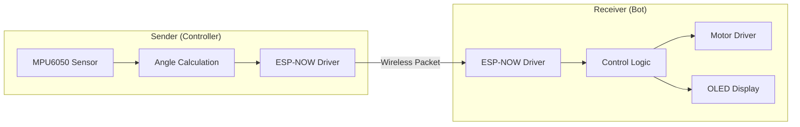
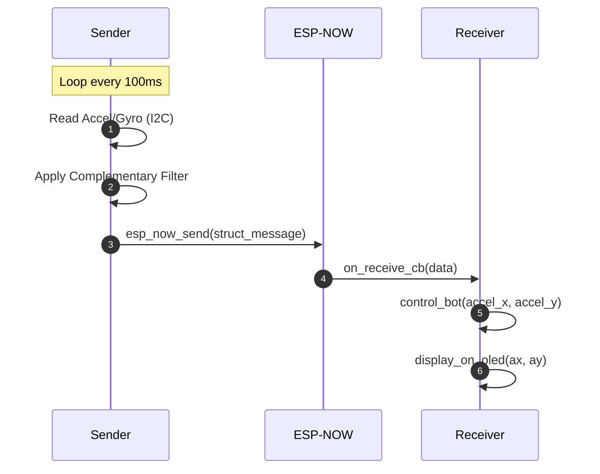

# System Architecture

The gesture-controlled bot is designed as a distributed system consisting of two primary hardware nodes: a **Sender (Controller)** and a **Receiver (Bot)**. These nodes communicate wirelessly using the ESP-NOW protocol, allowing for low-latency transmission of inertial measurement data to drive real-time motor responses.

## High-Level Overview

The system operates on a producer-consumer model. The Sender acts as the producer, sampling raw motion data from an MPU6050 IMU and calculating orientation angles. The Receiver acts as the consumer, translating these angles into specific motor commands and providing visual feedback via an OLED display.

### Component Relationship Diagram

The following diagram illustrates the hardware and software interaction between the controller and the bot.



## Module Decomposition

### 1. Sender Module (The Controller)
The Sender is responsible for data acquisition and telemetry. It leverages the I2C protocol to interface with the MPU6050 sensor.

*   **Data Acquisition:** Reads accelerometer and gyroscope values.
*   **Signal Processing:** Implements a complementary filter (`mpu6050_complimentory_filter`) to derive stable pitch and roll angles.
*   **Transmission:** Packages the integer portions of the pitch and roll into a `struct_message` and transmits it to the pre-defined MAC address of the receiver.

### 2. Receiver Module (The Bot)
The Receiver processes incoming telemetry to execute physical movements and update the system state.

*   **Packet Handling:** Uses an ESP-NOW receive callback (`on_receive_cb`) to asynchronously handle incoming data.
*   **Actuation Logic:** Maps `accel_x` (pitch) and `accel_y` (roll) to motor states (Forward, Backward, Left, Right, or Stop) based on defined thresholds.
*   **Visual Feedback:** Updates an LVGL-based OLED interface to show real-time axis values.

## Data Flow and Interaction

The system maintains a continuous loop of sensing, transmitting, and actuating. The following sequence diagram details the lifecycle of a single control packet.



## Communication Interface

The interaction between the Sender and Receiver is governed by a shared data structure to ensure binary compatibility during memory copying (`memcpy`).

### Shared Message Structure

| Field | Type | Description | Mapping |
| :--- | :--- | :--- | :--- |
| `accel_x` | `int` | Integer part of the calculated pitch angle | Controls Forward/Backward movement |
| `accel_y` | `int` | Integer part of the calculated roll angle | Controls Left/Right rotation |

### Control Thresholds
The Receiver implements a dead-zone to prevent jitter and unintended movement.

```c
// Logic extracted from receiver.c
if (ax < -40) {
    // Forward: Both motors forward
} else if (ax > 40) {
    // Backward: Both motors backward
} else if (ay < -40) {
    // Left: Left backward, Right forward
} else if (ay > 40) {
    // Right: Left forward, Right backward
} else {
    // Stop: Both motors stop
}