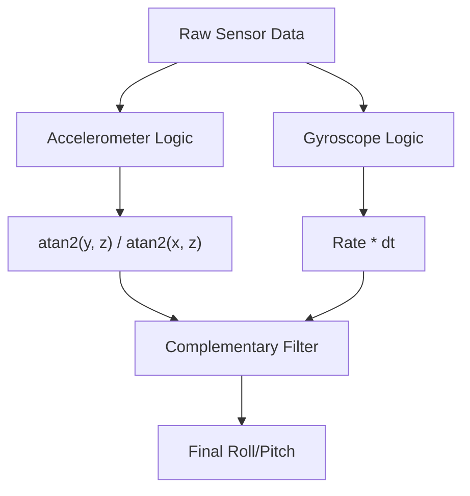
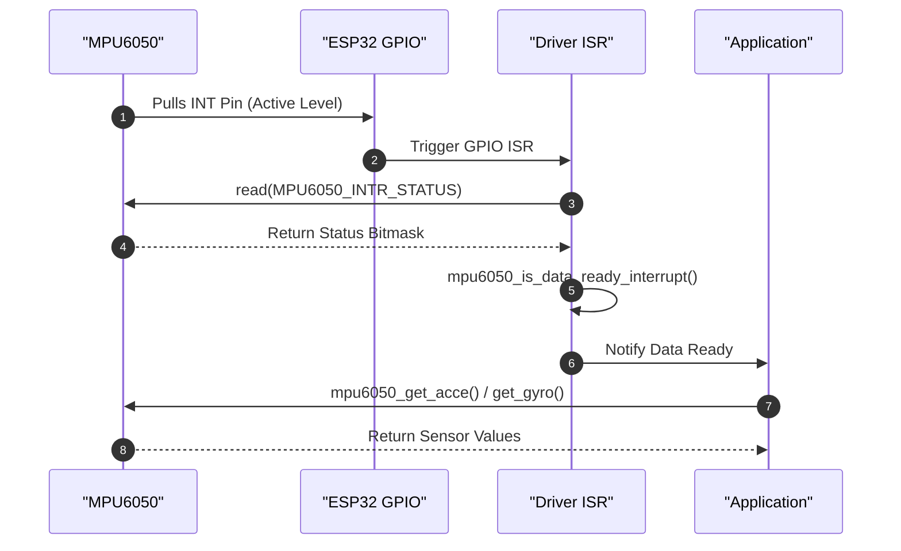

# Sensor Integration

This section provides a technical deep dive into the integration of the MPU6050 6-axis gyroscope and accelerometer. The driver facilitates communication via the I2C protocol to acquire motion data and calculate orientation using a complementary filter.

## Hardware Interface

The MPU6050 is integrated as an I2C slave device. The device address depends on the logic level of the `AD0` pin:

| AD0 Pin Level | I2C Address | Constant |
| :--- | :--- | :--- |
| Low | `0x68` | `MPU6050_I2C_ADDRESS` |
| High | `0x69` | `MPU6050_I2C_ADDRESS_1` |

### Connectivity Requirements
- **I2C Bus**: Used for all data acquisition and register configuration.
- **INT Pin**: Must be connected to an ESP32 GPIO to support interrupt-driven data ready notifications.

## Register Configuration

The driver interacts with the MPU6050 by reading and writing to specific internal registers.

### Key Register Map

| Register Name | Address | Description |
| :--- | :--- | :--- |
| `MPU6050_GYRO_CONFIG` | `0x1B` | Configures gyroscope full scale range. |
| `MPU6050_ACCEL_CONFIG` | `0x1C` | Configures accelerometer full scale range. |
| `MPU6050_INTR_PIN_CFG` | `0x37` | Configures the interrupt pin behavior. |
| `MPU6050_INTR_ENABLE` | `0x38` | Enables specific interrupt sources. |
| `MPU6050_INTR_STATUS` | `0x3A` | Indicates which interrupt triggered. |
| `MPU6050_ACCEL_XOUT_H` | `0x3B` | Start of accelerometer data registers. |
| `MPU6050_GYRO_XOUT_H` | `0x43` | Start of gyroscope data registers. |
| `MPU6050_TEMP_XOUT_H` | `0x41` | Start of temperature data registers. |
| `MPU6050_PWR_MGMT_1` | `0x6B` | Device reset and sleep mode control. |
| `MPU6050_WHO_AM_I` | `0x75` | Device identification (Expected: `0x68`). |

### Power Management
The driver provides two primary states for the sensor:
- **Wake Up**: Clears `BIT6` in `MPU6050_PWR_MGMT_1` to activate the sensor.
- **Sleep**: Sets `BIT6` in `MPU6050_PWR_MGMT_1` to enter low-power mode.

## Data Acquisition and Sensitivity

The MPU6050 provides data in raw `int16_t` format, which must be divided by a sensitivity factor to obtain meaningful physical values (g for acceleration, DPS for angular velocity).

### Accelerometer Sensitivity
The full scale range is configured via `mpu6050_config()`.

| Range | Sensitivity (LSB/g) | Enum Constant |
| :--- | :--- | :--- |
| $\pm 2g$ | 16384 | `ACCE_FS_2G` |
| $\pm 4g$ | 8192 | `ACCE_FS_4G` |
| $\pm 8g$ | 4096 | `ACCE_FS_8G` |
| $\pm 16g$ | 2048 | `ACCE_FS_16G` |

### Gyroscope Sensitivity
The full scale range is configured via `mpu6050_config()`.

| Range | Sensitivity (LSB/DPS) | Enum Constant |
| :--- | :--- | :--- |
| $\pm 250 \text{ DPS}$ | 131.0 | `GYRO_FS_250DPS` |
| $\pm 500 \text{ DPS}$ | 65.5 | `GYRO_FS_500DPS` |
| $\pm 1000 \text{ DPS}$ | 32.8 | `GYRO_FS_1000DPS` |
| $\pm 2000 \text{ DPS}$ | 16.4 | `GYRO_FS_2000DPS` |

```c
// Example of raw to float conversion in mpu6050.c
acce_value->acce_x = raw_acce.raw_acce_x / acce_sensitivity;
```

## Orientation Estimation: Complementary Filter

To determine the roll and pitch of the bot, the driver implements a complementary filter. This filter combines the fast response of the gyroscope with the long-term stability of the accelerometer to eliminate drift.

### Mathematical Logic
The filter uses a weighting factor $\alpha = 0.99$ (`ALPHA` in code).

1. **Accelerometer Angle**: Calculated using `atan2` to find the tilt relative to gravity.
2. **Gyroscope Angle**: Calculated by integrating the angular rate over time: $\text{Angle}_{gyro} = \text{Rate} \times dt$.
3. **Fusion**:
   $$\text{Angle}_{final} = (\alpha \times (\text{Angle}_{prev} + \text{GyroAngle})) + ((1 - \alpha) \times \text{AccelAngle})$$



## Interrupt Management

The MPU6050 can trigger a hardware interrupt on the ESP32 via the `INT` pin. This is primarily used for `DATA_RDY` (Data Ready) events.

### Interrupt Configuration
The `mpu6050_config_interrupts()` function configures the `MPU6050_INTR_PIN_CFG` register to define:
- **Active Level**: High or Low (`INTERRUPT_PIN_ACTIVE_LEVEL`).
- **Pin Mode**: Push-pull or Open Drain (`INTERRUPT_PIN_MODE`).
- **Latch Behavior**: 50$\mu$s pulse or latched until cleared (`INTERRUPT_LATCH`).
- **Clear Behavior**: Clear on any read or only on status read (`INTERRUPT_CLEAR_BEHAVIOR`).

### Sequence of Interrupt Handling



## API Summary

| Function | Description | Return Type |
| :--- | :--- | :--- |
| `mpu6050_create` | Allocates and initializes the sensor handle. | `mpu6050_handle_t` |
| `mpu6050_wake_up` | Transitions sensor from sleep to active mode. | `esp_err_t` |
| `mpu6050_config` | Sets accel and gyro full scale ranges. | `esp_err_t` |
| `mpu6050_get_acce` | Retrieves scaled accelerometer values (x, y, z). | `esp_err_t` |
| `mpu6050_get_gyro` | Retrieves scaled gyroscope values (x, y, z). | `esp_err_t` |
| `mpu6050_get_temp` | Retrieves internal temperature in Celsius. | `esp_err_t` |
| `mpu6050_complimentory_filter` | Fuses accel/gyro data to output roll and pitch. | `esp_err_t` |