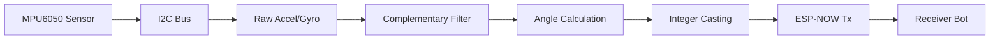
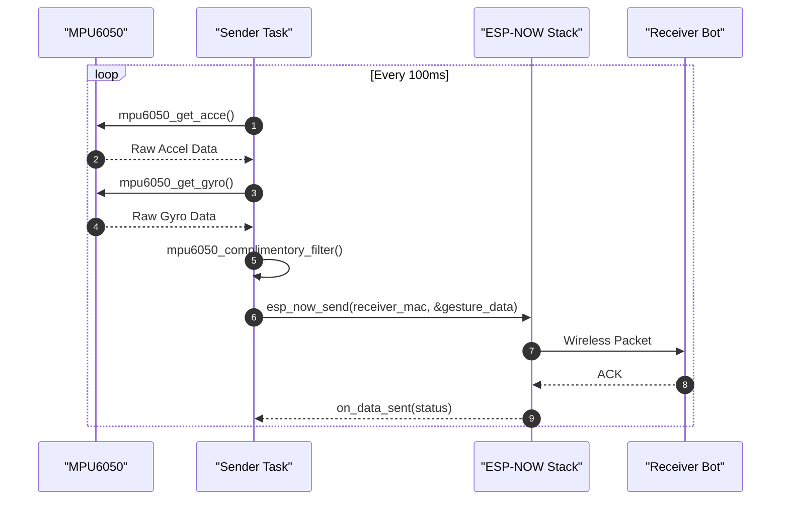

# Sender Module

The Sender Module serves as the primary input controller for the gesture-controlled bot. Its core responsibility is to acquire raw motion data from an MPU6050 Inertial Measurement Unit (IMU), process that data into stable Euler angles (pitch and roll), and transmit these values wirelessly to the receiver bot using the ESP-NOW protocol.

## Data Acquisition and Processing Flow

The sender firmware operates on a periodic execution cycle, ensuring a consistent stream of gesture data. The process transforms raw voltage-based readings from the sensor into actionable movement commands.

### Data Flow Diagram

The following diagram illustrates the pipeline from physical movement to wireless transmission:



### Logic Pipeline
1.  **Hardware Interface**: The module initializes an I2C master bus on GPIO 21 (SDA) and GPIO 22 (SCL) at a clock speed of 100kHz.
2.  **Sensor Acquisition**: Every 100ms, the `sender_task` triggers reads for both the accelerometer and gyroscope.
3.  **Signal Processing**: Raw data is passed through a complementary filter to mitigate the inherent weaknesses of the individual sensors (accelerometer noise and gyroscope drift).
4.  **Data Reduction**: The resulting floating-point angles are cast to integers to minimize the wireless payload size.
5.  **Transmission**: The processed coordinates are encapsulated in a `struct_message` and dispatched via ESP-NOW.

## Sensor Processing Logic

The module utilizes a Complementary Filter to compute the bot's orientation. This is critical for maintaining a stable "level" reference while remaining responsive to quick movements.

### The Complementary Filter
The implementation uses a weight factor $\alpha = 0.99$ to blend high-pass filtered gyroscope data with low-pass filtered accelerometer data.

**Formula Logic:**
$\text{Angle} = \alpha \times (\text{Angle} + \text{GyroRate} \times dt) + (1 - \alpha) \times \text{AccelAngle}$

This ensures that the gyroscope provides fast response times for short-term changes, while the accelerometer prevents long-term drift.

### MPU6050 Configuration
The sensor is initialized with specific full-scale ranges to balance sensitivity and maximum measurable movement:

| Parameter | Configuration | Description |
| :--- | :--- | :--- |
| **Accelerometer FS** | `ACCE_FS_2G` | $\pm 2g$ range for maximum sensitivity |
| **Gyroscope FS** | `GYRO_FS_250DPS` | $\pm 250$ degrees per second |
| **I2C Address** | `0x68` | Standard MPU6050 slave address |
| **Sample Rate** | 100ms | Defined by `vTaskDelayUntil` in `sender_task` |

## Transmission Layer

The sender utilizes ESP-NOW, a connectionless wireless protocol, to achieve low-latency communication with the receiver.

### Payload Structure
To ensure efficiency, the sender transmits a compact structure containing only the essential movement vectors.

```c
typedef struct {
  int accel_x; // Integer part of pitch angle
  int accel_y; // Integer part of roll angle
} struct_message;
```

### Communication Sequence
The following sequence diagram details the interaction between the application task and the wireless stack during a single loop iteration.



## Implementation Details

### Key Firmware Components

- **`app_main`**: Handles system bootstrap, including NVS flash initialization, Wi-Fi station mode setup, and ESP-NOW peer registration for the specific receiver MAC address `{0xAC, 0x67, 0xB2, 0x72, 0xA6, 0xD0}`.
- **`sender_task`**: The main execution loop that orchestrates the sensor-to-transmission pipeline.
- **`on_data_sent`**: A callback function used to log the success or failure of the wireless transmission.

### Error Handling
The firmware implements rigorous error checking using `ESP_ERROR_CHECK` and local `esp_err_t` evaluations. If a sensor read fails, the task logs the error and enters a 100ms recovery delay before attempting the next cycle:

```c
ret = mpu6050_get_acce(sensor, &acce_value);
if (ret != ESP_OK) {
  ESP_LOGE(TAG, "Failed to read accelerometer: %s", esp_err_to_name(ret));
  vTaskDelay(100 / portTICK_PERIOD_MS);
  continue;
}