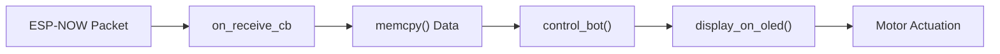
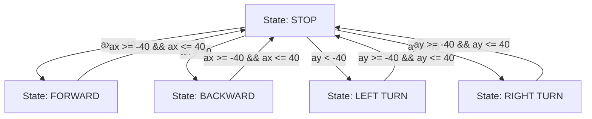

# Receiver Module

The Receiver Module serves as the execution engine of the gesture-controlled bot. It is responsible for listening for wireless data packets via the ESP-NOW protocol, parsing gesture orientation data, and translating those values into physical motor movements and visual feedback on an OLED display.

## Data Structure

The receiver expects a specific data payload from the sender to ensure synchronization. This payload is defined by a shared structure that maps accelerometer/gyroscope angles to integer values.

| Field | Type | Description | Source (Sender) |
| :--- | :--- | :--- | :--- |
| `accel_x` | `int` | Represents the pitch angle of the controller | `angles.pitch` |
| `accel_y` | `int` | Represents the roll angle of the controller | `angles.roll` |

```c
typedef struct struct_message {
  int accel_x;
  int accel_y;
} struct_message;
```

## Firmware Initialization

The `app_main` function orchestrates the boot sequence, ensuring all hardware peripherals and communication stacks are initialized before the bot enters its listening state.

1.  **NVS Initialization**: Initializes Non-Volatile Storage (`nvs_flash_init`) to handle system settings.
2.  **Network Stack**: Initializes the TCP/IP stack (`esp_netif_init`) and the default event loop.
3.  **Wi-Fi Configuration**: Sets the Wi-Fi mode to Station (`WIFI_MODE_STA`) and starts the radio.
4.  **ESP-NOW Setup**: Initializes the ESP-NOW protocol and registers the `on_receive_cb` callback function.
5.  **Peripheral Setup**:
    *   **OLED**: Initializes the display and clears the screen using LVGL.
    *   **Hardware**: Enables system switches via `enable_switches()`.
    *   **Motors**: Initializes two motor handles (`motor_a_0` and `motor_a_1`) via `enable_motor_driver`.

## Data Processing Pipeline

When a packet is received, the firmware follows a linear execution path to transform raw data into bot action and user feedback.



### 1. Signal Reception (`on_receive_cb`)
The callback function triggers upon the arrival of a packet. It copies the raw byte array into a `struct_message` and logs the sender's MAC address for debugging.

### 2. Movement Translation (`control_bot`)
The `control_bot` function implements the core movement logic. It uses a threshold-based system (fixed at $\pm 40$) to determine the intended direction.

### 3. Visual Feedback (`display_on_oled`)
The receiver uses the LVGL library to update an OLED screen in real-time, displaying the current `AX` and `AY` values received from the sender.

## Movement Logic and State Transitions

The bot's movement is determined by the values of `ax` (pitch) and `ay` (roll). The logic prioritizes pitch (forward/backward) over roll (turning).

### State Transition Diagram



### Motor Control Mapping

All active movements are executed at a constant speed of **70**.

| Gesture Condition | Bot Action | Motor A0 Direction | Motor A1 Direction |
| :--- | :--- | :--- | :--- |
| `ax < -40` | Forward | `MOTOR_FORWARD` | `MOTOR_FORWARD` |
| `ax > 40` | Backward | `MOTOR_BACKWARD` | `MOTOR_BACKWARD` |
| `ay < -40` | Left Turn | `MOTOR_BACKWARD` | `MOTOR_FORWARD` |
| `ay > 40` | Right Turn | `MOTOR_FORWARD` | `MOTOR_BACKWARD` |
| Default | Stop | `MOTOR_STOP` | `MOTOR_STOP` |

```c
if (ax < -40) {
    set_motor_speed(motor_a_0, MOTOR_FORWARD, 70);
    set_motor_speed(motor_a_1, MOTOR_FORWARD, 70);
} else if (ax > 40) {
    set_motor_speed(motor_a_0, MOTOR_BACKWARD, 70);
    set_motor_speed(motor_a_1, MOTOR_BACKWARD, 70);
} // ... further logic for ay