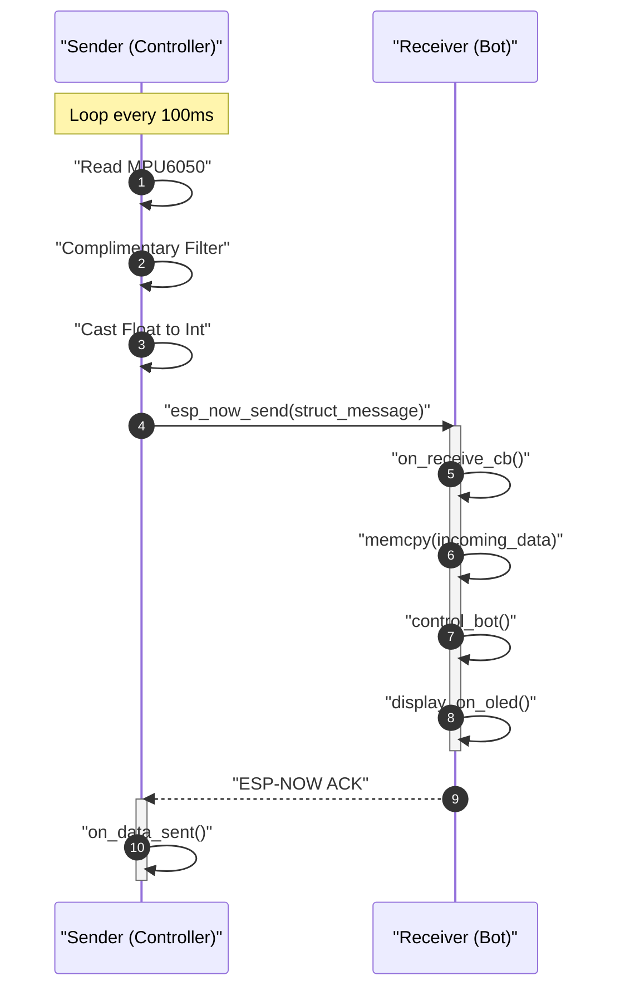

# Communication Protocol

The gesture-controlled bot utilizes a connectionless wireless communication protocol based on **ESP-NOW**, a proprietary low-power, low-latency communication protocol developed by Espressif. This protocol allows the sender (controller) to transmit gesture data directly to the receiver (bot) without the overhead of a standard Wi-Fi handshake or established TCP/UDP connection.

## Protocol Overview

The communication is designed as a unidirectional streaming flow where the sender periodically broadcasts the state of the MPU6050 sensor to a specific receiver MAC address.

### Key Specifications
| Parameter | Value | Description |
| :--- | :--- | :--- |
| **Transport Layer** | ESP-NOW | Connectionless Wi-Fi based protocol |
| **Addressing** | Unicast | Targeted to MAC `AC:67:B2:72:A6:D0` |
| **Transmission Rate** | 10 Hz | Data sent every 100ms |
| **Data Payload** | `struct_message` | Fixed-size binary structure |
| **Encryption** | Disabled | `peer_info.encrypt = false` |

## Data Packet Definition

To ensure binary compatibility between the sender and receiver, both modules implement an identical data structure. The sensor's floating-point Euler angles (pitch and roll) are cast to integers to minimize payload size and processing overhead.

### Packet Structure: `struct_message`

```c
typedef struct {
  int accel_x; // Integer part of pitch angle
  int accel_y; // Integer part of roll angle
} struct_message;
```

### Field Descriptions
| Field | Data Type | Description | Mapping |
| :--- | :--- | :--- | :--- |
| `accel_x` | `int` | The pitch angle of the controller | Derived from `angles.pitch` |
| `accel_y` | `int` | The roll angle of the controller | Derived from `angles.roll` |

## Communication Sequence

The following sequence diagram illustrates the data flow from the physical movement of the controller to the resulting motor action on the bot.



## Transmission Logic

### Sender Implementation
The sender operates within a dedicated FreeRTOS task (`sender_task`). It maintains a strict timing window using `vTaskDelayUntil` to ensure a consistent 100ms sampling and transmission interval.

1. **Peer Registration**: The receiver is added as a peer using `esp_now_add_peer` with the hardcoded MAC address.
2. **Payload Preparation**: 
   - Reads accelerometer and gyroscope data.
   - Processes data through `mpu6050_complimentory_filter`.
   - Assigns the integer portion of the results to `gesture_data.accel_x` and `gesture_data.accel_y`.
3. **Transmission**: Calls `esp_now_send()` passing the receiver's MAC and the binary representation of the struct.

### Receiver Implementation
The receiver remains in a listening state, utilizing an asynchronous callback mechanism.

1. **Reception**: The `on_receive_cb` function is triggered upon arrival of an ESP-NOW packet.
2. **Deserialization**: The raw `uint8_t *data` buffer is copied into a local `struct_message` instance via `memcpy`.
3. **Actuation**: The `control_bot()` function interprets the integers:
   - **Forward**: `accel_x < -40`
   - **Backward**: `accel_x > 40`
   - **Left Rotate**: `accel_y < -40`
   - **Right Rotate**: `accel_y > 40`
   - **Stop**: All values within $[-40, 40]$ range.