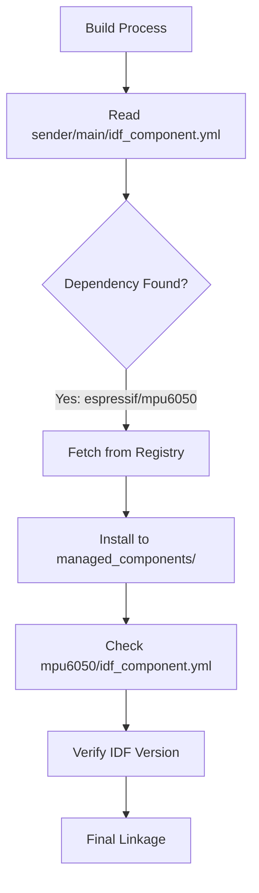

# Dependency Management

The gesture-controlled bot project leverages the ESP-IDF Component Manager to handle external libraries and hardware drivers. This system allows the project to declaratively define its dependencies, ensuring consistent builds across different development environments by automatically fetching and managing required components.

## ESP-IDF Component System

The project utilizes `idf_component.yml` manifest files to specify required dependencies. The ESP-IDF build system parses these files during the configuration phase to resolve and download components from the Espressif Component Registry or other specified sources.

In this project, the dependency management is primarily concentrated in the sender module, which requires specialized drivers to interface with the MPU6050 inertial measurement unit (IMU).

### Component Resolution Flow

The following diagram illustrates how the ESP-IDF build system resolves dependencies for the sender module:



## Sender Module Dependencies

The sender firmware defines its requirements in `sender/main/idf_component.yml`. It specifies a flexible versioning strategy for the sensor driver while enforcing a minimum version for the ESP-IDF framework.

### Dependency Manifest

The configuration is defined as follows:

```yaml
dependencies:
  espressif/mpu6050: "*"
  idf:
    version: ">=4.1.0"
```

### Versioning Constraints

The project maintains specific version requirements to ensure compatibility between the driver and the framework:

| Dependency | Required Version | Source/Role |
| :--- | :--- | :--- |
| `idf` | $\ge 4.1.0$ | Espressif IoT Development Framework |
| `espressif/mpu6050` | `*` (Any) | MPU6050 Hardware Driver |

## Managed Components: MPU6050

Components managed by the ESP-IDF Component Manager are stored in the `managed_components` directory. The `espressif__mpu6050` component provides the necessary abstraction for I2C communication with the sensor.

### Driver Specifications

Based on the `sender/managed_components/espressif__mpu6050/idf_component.yml` file, the driver has the following properties:

*   **Description**: I2C driver for MPU6050 6-axis gyroscope and accelerometer.
*   **Version**: `1.2.0`
*   **Minimum IDF Version**: $\ge 4.0$
*   **Upstream Source**: [espressif/esp-bsp](https://github.com/espressif/esp-bsp/tree/master/components/mpu6050)

### Integration Hierarchy

The relationship between the project's main application and the managed driver is represented in the following hierarchy:

```mermaid
graph LR
    App["Sender Application"] -- "Depends on" --> Driver["MPU6050 Driver (v1.2.0)"]
    Driver -- "Requires" --> IDF["ESP-IDF (>=4.0)"]