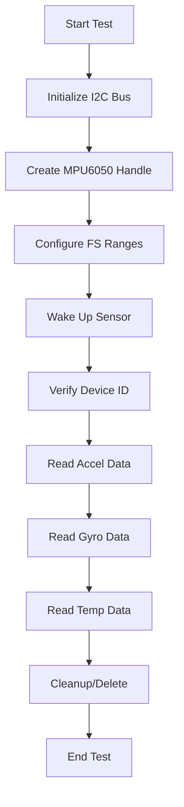
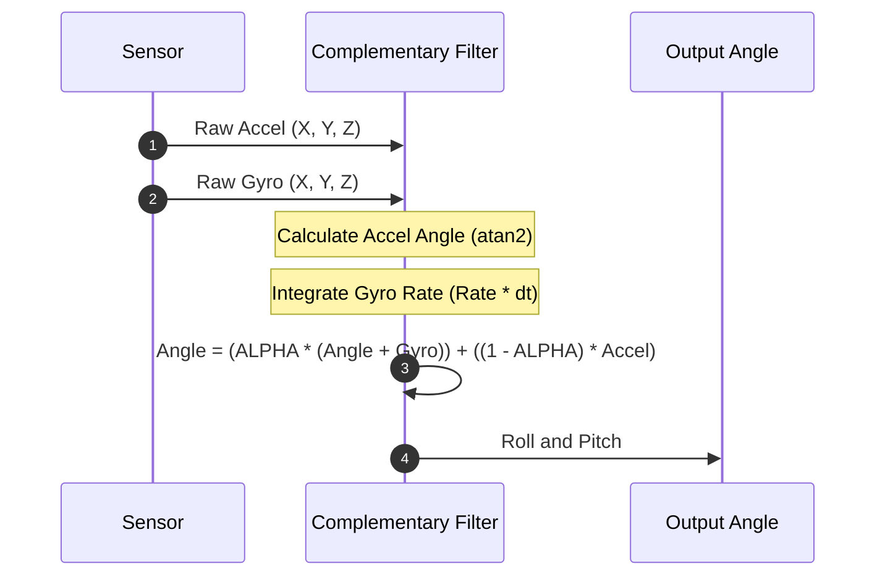

# Testing and Validation

This section outlines the guidelines and procedures for testing the hardware modules of the gesture-controlled bot, with a specific focus on the MPU6050 sensor integration, I2C communication reliability, and data validation.

## Sensor Validation Workflow

The validation of the MPU6050 sensor is performed through a structured test suite that ensures the hardware is correctly wired, initialized, and producing accurate telemetry. The following flowchart describes the sequence of operations performed during the sensor validation process as implemented in `mpu6050_test.c`.



### Hardware Initialization Testing
The testing process begins by configuring the I2C master bus. The following parameters are used for validation:

| Parameter | Value | Description |
| :--- | :--- | :--- |
| `I2C_MASTER_SCL_IO` | 26 | GPIO pin for I2C Clock |
| `I2C_MASTER_SDA_IO` | 25 | GPIO pin for I2C Data |
| `I2C_MASTER_FREQ_HZ` | 100,000 | Bus frequency (100 kHz) |
| `I2C_MASTER_NUM` | `I2C_NUM_0` | I2C port instance |

The initialization sequence is validated by asserting that `i2c_param_config` and `i2c_driver_install` return `ESP_OK`.

## Sensor Calibration and Configuration

Proper calibration requires setting the Full-Scale (FS) ranges based on the expected movement of the bot. The system provides configurable sensitivity scales for both the accelerometer and gyroscope.

### Sensitivity Mapping
The `mpu6050.c` module translates raw register values into physical units using the following sensitivity constants:

**Accelerometer Sensitivity**
| Range | Sensitivity Constant |
| :--- | :--- |
| `ACCE_FS_2G` | 16384 |
| `ACCE_FS_4G` | 8192 |
| `ACCE_FS_8G` | 4096 |
| `ACCE_FS_16G` | 2048 |

**Gyroscope Sensitivity**
| Range | Sensitivity Constant |
| :--- | :--- |
| `GYRO_FS_250DPS` | 131 |
| `GYRO_FS_500DPS` | 65.5 |
| `GYRO_FS_1000DPS` | 32.8 |
| `GYRO_FS_2000DPS` | 16.4 |

### Configuration Example
The test suite validates the configuration using a standard setup for moderate movement:
```c
// Configuration for 4G accelerometer range and 500DPS gyroscope range
ret = mpu6050_config(mpu6050, ACCE_FS_4G, GYRO_FS_500DPS);
TEST_ASSERT_EQUAL(ESP_OK, ret);
```

## Communication Reliability

### I2C Data Integrity
Communication reliability is verified by checking the `WHO_AM_I` register. This ensures the ESP32 is communicating with the correct device at the specified I2C address.

```c
ret = mpu6050_get_deviceid(mpu6050, &mpu6050_deviceid);
TEST_ASSERT_EQUAL(ESP_OK, ret);
TEST_ASSERT_EQUAL_UINT8_MESSAGE(MPU6050_WHO_AM_I_VAL, mpu6050_deviceid, "Who Am I register does not contain expected data");
```

### Interrupt Validation
The module supports interrupt-driven data acquisition to reduce polling overhead. Validation of the interrupt system involves:
1. **Pin Configuration**: Setting `active_level` (High/Low) and `pin_mode` (Open Drain/Push Pull).
2. **ISR Registration**: Using `mpu6050_register_isr` to attach a handler to the sensor's INT pin.
3. **Source Enabling**: Enabling specific interrupts (e.g., `MPU6050_DATA_RDY_INT_BIT`) via `mpu6050_enable_interrupts`.

## Data Validation and Filtering

To ensure the reliability of gesture data, the system implements a Complimentary Filter. This filter mitigates the drift associated with gyroscopes and the noise associated with accelerometers.

### Complimentary Filter Logic
The filter combines the high-pass filtered gyroscope data and low-pass filtered accelerometer data.



**Filtering Constants:**
- `ALPHA`: 0.99 (Weight given to the gyroscope integration).
- `RAD_TO_DEG`: 57.27272727 (Conversion factor for angular calculations).

The validation of this filter is performed by checking the `complimentary_angle` output over time, ensuring that the `dt` (delta time) is calculated accurately using `gettimeofday` and `timersub`.