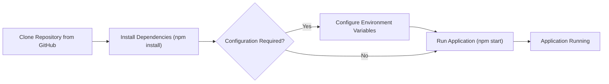

# Project Setup and Configuration

This document outlines the steps required to set up the development environment for the `shinymack/git_test` project. It covers essential configurations and provides insights into the project's structure.

## Prerequisites

Before setting up the project, ensure you have the following installed:

*   **Node.js:**  Version 16 or higher is recommended. You can download it from [nodejs.org](https://nodejs.org/).
*   **npm** or **yarn:**  Node Package Manager (npm) is installed with Node.js. Yarn is an alternative package manager.
*   **Git:**  Required for cloning the repository. You can download it from [git-scm.com](https://git-scm.com/).

## Installation

1.  **Clone the Repository:**

    Use Git to clone the `shinymack/git_test` repository to your local machine:

    ```bash
    git clone https://github.com/shinymack/git_test.git
    cd git_test
    ```

    [View on GitHub](https://github.com/shinymack/git_test/blob/main/)

2.  **Install Dependencies:**

    Navigate to the project directory and install the necessary dependencies using npm or yarn:

    ```bash
    npm install
    # or
    yarn install
    ```

    This command reads the `package.json` file and installs all listed dependencies.

    [View on GitHub](https://github.com/shinymack/git_test/blob/main/package.json)

3.  **Examine `package.json`:**

    The `package.json` file contains metadata about the project and lists its dependencies and scripts. Here's a snippet illustrating the structure:

    ```json
    {
      "name": "git_test",
      "version": "1.0.0",
      "description": "A test repository",
      "main": "index.js",
      "scripts": {
        "test": "echo \"Error: no test specified\" && exit 1",
        "start": "node index.js"
      },
      "keywords": [],
      "author": "",
      "license": "ISC",
      "dependencies": {
        "express": "^4.18.2"
      }
    }
    ```

    *   `name`:  The name of the project.
    *   `version`:  The current version of the project.
    *   `scripts`:  Defines commands that can be run using `npm run <script-name>`.  The `start` script typically launches the application.
    *   `dependencies`: Lists the project's dependencies, such as `express`.

    [View on GitHub](https://github.com/shinymack/git_test/blob/main/package.json)

4.  **Configuration (if applicable):**

    Check the `README.md` file for any specific configuration instructions.  The project might require setting environment variables or creating configuration files.  If environment variables are needed, you can set them in your shell:

    ```bash
    export VARIABLE_NAME="value"
    ```

    Or create a `.env` file (if the project uses `dotenv` or similar).  **Note:** Be careful not to commit `.env` files containing sensitive information to your repository.

5.  **Running the Application:**

    Use the `start` script defined in `package.json` to run the application:

    ```bash
    npm start
    # or
    yarn start
    ```

    This will typically start the application server.  Refer to the console output for the address and port where the application is running.

    [View on GitHub](https://github.com/shinymack/git_test/blob/main/package.json)

## Project Structure

A basic understanding of the project structure is crucial. Here's a simplified overview:

*   `node_modules`:  Contains the installed dependencies.  This directory is usually excluded from version control using `.gitignore`.
*   `package.json`:  Project metadata and dependencies.
*   `index.js` (or similar):  The main entry point of the application.

The `README.md` file should provide a more detailed explanation of the project's specific structure and components.

## Example: Simple Express Server (index.js)

Here's an example of what the `index.js` file might contain, showcasing a basic Express server:

```javascript
const express = require('express');
const app = express();
const port = 3000;

app.get('/', (req, res) => {
  res.send('Hello World!');
});

app.listen(port, () => {
  console.log(`Example app listening at http://localhost:${port}`);
});
```

This code creates a simple web server that listens on port 3000 and responds with "Hello World!" when accessed at the root path.

[View on GitHub](https://github.com/shinymack/git_test/blob/main/index.js)

## Understanding the Workflow

The following Mermaid diagram illustrates the typical workflow of setting up and running the project:





## Key Integration Points

*   **Dependency Management:**  `npm` or `yarn` are crucial for managing project dependencies. Understanding how to add, update, and remove dependencies is essential.
*   **Environment Variables:**  Many applications rely on environment variables for configuration. Learn how to set and access these variables. Always be mindful of security when handling sensitive information in environment variables.
*   **Version Control (Git):**  Use Git to track changes, collaborate with others, and manage different versions of the project.

By following these steps and understanding the key integration points, you should be well-equipped to set up and work with the `shinymack/git_test` project.
```