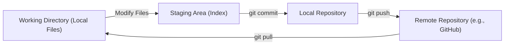
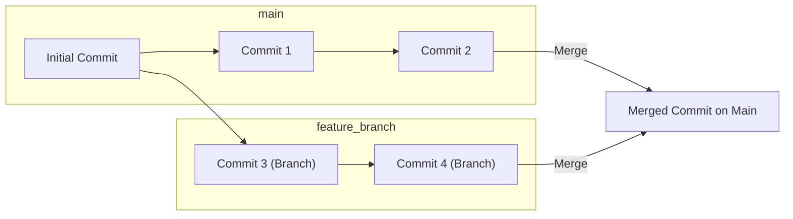

# Core Functionality

This document outlines the core functionality of the `shinymack/git_test` repository. This repository appears to be a simple test repository, potentially used for demonstration or learning purposes related to Git.  The main functional components revolve around the ability to create, modify, and track changes in text files.

## File Structure and Purpose

The repository includes a directory `dir_a` containing `file_a.txt`, and a file `file_c.txt` at the root level. These files likely serve as simple data containers for illustrating Git's version control capabilities.  The contents of these files, while not directly specified, are likely basic text, designed to be modified and committed to demonstrate Git features.

## Core Features

*   **File Creation:** Demonstrates the initial addition of files to a Git repository.
*   **Content Modification:** Highlights Git's ability to track changes to file content over time.
*   **Version Control:** Showcases the fundamental versioning capabilities of Git.
*   **Directory Structure:** Illustrates how Git handles directory organization within a repository.

## Key Integration Points

This repository, being a test repository, doesn't have external integrations. However, it showcases the fundamental principles upon which larger Git workflows and integrations are built. Understanding the core concepts demonstrated here is essential for working with Git in any environment.

## Code Snippets & Explanations

While the files themselves likely contain simple text, the *process* of interacting with them through Git is where the "code" lies.  The commands used to add, commit, and track changes represent the core interactions.

### Adding a File

The command `git add <file>` stages changes for commit.  This tells Git to include the specified file in the next snapshot of the repository.

```bash
git add dir_a/file_a.txt
git add file_c.txt
```

[View on GitHub](https://github.com/shinymack/git_test/blob/main/)

### Committing Changes

The `git commit -m "<message>"` command creates a new commit, saving the staged changes with a descriptive message.  The message is crucial for understanding the purpose of the commit later on.

```bash
git commit -m "Initial commit: Added file_a.txt and file_c.txt"
```

[View on GitHub](https://github.com/shinymack/git_test/blob/main/)

### Modifying and Committing Again

After modifying a file, the changes must be added and committed again to update the repository's history.

```bash
# (Assume file_a.txt has been modified)
git add dir_a/file_a.txt
git commit -m "Updated file_a.txt with new content"
```

[View on GitHub](https://github.com/shinymack/git_test/blob/main/)

### Viewing the Commit History

The `git log` command displays the commit history, showing the author, date, commit message, and hash for each commit.

```bash
git log
```

[View on GitHub](https://github.com/shinymack/git_test/blob/main/)

### Checking File Status

The `git status` command shows the state of the working directory and staging area.  It indicates which files have been modified, staged, or are untracked.

```bash
git status
```

[View on GitHub](https://github.com/shinymack/git_test/blob/main/)

### Branching and Merging (Conceptual - Not explicitly in repo)

Although not explicitly present in the base repository, branching and merging are fundamental Git operations. This snippet shows conceptual commands.

```bash
git branch feature-x # Creates a new branch called feature-x
git checkout feature-x # Switches to the feature-x branch
# Make changes, add, and commit on the feature-x branch
git checkout main      # Switches back to the main branch
git merge feature-x    # Merges the changes from feature-x into main
```

[View on GitHub](https://github.com/shinymack/git_test/blob/main/)

## Conceptual Git Flow Diagram

This diagram shows a simplified Git workflow, highlighting the core stages of modifying and committing changes.





## Branching and Merging Diagram





## Insights on Flows and Best Practices

This repository, while simple, highlights the fundamental Git workflow:

1.  **Modify:** Make changes to files in your local working directory.
2.  **Stage:** Add the modified files to the staging area using `git add`.
3.  **Commit:** Commit the staged changes to the local repository with a descriptive message using `git commit`.
4.  **Push/Pull:** Synchronize local changes with a remote repository (e.g., GitHub) using `git push` and `git pull`.

**Best Practices:**

*   **Descriptive Commit Messages:** Write clear and concise commit messages that explain the purpose of the changes.
*   **Frequent Commits:** Commit frequently to create a detailed history of changes, making it easier to revert or understand modifications.
*   **Branching:** Use branches to isolate new features or bug fixes from the main codebase.
*   **Regular Synchronization:** Regularly synchronize your local repository with the remote repository to stay up-to-date with changes.
*   **Code Reviews:** Use pull requests and code reviews to ensure code quality and catch potential issues.