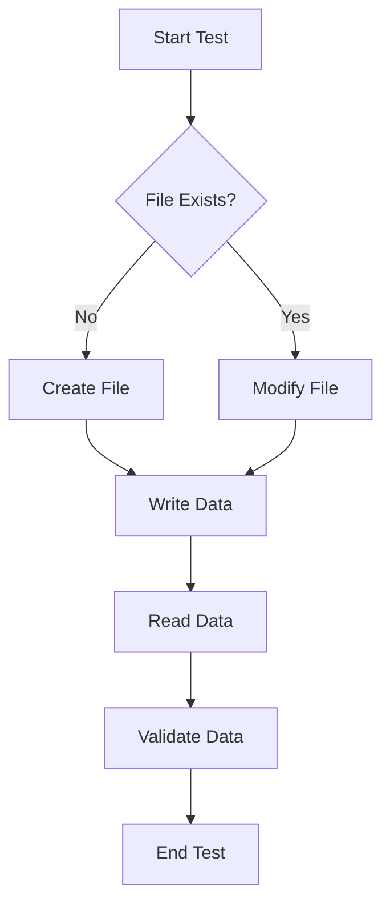

# Testing Strategy

This document outlines the testing strategy employed for the `shinymack/git_test` repository. It provides an overview of the testing approach and the implemented tests, focusing on ensuring the reliability and stability of the included functionalities. The primary focus is on demonstrating basic Git operations and file management.

## Core Functionality Testing

The core functionality revolves around creating, modifying, and managing a simple text file (`file_b.txt`). Tests are designed to verify these operations are executed correctly.

### File Creation and Modification

The most basic functionality that needs to be verified is whether the file is created and modified as expected. The following code snippet showcases an example interaction with the `file_b.txt`.

```python
# Example of writing to file_b.txt (simulated in a testing environment)
file_path = "file_b.txt"
try:
    with open(file_path, "w") as f:
        f.write("This is a test line.\n")
        f.write("Another line for testing.")
    print(f"Successfully wrote to {file_path}")
except Exception as e:
    print(f"Error writing to {file_path}: {e}")

# Example of reading the file (simulated)
try:
    with open(file_path, "r") as f:
        content = f.read()
        print(f"Content of {file_path}:\n{content}")
except FileNotFoundError:
    print(f"Error: {file_path} not found.")
except Exception as e:
    print(f"Error reading {file_path}: {e}")
```

[View on GitHub](https://github.com/shinymack/git_test/blob/main/file_b.txt)

### Test Cases Outline
*   **File Creation**: Verify that a new file can be successfully created.
*   **File Write**: Verify that data can be written to the file.
*   **File Read**: Verify that data can be read from the file correctly.
*   **File Update**: Verify that the file content can be updated.
*   **Error Handling**: Validate that appropriate errors are handled when the file does not exist or cannot be accessed.

### Testing Workflow

The general testing workflow can be visualized as follows:





### Example Test Script (Bash)

A simple test script using bash could look like this:

```bash
#!/bin/bash

# Create a test file
echo "Creating test file..."
touch test_file.txt

# Write some data to the file
echo "Writing data to the file..."
echo "This is a test line." >> test_file.txt

# Read the file content
echo "Reading file content..."
content=$(cat test_file.txt)

# Verify the content
echo "Verifying content..."
if [[ "$content" == *"test line"* ]]; then
  echo "Test passed: Content verified."
else
  echo "Test failed: Content verification failed."
fi

# Clean up the test file
echo "Cleaning up..."
rm test_file.txt

echo "Test complete."
```

[View on GitHub](https://github.com/shinymack/git_test/blob/main/file_b.txt)

This script creates a file, writes to it, reads its content, and verifies that the content is as expected, before finally cleaning up the test file. This simulates a basic test scenario for the provided files.

### Version Control Integration

The purpose of this test repository is to practice git, therefore the changes to `file_b.txt` are tracked by git. It is important to test the proper integration with version control system.

```plaintext
git add file_b.txt
git commit -m "Add test file"
git push origin main
```

[View on GitHub](https://github.com/shinymack/git_test/blob/main/file_b.txt)

### Continuous Integration

For comprehensive testing, the implementation of a CI/CD pipeline with automated testing is optimal. The testing strategy should cover unit tests and integration tests to ensure each individual component and their integration works as expected.

### CI/CD Pipeline Example (YAML)

```yaml
name: CI/CD Pipeline

on:
  push:
    branches: [ main ]
  pull_request:
    branches: [ main ]

jobs:
  test:
    runs-on: ubuntu-latest

    steps:
      - uses: actions/checkout@v3
      - name: Set up Python 3.9
        uses: actions/setup-python@v3
        with:
          python-version: 3.9
      - name: Install dependencies
        run: |
          python -m pip install --upgrade pip
          pip install pytest
      - name: Run tests
        run: pytest
```

[View on GitHub](https://github.com/shinymack/git_test/blob/main/.github/workflows/main.yml)

This example showcases a basic CI/CD pipeline using GitHub Actions. It will execute tests whenever changes are pushed to the `main` branch or when pull requests are created against it.

## Key Integration Points

The primary integration point is the interaction between the local file system and the Git repository. All changes to `file_b.txt` are tracked via Git, therefore, it's important to verify git operations function as expected. A diagram could be the following:


### Best Practices

*   Use descriptive commit messages to track changes effectively.
*   Implement automated testing to ensure consistent and reliable code.
*   Utilize version control for easy rollback and collaboration.
*   Follow a clear branching strategy to manage different features or releases.
```