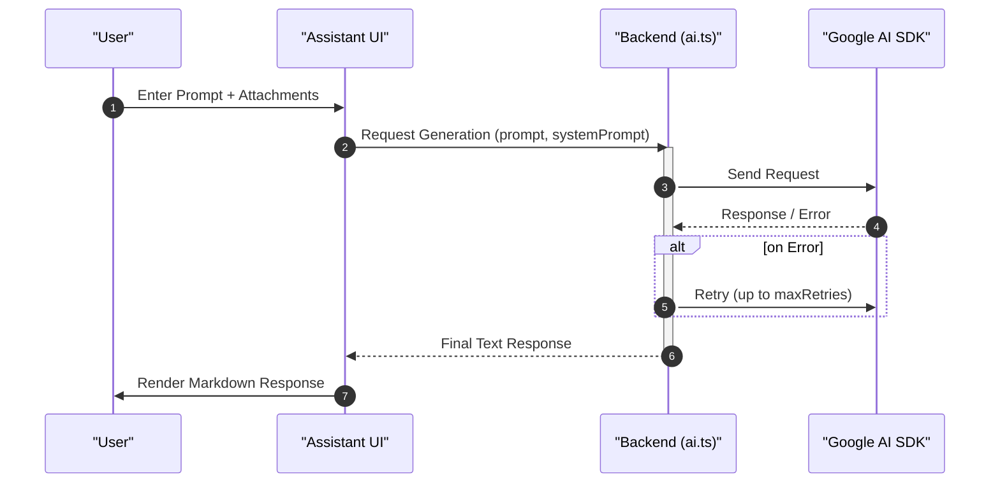

# Core Features

GitDex provides a sophisticated suite of tools designed to bridge the gap between complex codebases and AI-driven analysis. By combining a robust AI orchestration layer with a specialized user interface, it enables developers to interact with repositories through natural language.

## AI-Powered Conversational Interface

The centerpiece of GitDex is its intelligent chat system, which allows users to query their codebase, seek architectural explanations, and debug logic in real-time.

### Interactive Chat Thread
The AI interface is built using a modular architecture that ensures a seamless conversation flow. The system implements a highly customizable thread that handles multiple message states and rich content rendering.

**Key UI Capabilities:**
*   **Rich Text Rendering:** Integration of `MarkdownText` ensures that code snippets, tables, and formatted explanations are displayed clearly.
*   **Contextual Attachments:** Users can attach specific codebase references using `ComposerAddAttachment` and `ComposerAttachments`, allowing the AI to focus on specific files or blocks of code.
*   **Interactive Components:** The interface includes `ThreadSuggestions` to guide users and a `UserActionBar` for quick interactions.
*   **Tool Integration:** Through `ToolFallback`, the system can handle AI tool calls that may not have a dedicated UI representation, ensuring the conversation remains uninterrupted.

### AI Orchestration and Reliability
On the backend, GitDex leverages the Google AI SDK to process prompts. To ensure production-grade stability, the system implements a retry mechanism to handle transient API failures.

```typescript
interface GenerateOptions {
  systemPrompt?: string;
  prompt: string;
  maxRetries?: number;
}

export async function generateWithRetry({
  systemPrompt,
  prompt,
  maxRetries = 3
}: GenerateOptions): Promise<string>
```

## Repository Analysis Workflow

GitDex transforms raw repository data into AI-consumable context. The interaction between the frontend assistant and the backend AI layer follows a structured pipeline to ensure context-aware responses.

### Data Flow Architecture



## Feature Summary

The following table outlines the core capabilities provided by the system's current implementation:

| Feature | Component/Module | Description |
| :--- | :--- | :--- |
| **Contextual Chat** | `Thread` / `Composer` | AI-driven dialogue with support for codebase attachments. |
| **Reliable Generation** | `generateWithRetry` | Backend logic to prevent request failure via configurable retries. |
| **Rich Formatting** | `MarkdownText` | High-fidelity rendering of AI responses including code blocks. |
| **Attachment System** | `UserMessageAttachments` | Ability to link specific code segments to a chat prompt. |
| **LLM Integration** | `@ai-sdk/google` | Deep integration with Google's generative AI models. |

## Component Relationship

The AI interface is organized as a hierarchy of specialized primitives to maintain a clean separation between state management and visual representation.

```mermaid
graph TD
    T["Thread Component"] --> C["ComposerPrimitive"]
    T --> M["MessagePrimitive"]
    C --> A["ComposerAddAttachment"]
    C --> AT["ComposerAttachments"]
    M --> MT["MarkdownText"]
    M --> TF["ToolFallback"]
    T --> TS["ThreadSuggestions"]