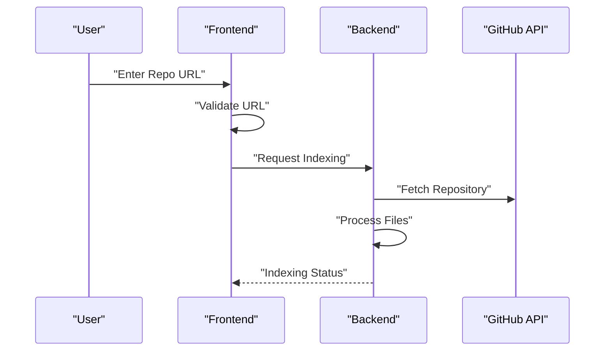

# Core Features

The Core Features module of GitDex represents the primary value delivery layer of the application. It transforms raw GitHub repository data into an interactive, AI-augmented knowledge base. Rather than treating a repository as a static collection of files, GitDex treats it as a queryable entity, bridging the gap between source code exploration and semantic understanding.

This module coordinates three primary capabilities: **Intelligent Repository Ingestion**, **Resilient AI Analysis**, and **Immersive Code Visualization**.

### Feature Overview

| Feature | Purpose | Primary Implementation |
| :--- | :--- | :--- |
| **Repo Indexing** | Validates and prepares GitHub repositories for AI analysis. | `client/src/app/page.tsx` |
| **AI Chat** | Provides semantic insights using LLMs with built-in reliability. | `server/src/ai.ts` |
| **Visualization** | Renders repository structures as interactive visual elements. | `InteractiveConstellation` |

---

### Intelligent Repository Indexing

The entry point for any analysis is the indexing pipeline. GitDex utilizes a streamlined onboarding flow that ensures only valid GitHub targets are processed, reducing server-side waste and improving user experience.

The process begins with strict URL validation and optional repository suggestions, allowing users to precisely target the codebase they wish to analyze.

```typescript
// Simplified logic from client/src/app/page.tsx
const handleSubmit = async () => {
  if (!validateGitHubUrl(url)) {
    // Handle invalid URL state
    return;
  }
  // Trigger the indexing process via backend API
  await startIndexing(url);
};
```

The indexing flow follows this sequence:



---

### Resilient AI Analysis

At the heart of GitDex is the AI integration layer. Instead of simple prompt-response cycles, the system implements a robust generation wrapper designed for production stability. Using the `@ai-sdk/google` provider, the server facilitates deep reasoning over the indexed code.

A critical architectural decision is the implementation of the `generateWithRetry` pattern. Because LLM APIs can be subject to transient failures or rate limits, GitDex ensures high availability by wrapping the generation logic in a retry loop.

```typescript
// server/src/ai.ts
export async function generateWithRetry({
  systemPrompt,
  prompt,
  maxRetries = 3
}: GenerateOptions): Promise<string> {
  // Logic to attempt text generation 
  // using the google AI provider, 
  // catching errors and retrying 
  // up to maxRetries.
}
```

**Key Technical Specifications:**
- **Model Provider:** Google AI SDK.
- **Reliability Pattern:** Exponential backoff/retry mechanism.
- **Context Injection:** Supports `systemPrompt` to define the AI's persona as a repository expert.

---

### Immersive Code Visualization

GitDex moves beyond the traditional file-tree navigation. The "Core Features" include a visualization layer that maps the repository's architecture into an interactive spatial environment.

The UI utilizes specialized components to provide an immediate sense of project scale and complexity:
- **InteractiveConstellation:** Transforms the abstract relationship between files and modules into a visual map.
- **FlickeringGrid:** Provides high-fidelity visual feedback during the indexing and loading states.
- **FeatureGrid:** A discovery layer that guides users toward the platform's primary capabilities (Chat, Code Analysis, and Sync).

The data flow for visualization occurs in parallel with the AI chat, ensuring that as the user asks questions, they can visually reference the structural location of the code being discussed.

```mermaid
graph LR
    A["Repo Data"] --> B["Indexing Engine"]
    B --> C["AI Context"]
    B --> D["Visual Map"]
    C --> E["Chat Interface"]
    D --> E