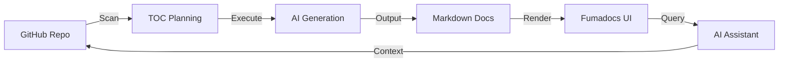

# Project Introduction

GitDex is a specialized system designed to transform raw GitHub repositories into comprehensive, AI-powered interactive documentation. By automating the analysis of codebase structures and utilizing Large Language Models (LLMs), GitDex bridges the gap between complex source code and readable technical documentation, providing both a static knowledge base and a dynamic AI assistant.

## Overview

The primary objective of GitDex is to eliminate the manual effort required to document a repository. It accomplishes this by scanning a codebase, planning a logical Table of Contents (TOC), and generating high-quality Markdown documentation that is then served through a search-optimized web interface.

Unlike traditional documentation tools that rely on manual input, GitDex leverages a multi-step AI pipeline to understand the intent and architecture of the code, rendering it into a structured format compatible with modern documentation engines.

## Intended Use Cases

GitDex is designed for developers, architects, and technical writers who need to quickly synthesize understanding of a repository.

*   **Rapid Onboarding**: New contributors can use the AI-powered chat assistant to ask specific questions about the codebase without needing to manually grep through thousands of lines of code.
*   **Automated Technical Mapping**: Automatically generating high-level architectural summaries and Mermaid diagrams to visualize how components interact.
*   **Dynamic Documentation**: Creating a "living" documentation site that can be regenerated as the repository evolves, ensuring the docs stay in sync with the implementation.
*   **Codebase Exploration**: Using the interactive AI assistant—powered by ReAct loops—to perform deep-dives into specific logic flows or dependency chains.

## High-Level Workflow

The transformation from a GitHub URL to a hosted documentation site follows a decoupled, asynchronous pipeline to ensure reliability in serverless environments.

## Technical Stack Summary

GitDex utilizes a modern full-stack architecture optimized for performance and scalability.

| Layer | Technology | Primary Purpose |
| :--- | :--- | :--- |
| **Frontend Framework** | Next.js (App Router) | Dynamic routing and server-side rendering |
| **Docs Engine** | Fumadocs | MDX rendering and search-ready page hierarchy |
| **Chat Interface** | assistant-ui | Interactive AI conversation UI |
| **Backend API** | Node.js / Express | Queue management and API orchestration |
| **AI Model** | Google Gemini | Code analysis and content generation |
| **Queue System** | Upstash Redis / QStash | Handling long-running indexing tasks |
| **GitHub Integration** | Octokit | Programmatic access to repository data |

## Invariants & Failure Modes

To maintain production stability, GitDex implements several architectural safeguards:

### Serverless Execution Constraints
Standard serverless functions (like those on Vercel) have strict execution timeouts. To prevent the indexing pipeline from failing during large repository analysis, GitDex implements a **Serverless Queueing** pattern.
*   **Invariant**: No single HTTP request handles the entire indexing process.
*   **Mechanism**: The workflow is decoupled into discrete steps orchestrated by Upstash QStash, ensuring each segment of the pipeline completes within the timeout window.

### AI Reliability and Grounding
Generating documentation via LLMs introduces the risk of "hallucinations" (inventing non-existent functions or logic).
*   **Mitigation**: The AI Code Assistant utilizes **manual ReAct loops**, allowing the AI to reason through a problem and verify facts against the actual repository content before providing a final answer.

### API Rate Limiting
The system relies heavily on external APIs (GitHub and Google Gemini).
*   **Failure Mode**: Excessive requests to the GitHub REST API can result in rate limiting.
*   **Handling**: The system is designed to operate asynchronously via the server-side queue, allowing for controlled execution and potential retry logic managed by the job controller.