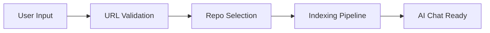

# Core Features

GitDex provides a comprehensive suite of tools designed to transform raw GitHub repositories into actionable insights through AI-driven analysis and interactive visualizations. The platform bridges the gap between static code reading and dynamic architectural understanding.

## AI-Powered Chat

The core of GitDex is an intelligent AI assistant capable of reasoning over the indexed codebase. By leveraging Large Language Models (LLMs) and a specialized indexing pipeline, the assistant provides context-aware answers to complex technical questions.

### Capabilities
- **Code Explanation**: Detailed breakdowns of how specific functions or modules operate.
- **Architectural Analysis**: High-level summaries of the system design and component interactions.
- **Contextual Queries**: Ability to ask questions that require scanning multiple files across the repository.

## Repository Indexing

Before analysis can occur, GitDex performs a structured ingestion of the target repository. This process ensures that the AI has a grounded, up-to-date representation of the source code.

### Indexing Workflow
The indexing process is triggered via the landing page interface where users provide a GitHub repository URL.

```typescript
interface RepoSuggestion {
  full_name: string;
  description: string;
  html_url: string;
}
```

The sequence of events from input to analysis is illustrated below:



### Input Validation
To ensure system stability and prevent invalid requests, GitDex employs strict validation for GitHub URLs before initiating the indexing process.

| Validation Step | Logic | Purpose |
| :--- | :--- | :--- |
| URL Format | `validateGitHubUrl()` | Ensures the input matches GitHub's domain structure. |
| Repo Selection | `handleSelectRepo()` | Allows users to pick from suggested repositories. |
| Submission | `handleSubmit()` | Triggers the backend indexing job. |

## Codebase Visualization

GitDex moves beyond text-based analysis by providing immersive visual representations of the codebase. These components help users conceptualize the scale and connectivity of the project they are analyzing.

### Visual Components
- **Interactive Constellation**: A dynamic visualization (`InteractiveConstellation`) that represents the repository's structure as a network of connected nodes.
- **Flickering Grid**: A high-performance background element (`FlickeringGrid`) that uses a cursor-interaction aura to provide a modern, data-centric aesthetic.

### Feature Summary

| Feature | Component/Icon | Primary Function |
| :--- | :--- | :--- |
| AI Chat | `MessageSquare` / `Sparkles` | Interactive Q&A with codebase context. |
| Indexing | `RefreshCw` | Parsing and vectorizing repository files. |
| Code Analysis | `Code` | Deep dives into specific implementation details. |
| Repo Branching | `GitFork` | Analysis of different repository versions. |

## Invariants & Failure Modes

The reliability of the core features depends on the successful synchronization between the frontend input and the backend indexing engine.

### Failure Modes
- **Invalid URL Submission**: If `validateGitHubUrl` fails, the system prevents the `handleSubmit` trigger, ensuring no wasted compute resources on invalid targets.
- **Indexing Latency**: Because repository indexing is an asynchronous process, there is a temporal gap between submission and the availability of the AI chat.
- **Rendering Performance**: The codebase visualizations (specifically the `FlickeringGrid`) utilize canvas-like logic to skip drawing transparent cells, preventing UI lag during heavy animations.

### Technical Invariants
- **Client-Side Validation**: URL validation must occur on the client side before any API request is dispatched.
- **Visual Decoupling**: Visual components like the `InteractiveConstellation` are designed to be independent of the chat state to ensure the UI remains responsive during AI generation.